# Notatki z kursu dockera:
[Kurs dockera na coursera](https://www.coursera.org/learn/docker-for-the-absolute-beginner/home/module/1)

# Moduł 1

## Najważniejsze informacje o Dockerze:

### Problematyka tradycyjnego podejścia:
- Przy tworzeniu aplikacji korzystających z różnych technologii (np. Node.js, MongoDB, Redis, Ansible) występowały problemy z kompatybilnością komponentów z systemem operacyjnym oraz między sobą.
- Zmiana komponentów wymagała ciągłych sprawdzeń kompatybilności.
- Trudności w tworzeniu środowisk dla nowych programistów i zapewnianiu zgodności w środowiskach deweloperskim, testowym i produkcyjnym.

### Rozwiązanie dzięki Dockerowi:
- Docker pozwala uruchamiać każdy komponent w osobnym kontenerze z własnymi zależnościami i bibliotekami.
- Konfigurację kontenerów tworzy się raz, a następnie można ją łatwo uruchomić na dowolnym systemie operacyjnym, mając zainstalowanego Dockera.
- Kontenery to izolowane środowiska, które współdzielą jądro systemu operacyjnego, co odróżnia je od wirtualnych maszyn (VM).

### Zalety kontenerów Dockera:
- Lekkość i szybki start (w sekundach), w przeciwieństwie do wirtualnych maszyn (minuty).
- Niskie zużycie zasobów, dzięki współdzieleniu jądra OS.
- Uproszczona konfiguracja środowisk dzięki gotowym obrazom dostępnym w Docker Hub.

### Różnice między kontenerami a wirtualnymi maszynami:
- Kontenery współdzielą jądro systemu operacyjnego, co ogranicza ich izolację, ale zmniejsza obciążenie zasobów.
- Wirtualne maszyny posiadają pełną izolację, co umożliwia uruchamianie różnych systemów operacyjnych, ale są cięższe.

### Integracja technologii:
- Docker i wirtualne maszyny mogą działać razem – wirtualne maszyny hostują kontenery, co łączy zalety obu technologii (łatwość skalowania aplikacji i zarządzania infrastrukturą).

### Obrazy Dockera i kontenery:
- Obraz to szablon do tworzenia kontenerów.
- Kontener to działająca instancja obrazu, izolowana i z własnymi procesami.

### Docker w procesach DevOps:
- Upraszcza współpracę między zespołami deweloperskimi i operacyjnymi dzięki wspólnemu środowisku pracy.
- Docker występuje w dwóch wersjach: Community Edition (CE) i Enterprise Edition (EE).
- Community Edition (CE): darmowa wersja Dockera dostępna na Linux, Mac, Windows oraz chmury (AWS, Azure).
- Enterprise Edition (EE): płatna wersja z dodatkami dla przedsiębiorstw, np. zarządzanie obrazami, bezpieczeństwo obrazów, uniwersalna platforma kontrolna (orchestracja kontenerów).

W tej części kursu skupimy się na **Community Edition**. W wersji na Mac i Windows są dwie opcje:
- Utworzenie VM z Linuxem (np. VirtualBox) i postępowanie zgodnie z instalacją dla Linuxa.
- Docker Desktop: natywne aplikacje dla Mac i Windows (szczegóły w dalszych częściach kursu).

---

## Test nr 1 - Docker introducion

1. Which of the following is a key difference between the community and enterprise editions of Docker?

- [ ] The community edition cannot run on Linux
- [ ] The community edition does not support Docker Swarm
- [ ] Only the enterprise edition supports containerization
- [x] The enterprise edition offers additional features such as advanced management capabilities <-

2.Which of the following is not a reason to use Docker for deploying applications?

- [x] It increases the size of applications. <-
- [ ] It simplifies the setup of complex application stacks.
- [ ] It enhances collaboration between developers and operations teams.
- [ ] It solves compatibility issues.

3. What is the file which is used by Docker to automate the deployment of applications? Please answer in all lowercase.

> dockerfile

4. How many main editions does Docker have?

> 2

5. What does Docker primarily use to isolate application dependencies?

- [ ] Virtual machines
- [ ] Sandboxes
- [ ] Firewalls
- [x] Containers <-

6. Which of the following best describes the impact of Docker on the collaboration between developers and operations teams in deploying applications?

- [ ] Docker causes a divide between developers and operations teams
- [x] Docker bridges the gap between developers and operations teams by providing a shared framework <-
- [ ] Docker eliminates the need for operations teams
- [ ] Docker is irrelevant to the collaboration between developers and operations teams

7. Which type of container does Docker utilize?

- [x] LXC <-
- [ ] LXD
- [ ] LXCFS
- [ ] All of the above.

8. Which of the following platforms does Docker support?

- [ ] Windows
- [x] All of the above <-
- [ ] Linux
- [ ] macOS

9. Which of the following are benefits of using Docker to simplify the setup of complex application stacks and address compatibility issues?

- [x] Docker ensures that applications run the same regardless of where they are run <-
- [ ] Docker eliminates the need for virtual machines
- [ ] Docker containers are lightweight
- [ ] Docker automatically updates applications to the latest version

### Wynik testu:
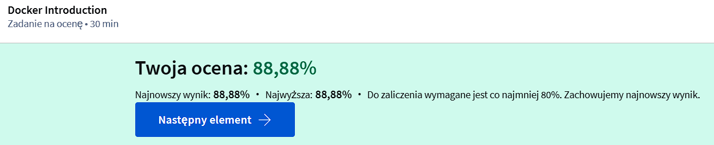
---

# Moduł 2

## Podstawowe komendy Dockera:

docker run [image]
- Uruchamia kontener z obrazu.
- Jeśli obraz nie istnieje lokalnie, zostanie pobrany z Docker Hub.

docker ps
- Wyświetla listę działających kontenerów.
- Opcja -a pokazuje także kontenery zatrzymane.

docker stop [container_id/nazwa]
- Zatrzymuje działający kontener.

docker rm [container_id/nazwa]
- Usuwa zatrzymany kontener.

docker images
- Wyświetla listę dostępnych obrazów Dockera.

docker rmi [image]
- Usuwa nieużywane obrazy (wymaga wcześniejszego zatrzymania powiązanych kontenerów).

docker pull [image]
- Pobiera obraz bez uruchamiania kontenera.

docker exec [container_id/nazwa] [komenda]
- Uruchamia komendę w działającym kontenerze.

docker run -d [image]
- Uruchamia kontener w tle (tryb detached).

docker attach [container_id/nazwa]
- Przyłącza się do działającego kontenera.

## Ważne informacje:
- Kontenery są przeznaczone do uruchamiania procesów, np. serwera WWW, bazy danych, analizy danych.
- Kontener działa tylko tak długo, jak aktywny jest proces w nim uruchomiony.
- Obraz Ubuntu to baza systemowa, bez uruchomionych procesów – kontener zatrzymuje się od razu po starcie.
- Można uruchomić proces w kontenerze, np. docker run ubuntu sleep 5.

### Tryby pracy kontenera:
- Foreground (attached): Kontener działa na pierwszym planie, widzisz jego logi, ale nie możesz używać terminala.
- Detached (-d): Kontener działa w tle, można do niego wrócić za pomocą docker attach.

## Polecenia w docker:

Instalacja i uruchamianie kontenerów:
- Polecenie docker run służy do uruchamiania kontenerów z obrazów. Przykład: `docker run centos`

  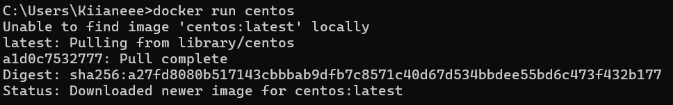

Docker Hub:
- Oficjalne obrazy można znaleźć na Docker Hub w sekcji "Explore".
- Własne obrazy wymagają formatu: użytkownik/nazwa_repozytorium.

Polecenia w kontenerze:
- Aby utrzymać kontener aktywny, należy uruchomić w nim proces, np. `docker run -it centos bash` loguje użytkownika do kontenera CentOS.
- W kontenerze można sprawdzić system operacyjny poleceniem `cat /etc/*release*`

   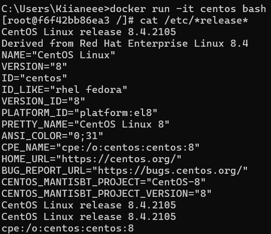

Zarządzanie kontenerami:
- `docker ps` wyświetla działające kontenery.
- `docker ps -a` pokazuje wszystkie kontenery (działające i zatrzymane).
- Kontener można zatrzymać poleceniem `docker stop [ID kontenera]`

  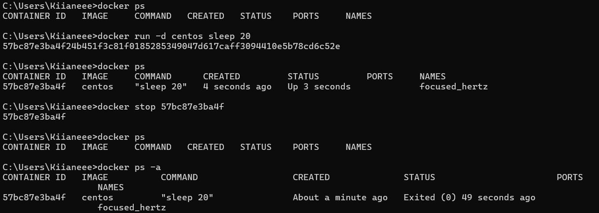

Czyszczenie kontenerów:
- Zatrzymane kontenery można usunąć poleceniem `docker rm [ID kontenera]`
- Usuwanie wielu kontenerów: `docker rm [ID1] [ID2]`

Obrazy Docker:
- `docker images` pokazuje pobrane obrazy.
- Usuwanie obrazów: `docker rmi [nazwa obrazu lub ID]`

---

[Test - Basic commands na stronie kodekloud](https://kodekloud.com/pages/free-labs/docker/docker-basic-commands)
Pytania i odpowiedzi
1. What is the version of Docker Server Engine running on the Host?
> `docker version`
> 25.0.5
2. How many containers are running on this host?
> `docker ps`
> 0
3. How many images are available on this host?
> `docker images`
> 9
4. Run a container using the redis image
`docker run redis`
5. Stop the container you just created
> ctrl+C
6. How many containers are RUNNING on this host now?
> `docker ps`
> 0
7. How many containers are RUNNING on this host now?
> `docker ps`
> 4
8. How many containers are PRESENT on the host now?
Including both Running and Not Running ones
> `docker ps -a`
> 6
9. What is the image used to run the nginx-1 container?
> ngix:alpine
10. What is the name of the container created using the ubuntu image?
> anesnonwe_nothcut
11. What is the ID of the container that uses the alpine image and is not running?
> df5b18695ac8
12. What is the state of the stopped alpine container?
> EXITED
13. Delete all containers from the Docker Host.
Both Running and Not Running ones. Remember you may have to stop containers before deleting them.
> `docker rm $(docker ps -aq)`
14. Delete the ubuntu Image.
> `docker rmi ubuntu`
15. You are required to pull a docker image which will be used to run a container later. Pull the image nginx:1.14-alpine
Only pull the image, do not create a container. 
> docker pull nginx:1.14-alpine
16. Run a container with the nginx:1.14-alpine image and name it webapp
> `docker run --name webapp -d nginx:1.14-alpine`
17. Cleanup: Delete all images on the host
Remove containers as necessary
> `docker rmi $(docker images -q) -f`

Screen z ukończenia:


---

## Test nr 2 - Docker comands

1.Which Docker command is used to list all running containers?
- [ ] docker view
- [ ] docker show
- [x] docker ps
- [ ] docker list

2.What is the role of the 'docker pull' command?
- [ ] To build a Dockerfile
- [x] To download a Docker image from a registry
- [ ] To list all running Docker containers
- [ ] To remove a Docker container

3.Which of the following Docker commands require an image name or ID?
- [x] docker exec
- [x] docker pull
- [x] docker stop
- [x] docker run
- [ ] docker ps
- [x] docker rmi

4.What Docker command is used to stop a running container? Please answer in all lowercase.

> docker stop

5.Which command would you use to run a command inside a running Docker container?
docker exec
- [ ] docker push
- [ ] docker stop
- [ ] docker rm

6.Which of the following Docker commands can be used for managing Docker images?
- [ ] docker stop
- [x] docker images
- [x] docker pull
- [ ] docker ps
- [x] docker rmi
- [ ] docker exec

7.Which of the following Docker commands are related to managing containers?
- [x] docker run
- [x] docker stop
- [x] docker ps
- [ ] docker build

8.What does the 'docker run' command do?
- [ ] It builds a Docker image from a Dockerfile
- [x] It runs a Docker container from an image
- [ ] It lists all running Docker containers
- [ ] It stops a running Docker container

9.What is the Docker command to remove a Docker container?

> docker rm

10.What does the 'docker rm' command do?
- [ ] Lists all Docker containers
- [ ] Stops a running Docker container
- [x] Removes a Docker container
- [ ] Removes a Docker image

### Wynik:
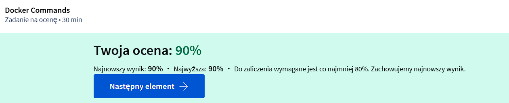
---

# Moduł 3 

## Najważniejsze informacje o poleceniach Docker poznane z 3 modułu:

Uruchamianie kontenera z konkretną wersją obrazu:
- Domyślnie docker run uruchamia najnowszą wersję obrazu (latest tag).
- Aby uruchomić inną wersję, należy użyć tagu np. `docker run redis:4.0`

Interaktywne uruchamianie aplikacji:
- `-i` do trybu interaktywnego (wprowadzenia danych)
- `-t` do połączenia z terminalem

Mapowanie portów kontenera:
- Kontenery mają przypisane wewnętrzne IP, ale jest ono dostępne tylko na Docker host.
- `-p` służy do mapowania portów np. `docker run -p 80:5000`, aby użytkownicy mieli dostęp przez port 80 Docker host.
- Można uruchomić wiele aplikacji, mapując różne porty np. MySQL na 3306 i 8306.

Przechowywanie danych:
- Dane w kontenerze są usuwane po jego usunięciu.
- `-v` służy do mapowania folderu hosta z folderem w kontenerze, np. `/opt/datadir:/var/lib/mysql`

Szczegóły kontenera:
- `docker inspect` - szczegóły kontenera w formacie JSON.

Wyświetlanie logów:
- Aby zobaczyć logi kontenera uruchomionego w trybie detached - `docker logs <ID_kontenera>`

### Najważniejsze opcje w skrócie:
- `-i` - Tryb interaktywny (wejście standardowe).
- `-t` - Pseudo-terminal (obsługa terminala).
- `-p` - Mapowanie portów kontenera na hosta.
- `-v` - Mapowanie wolumenów dla trwałości danych.
- `docker logs` - Podgląd logów kontenera.
- `docker inspect` - Szczegóły kontenera (JSON)

[Docker Run Commands na kodekloud](https://kodekloud.com/pages/free-labs/docker/docker-run)

Let us first inspect the environment. How many containers are running on this host? > docker ps -> 1
What is the image used by the container? > nginx:alpine
How many ports are published on this container? > 2
Which of the below ports are the exposed on the CONTAINER? > 3456 & 80
Which of the below ports are published on Host? > 38080 & 3456
Run an instance of kodekloud/simple-webapp with a tag blue and map port 8080 on the container to 38282 on the host. 
> docker run -d -p 38282:8080 kodekloud/simple-webapp:blue

---
## Test 3 - Docker Run

1.Which of the following are reasons why it's important to map volumes for data persistence in Docker containers?
- [x] Volumes can be used to store sensitive data outside of the container
- [x] Volumes persist data even when the container is deleted
- [x] Volumes allow data to be shared between containers
- [ ] Mapped volumes can improve the speed of the Docker container

2.What command is used to view the logs of a Docker container?
Please answer in all lowercase.

> docker logs

3.Which command allows you to run a Docker container in the detached mode?
- [ ] All of the above
- [ ] docker run imagename -d
- [x] docker run -d imagename
- [ ] docker run --detach imagename

4.Which of the following options are TRUE regarding data persistence in Docker?
- [ ] Data persistence is irrelevant for Docker containers.
- [x] Volumes are used in Docker to persist data.
- [x] Data in a Docker container is lost when the container is removed.
- [x] Data in a Docker container can be accessed even after the container is stopped.

5.Which of the following commands are used to manage Docker containers?
- [x] docker stop
- [x] docker start
- [x] docker restart
- [ ] docker delete

6.Which command would you use to run a Docker container with a specific image tag?
- [x] docker run imagename:tag
- [ ] docker start imagename:tag
- [ ] docker run imagename -tag
- [ ] docker run -t imagename:tag

7.What is the result of running the 'docker run' command without specifying an image tag?
- [ ] Docker will throw an error
- [ ] Docker will run the container with a random tag
- [x] Docker will run the container with the 'latest' tag
- [ ] Docker will prompt you to enter a tag

8.If you want to run a Docker container with a specific command, which of the following options should be used with the 'docker run' command?
- [x] --command
- [ ] --execute
- [ ] --cmd
- [ ] --operation

9.If you want to check the logs of a running Docker container, what command would you use?
Please answer in all lowercase.

> docker logs

10.What is the purpose of the '-d' option in the 'docker run' command?
- [ ] To delete the Docker container after it's stopped.
- [x] To run the Docker container in the background.
- [ ] To display debugging information.
- [ ] To delay the start of the Docker container.

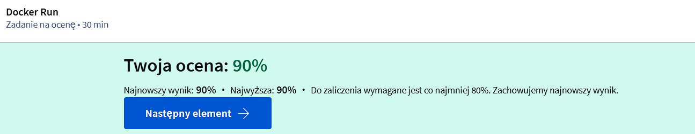

---
# Moduł 4 - Docker Images

### Dlaczego tworzy się własny obraz Docker?
- Brak komponentu/usługi na Docker Hub.
- Aplikacja wymaga konteneryzacji dla łatwego wdrażania.

### Proces konteneryzacji aplikacji:
- Przygotowanie aplikacji: Zrozumienie, jakie kroki ręczne są potrzebne do uruchomienia aplikacji (np. instalacja systemu, zależności, kopiowanie kodu, uruchamianie serwera).
- Tworzenie Dockerfile - zawiera instrukcje dla Dockera, np.:
  - FROM: wybór bazowego obrazu np. `FROM ubuntu` systemu Ubuntu
  - RUN: instalacja zależności np. `RUN apt-get update && apt-get install -y python3 python3-pip` aktualizuje listę pakietów i instaluje Python 3 oraz pip w systemie
  - COPY: kopiuje pliki lub katalogi z lokalnego systemu (hosta) do środka obrazu Docker. Pozwala to na przeniesienie kodu źródłowego lub innych potrzebnych plików do kontenera np. `COPY app.py /opt/app.py`
  - EXPOSE: informuje, które porty w kontenerze mają być udostępnione na zewnątrz np. `EXPOSE 8080` oznacza, że kontener będzie nasłuchiwał na porcie 8080
  - WORKDIR: ustawia katalog roboczy w kontenerze, w którym będą wykonywane kolejne instrukcje w Dockerfile np. `WORKDIR /opt`
  - ENTRYPOINT: polecenie uruchamiające aplikację np. `ENTRYPOINT ["python3", "/opt/app.py"]` uruchamia skrypt app.py przy pomocy Python 3, gdy kontener zostanie uruchomiony.
- Budowanie obrazu - Użycie docker build z podaniem Dockerfile i tagu.
- Optymalizacja obrazu Docker:
  - Obrazy są budowane warstwowo. Każda instrukcja tworzy nową warstwę.
  - Warstwy są przechowywane w pamięci podręcznej, co przyspiesza budowanie, gdy zmiany dotyczą tylko wybranych warstw.
- Udostępnianie obrazu - Wypchnięcie na Docker Hub za pomocą docker push.

Kluczowe komendy:
- `docker build` - budowanie obrazu
- `docker push` - wysyłanie obrazu na Docker Hub
- `docker history` - podgląd warstw obrazu

---
[Hands-on Lab: Docker Images](https://kodekloud.com/pages/free-labs/docker/docker-images)

Pytania i odpowiedzi:

1. How many images are available on this host?
> `docker images`
> 9
2. What is the size of the ubuntu image?
> 78MB
3. We just pulled a new image. What is the tag on the newly pulled NGINX image?
> 1.14-alpine
4. We just downloaded the code of an application. What is the base image used in the Dockerfile?
Inspect the Dockerfile in the webapp-color directory.
> `cd webapp-color`
> `cat Dockerfile`
> python:3.6
5. To what location within the container is the application code copied to during a Docker build?
Inspect the Dockerfile in the webapp-color directory.
> /opt
6. When a container is created using the image built with this Dockerfile, what is the command used to RUN the application inside it.
Inspect the Dockerfile in the webapp-color directory.
> python app.py
7. What port is the web application run within the container?
Inspect the Dockerfile in the webapp-color directory.
> 8080
8. Build a docker image using the Dockerfile and name it webapp-color. No tag to be specified.
> `docker build -t webapp-color .`
9. Run an instance of the image webapp-color and publish port 8080 on the container to 8282 on the host.
> `docker run -d -p 8282:8080 --name webapp-instance webapp-color`
10. Access the application by clicking on the tab named HOST:8282 above your terminal.
After you are done, you may stop the running container by hitting CTRL + C if you wish to.
> Hello from 06f00e75f01a!
11. What is the base Operating System used by the python:3.6 image?
If required, run an instance of the image to figure it out.
> `docker run -it python:3.6 /bin/bash`
> `cat /etc/os-release`
> debian
12. What is the approximate size of the webapp-color image?
> `docker images`
> 920MB
13. That's really BIG for a Docker Image. Docker images are supposed to be small and light weight. Let us try to trim it down.
> OK
14. Build a new smaller docker image by modifying the same Dockerfile and name it webapp-color and tag it lite.
Hint: Find a smaller base image for python:3.6. Make sure the final image is less than 150MB.
> `nano Dockerfile`
> edycja na `FROM python:3.6-alpine`
> `docker build -t webapp-color:lite .`
15. Run an instance of the new image webapp-color:lite and publish port 8080 on the container to 8383 on the host.
> `docker run -d -p 8383:8080 --name webapp-light webapp-color:lite`

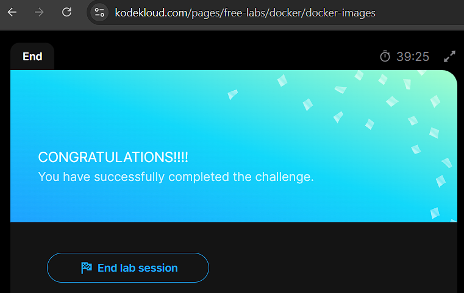
---

### Konfiguracja zmiennych środowiskowych w Dockerze:
- Dobra praktyka: Przeniesienie zmiennych (np. kolor tła) z kodu aplikacji do zmiennych środowiskowych (np. APP_COLOR).
- Uruchamianie z Dockerem: Ustawienie zmiennych środowiskowych podczas uruchamiania kontenera za pomocą opcji `-e`.
- Podgląd zmiennych środowiskowych: polecenie `docker inspect`, aby sprawdzić właściwości kontenera i zmienne w sekcji Config.

---
[Hands-on Lab: Environment Variables](https://kodekloud.com/pages/free-labs/docker/docker-env-vars)

Pytania i odpowiedzi:

1. Inspect the environment variables set on the running container and identify the value set to the APP_COLOR variable.
> docker ps
> docker inspect elastic_galileo
> pink
2. Run a container named blue-app using image kodekloud/simple-webapp and set the environment variable APP_COLOR to blue. Make the application available on port 38282 on the host. The application listens on port 8080.
> docker run -d --name blue-app -e APP_COLOR=blue -p 38282:8080 kodekloud/simple-webapp
3. View the application by clicking the link HOST:38282 above your terminal and ensure it has the right color.
> Hello from 99e305b0be7f!

4. Deploy a mysql database using the mysql image and name it mysql-db.
Set the database password to use db_pass123. Lookup the mysql image on Docker Hub and identify the correct environment variable to use for setting the root password.
> docker run -d --name mysql-db -e MYSQL_ROOT_PASSWORD=db_pass123 mysql
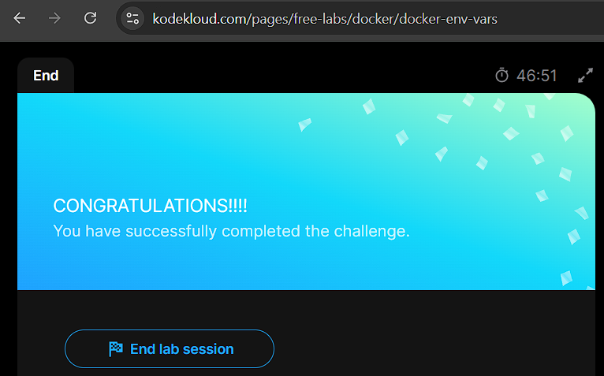
---

### CMD, argumenty i Entry Point w Dockerze:
- Procesy w kontenerach: Kontenery wykonują pojedyncze zadania/procesy i kończą się po zakończeniu tego procesu.
- Instrukcja CMD: Definiuje domyślny proces uruchamiany w kontenerze (np. nginx dla obrazu NGINX).
- Zmienianie procesu: Można nadpisać domyślny proces, dodając polecenie po docker run (np. docker run ubuntu sleep 5).
- Entry Point: Działa podobnie do CMD, ale parametry z linii poleceń są dołączane do instrukcji Entry Point np. `ENTRYPOINT ["sleep"]` + `docker run ubuntu_sleeper 10` uruchamia sleep 10.
- Łączenie CMD i Entry Point: CMD definiuje domyślne parametry, które mogą zostać nadpisane w linii poleceń (np. sleep 5).
- Zmiana Entry Point podczas uruchamiania: Użyj opcji --entrypoint w docker run, aby nadpisać domyślny Entry Point.

---
[Hands-on Lab: Command vs Entrypoint](https://kodekloud.com/pages/free-labs/docker/docker-cmd-entrypoint)

Pytania i odpowiedzi:
1. Dockerfiles for a few commonly used Docker Images are given in the /root (current) directory. Inspect them and try to answer the following questions.
> Ok
2. What is the ENTRYPOINT configured on the mysql image?
> `docker inspect mysql`
> docker-entrypoint.sh
3. What is the CMD configured on the wordpress image?
> `cat Dockerfile-wordpress | grep "CMD"`
> apache2-foreground
4. What is the final command run at startup when the wordpress image is run. Consider both ENTRYPOINT and CMD instructions
> docker-entrypoint.sh apache2-foreground
5. What is the command run at startup when the ubuntu image is run?
> `cat Dockerfile-ubuntu | grep "CMD"`
> bash
6. Run an instance of the ubuntu image to run the sleep 1000 command at startup.
Run it in detached mode.
> docker run -d --name ubuntu-instance ubuntu sleep 1000
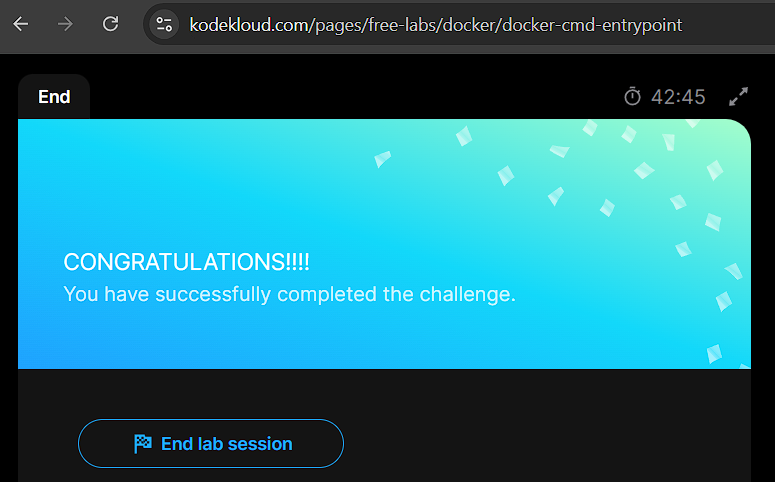
---
## Test nr 4 - Docker Images

1.What steps are involved in deploying a Docker container from a custom Docker image?
- [x] Build the Docker image from the Dockerfile
- [ ] Write a Dockerfile
- [x] Tag the Docker image with the account name
- [ ] Push the Docker image to Docker Hub
- [x] Run the Docker container from the Docker image

2.Which of the following statements about Docker images and Docker containers are true?
- [ ] A Docker container contains an operating system
- [x] A Docker image is a lightweight, standalone executable package
- [ ] Docker containers can be built from Dockerfiles
- [x] Docker images can be built from Dockerfiles
- [x] A Docker container is a running instance of a Docker image

3.What is the Dockerfile used for in Docker?
- [ ] To run Docker containers
- [ ] To start and stop Docker containers
- [ ] To push Docker images to Docker Hub
- [x] To build custom Docker images

4.How can we modify the behavior of a Docker container?
- [x] By using environment variables
- [ ] By running the container with different arguments
- [ ] By modifying the Docker image
- [ ] By changing the Dockerfile

5.What is the purpose of setting environment variables in a Docker container?
- [ ] To change the default command of a Docker image
- [x] To configure runtime behavior of the container
- [ ] To set the Docker image version
- [ ] To store persistent data

6.Why is it important to tag a Docker image with an account name before pushing it to Docker Hub?
- [ ] To verify the authenticity of the image
- [x] To ensure the image is stored under the right account on Docker Hub
- [ ] To make the image publicly available
- [ ] To provide a version number for the image

7.Which of the following are valid reasons for creating custom Docker images?
- [ ] To run Docker containers
- [x] To create a reproducible environment
- [x] To include application-specific configuration
- [x] To pre-install software dependencies
- [ ] To push images to Docker Hub

8.What happens when you try to run a Docker container from an image that isn't available locally?
- [ ] Docker will build the image from a Dockerfile
- [ ] Docker will create a new Dockerfile
- [x] Docker will automatically pull the image from Docker Hub
- [ ] Docker will return an error message

9.What command is used to run a Docker container from an image? Please answer in all lowercase.
> docker build

10.What command is used to build a Docker image from a Dockerfile?
> docker run

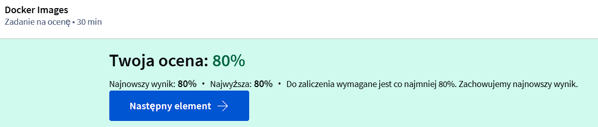
---
# Moduł 5 - Docker Compose

### Wprowadzenie do Docker Compose:
- Docker Compose pozwala na łatwe zarządzanie aplikacjami składającymi się z wielu kontenerów. 
- Tworzy się plik konfiguracyjny docker-compose.yml w formacie YAML, w którym definiowane są różne usługi oraz opcje ich uruchamiania. 
- Następnie, za pomocą komendy docker-compose up, uruchamiany jest cały stos aplikacji. 
- Docker Compose jest szczególnie przydatny w przypadku aplikacji wymagających wielu usług, jak baza danych czy aplikacje frontendowe i backendowe.
- Ułatwia zarządzanie, uruchamianie i modyfikowanie aplikacji dzięki przechowywaniu konfiguracji w jednym pliku.

### Przykładowa aplikacja
W przykładzie aplikacji głosowania, składającej się z kilku komponentów (Redis, PostgreSQL, aplikacje frontendowe i backendowe), kontenery są uruchamiane za pomocą komendy docker run. Jednak, aby połączyć je ze sobą, używamy opcji "link", która umożliwia komunikację między kontenerami. W nowoczesnym Docker Compose wersji 2 i 3, linki zostały zastąpione automatycznym tworzeniem sieci, co upraszcza konfigurację.

Wersja 1 Docker Compose miała ograniczenia, takie jak brak możliwości definiowania kolejności uruchamiania kontenerów. 
W wersji 2 i 3, dodano opcje takie jak depends_on, które pozwalały na określenie zależności między usługami. 
W wersji 3 dodano wsparcie dla Docker Swarm.

Przykład architektury aplikacji w Docker Compose pokazuje, jak można rozdzielić ruch użytkowników i wewnętrzny ruch aplikacji przy użyciu sieci front-end i back-end.

Kluczowe komendy:
- `docker-compose up` - uruchamia aplikację zdefiniowaną w pliku docker-compose.yml.
- `docker-compose build` - buduje obrazy z aplikacji, jeśli nie są dostępne w rejestrze.

Aplikacja głosowania (Voting App) jest dostępna na GitHubie w repozytorium Docker samples. Aplikacja składa się z kilku komponentów:

### Voting App w Pythonie, używający Flask.
- Redis jako system komunikacji.
- Worker w .NET, który przetwarza głosy i zapisuje je do bazy danych Postgres.
- Result App w Node.js, wyświetlający wyniki głosowania.

Rozkład aplikacji:
- Głosowanie przesyłane do Redis.
- Worker przetwarza głos i zapisuje do Postgres.
- Wyniki wyświetlane na stronie internetowej (Result App).

Dockerfile:
- Aplikacje są pakowane do obrazów Docker.
- Voting App korzysta z obrazu Pythona 2.7.
- Worker używa obrazu Microsoft.NET SDK.
- Result App używa obrazu Node.js.

Uruchamianie aplikacji:
- Najpierw należy uruchomić Redis i PostgreSQL.
- Następnie budowane są obrazy dla Voting App, Worker i Result App.
- Aplikacja jest uruchamiana za pomocą docker run, łącząc kontenery z odpowiednimi usługami (Redis, Postgres).

Docker Compose:
- Docker Compose pozwala na uruchomienie wszystkich usług w jednym pliku konfiguracyjnym.
- Tworzymy plik docker-compose.yml z definicjami usług, portów i połączeń (linków).
- Po zapisaniu pliku uruchamiamy wszystko jednym poleceniem docker-compose up, co tworzy kontenery i uruchamia aplikację.

---

[Hands-on Lab: Docker Compose](https://kodekloud.com/pages/free-labs/docker/docker-compose)

Pytania i odpowiedzi:

1. First create a redis database container called redis, image redis:alpine.
if you are unsure, check the hints section for the exact commands.
> `docker run -d --name redis redis:alpine`
2. Next, create a simple container called clickcounter with the image kodekloud/click-counter, link it to the redis container that we created in the previous task and then expose it on the host port 8085
The clickcounter app run on port 5000.
if you are unsure, check the hints section for the exact commands.
> `docker run -d --name clickcounter --link redis -p 8085:5000 kodekloud/click-counter`
3. You can now access this application using the Click-Counter tab above the terminal.
Refresh the page and see the count increase.
> CLICK COUNTER! Refresh to see the count increase! CLICK COUNT: 3
4. Let's clean up the actions carried out in previous steps. Delete the redis and the clickcounter containers.
> `docker stop fa0a5a7d4410`
> `docker stop 8c8c37c21283`
> `docker rm fa0a5a7d4410`
> `docker rm 8c8c37c21283`
5. Create a docker-compose.yml file under the directory /root/clickcounter. Once done, run docker-compose up.
The compose file should have the exact specification as follows -
redis service specification - Image name should be redis:alpine.
clickcounter service specification - Image name should be kodekloud/click-counter, app is run on port 5000 and expose it on the host port 8085 in the compose file.
> `cd /root/clickcounter`
> `nano docker-compose.yml`
docker-compose.yml:
```bash
services:
  redis:
    image: redis:alpine

  clickcounter:
    image: kodekloud/click-counter
    ports:
      - '8085:5000'
```
> `docker-compose up`

---
## Test nr 5 - Docker Compose

1. What is the role of the 'depends_on' key in a Docker Compose file?
- [ ] Specifies the image to use for the service
- [x] Defines the order of service startup
- [ ] Sets environment variables for the service
- [ ] Specifies the ports to expose

2.If you encounter a network issue while deploying an application with Docker, what could be a plausible solution?
- [x] Restart the Docker service
- [ ] Upgrade the Docker-compose file
- [ ] Change the Docker version
- [ ] Delete and recreate the Docker network

3.When deploying the Example Voting App using Docker, which components need to be set up and connected?
- [x] Voting App
- [x] Result App
- [x] Redis
- [x] Worker Service
- [x] Postgres

4.What is the major benefit of upgrading a docker-compose file from version1 to version3?
Please answer in all lowercase.
compatible with swarm


5.Which of the following commands is used to run Docker Compose?
- [ ] docker compose start
- [ ] docker compose execute
- [ ] docker compose run
- [x] docker compose up

6.Which of the following are possible issues you might face while deploying the Example Voting App using Docker?
- [x] Redis connectivity issues
- [x] Database initialization errors
- [x] Network connectivity issues
- [ ] Docker version incompatibility

7.What command would you use to run a docker-compose file?
Please answer in all lowercase.

docker compose up

8.Which of the following features are unique to Docker Compose version3?
- [ ] Introduced versioning
- [ ] Support for 'volumes' key
- [x] Support for 'depends_on' key?
- [ ] Ability to define networks
- [x] Support for 'deploy' key

9.What are the differences between Docker Compose file versions?
- [ ] Syntax differences
- [ ] All of these
- [ ] Different ways of defining services
- [x] Different supported features

10.If the Result App is unable to connect to Redis, what might be the possible reason?
Please answer in all lowercase.
incorrect host or port


---

# Moduł 6 - Docker Engine and Storage

## Docker Engine najważniejsze informacje:
- Docker Engine to host z zainstalowanym Dockerem. Instalacja na systemie Linux obejmuje trzy składniki:
  - Docker Daemon – zarządza obrazami, kontenerami, woluminami, sieciami.
  - Rest API server – interfejs API do komunikacji z demonem.
  - Docker CLI – interfejs wiersza poleceń do zarządzania Dockerem.
- Namespaces: Docker używa przestrzeni nazw do izolacji kontenerów (procesy, sieci, komunikacja między procesami, itp.). Przykładem jest izolacja identyfikatorów procesów (PID) – każdy kontener ma własny numer PID 1, chociaż procesy działają na tym samym hoście.
- Cgroups (control groups): Docker używa cgroups do ograniczania zasobów CPU i pamięci, które może wykorzystać kontener. Można ustawić limity np. --memory 100m, aby kontener używał maksymalnie 100 MB pamięci.

## Docker – Zarządzanie danymi i systemem plików:
- Przechowywanie danych: Docker przechowuje dane w folderze /var/lib/docker w podkatalogach jak aufs, containers, images, volumes. Tam przechowywane są obrazy i kontenery.
- Architektura warstwowa obrazów: Obrazy Docker są tworzone w architekturze warstwowej. Każda instrukcja w Dockerfile tworzy nową warstwę, np. instalacja pakietów, kopiowanie plików. Docker wykorzystuje pamięć podręczną, aby przyspieszyć budowanie obrazów, ponownie używając tych samych warstw, jeśli są identyczne.
- Kontenery i warstwa zapisu: Po uruchomieniu kontenera na obrazie, Docker tworzy warstwę zapisu, która pozwala na zapis danych (np. plików dzienników) w kontenerze. Po zniszczeniu kontenera ta warstwa zostaje usunięta.
- Persistentne dane: Aby zachować dane (np. bazy danych), używa się woluminów. Można je tworzyć za pomocą docker volume create i montować je do kontenerów, zapewniając trwałość danych.
- Rodzaje montowania: Istnieją dwa główne typy montowania:
  - Woluminy: Montowanie folderu z katalogu var/lib/docker/volumes.
  - Bind mount: Montowanie dowolnego folderu na hoście do kontenera.
- Storage Drivers: Docker używa różnych sterowników magazynowania do obsługi warstwowej architektury. W zależności od systemu operacyjnego, np. w Ubuntu domyślny sterownik to aufs, a w CentOS może to być device mapper. Wybór sterownika wpływa na wydajność i stabilność.

---

[Hands-on Lab: Docker Storage](https://kodekloud.com/pages/free-labs/docker/docker-storage)

Pytania i odpowiedzi:

1. What location are the files related to the docker containers and images stored?
> /var/lib/docker
2. What directory under /var/lib/docker are the files related to the container alpine-3 image stored?
> `docker ps -a`
> 2ef34b1c79d0
3. Run a mysql container named mysql-db using the mysql image. Set database password to db_pass123
Note: Remember to run it in the detached mode.
> `docker run -d --name mysql-db -e MYSQL_ROOT_PASSWORD=db_pass123 mysql`
4. We have just written some data into the database. To view the information we wrote, run the get-data.sh script available in the /root directory. How many customers data have been written to the database?
Command: sh get-data.sh
> `sh get-data.sh`
> 30
5. The database crashed. Are you able to view the data now?
Use the same command to try and view data. Try to find the container.
> NO
6. Damn! We didn't plan that well at all. Let's try again!!
> Ok
7. Run a mysql container again, but this time map a volume to the container so that the data stored by the container is stored at /opt/data on the host.
Use the same name : mysql-db and same password: db_pass123 as before. Mysql stores data at /var/lib/mysql inside the container.
> docker run -d --name mysql-db -e MYSQL_ROOT_PASSWORD=db_pass123 -v /opt/data:/var/lib/mysql mysql
8. We have now re-written data again. Run the get-data.sh script to ensure data is present.
Command: sh get-data.sh
> Ok
9. Disaster strikes.. again! And the database crashed again. But this time we have the data stored at /opt/data directory. Re-deploy a new mysql instance using the same options as before.
Just run the same command as before. Here it is for your convenience: docker run -v /opt/data:/var/lib/mysql -d --name mysql-db -e MYSQL_ROOT_PASSWORD=db_pass123 mysql
> docker run -v /opt/data:/var/lib/mysql -d --name mysql-db -e MYSQL_ROOT_PASSWORD=db_pass123 mysql
10. Fetch data and make sure it is present.
> sh get-data.sh

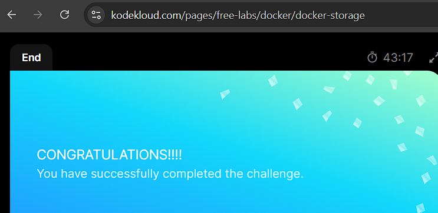

---

## Test nr. 6 - Docker Engine and Storage

1. Which component of Docker is responsible for resource management?
- [x] C groups
- [ ] Namespaces
- [ ] Layered architecture
- [ ] Storage drivers

2.What are the responsibilities of Docker's namespaces?
- [ ] Handle layered file systems
- [ ] Manage resource allocation
- [x] Provide isolation between containers
- [x] Ensure security and privacy

3.If an image has 7 layers and a container based on that image adds 3 more layers, how many layers does the container have in total?

> 10

4.What does Docker use to manage resources such as CPU and memory?
Please answer in all lowercase.

> cgroups

5.Why does Docker use a layered architecture?
- [x] To facilitate sharing and modifying
- [ ] To ensure isolation
- [ ] To enhance performance
- [ ] To increase security

6.If a Docker storage driver is responsible for handling the details of the union file system, what does it imply?
- [ ] It manages the network interfaces
- [x] It handles the layered structures and file systems
- [ ] It deals with the user permissions
- [ ] It controls the CPU usage

7.What is the role of storage drivers in Docker's layered architecture?
- [x] They enable the layered architecture.
- [ ] They provide network connectivity.
- [ ] They isolate containers from each other.
- [ ] They manage resources.

8.If an image is made up of 5 layers, and a container based on that image adds2 more layers, how many layers does the container have in total?

> 7

9.What does Docker use for isolation?
Please answer in all lowercase.

> namespaces

10.Which of the following are components of Docker engine architecture?
- [x] Docker CLI
- [ ] C groups
- [ ] Namespaces
- [x] Docker Daemon
- [ ] Repository

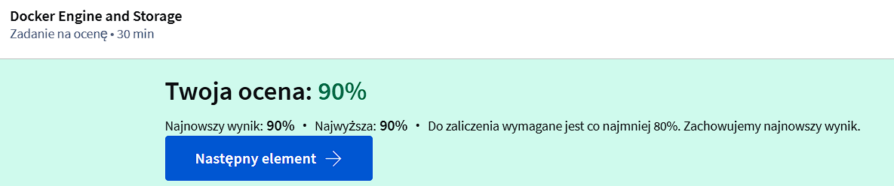

---

# Moduł 7 - Networking and Registry

## Sieci w Dockerze:
- Domyślne sieci w Dockerze: Podczas instalacji Dockera automatycznie tworzonych jest 3 sieci: bridge, null i host.
  - Bridge: Domyślna sieć prywatna dla kontenerów, które uzyskują wewnętrzny adres IP (np. z zakresu 172.17.x.x).
  - Host: Łączy kontenery bezpośrednio z siecią hosta, eliminując izolację sieciową.
  - Null: Kontenery nie są połączone z żadną siecią, brak dostępu do innych kontenerów i sieci zewnętrznej.
- Tworzenie własnych sieci: Można tworzyć izolowane sieci wewnętrzne za pomocą polecenia docker network create, określając sterownik (np. bridge) i podsieć.
- Komunikacja między kontenerami:
  - Kontenery w tej samej sieci mogą się komunikować za pomocą adresów IP.
  - Zaleca się używanie nazw kontenerów zamiast IP, ponieważ Docker posiada wbudowany serwer DNS (127.0.0.11), który rozwiązuje nazwy kontenerów.
  - Izolacja kontenerów: Docker wykorzystuje network namespaces do tworzenia oddzielnych przestrzeni nazw dla każdego kontenera, a virtual ethernet pairs umożliwiają łączenie kontenerów.
- Inspekcja sieci kontenera: Polecenie docker inspect pozwala zobaczyć szczegóły sieci (typ, IP, MAC adres itp.) przypisane do kontenera.

---

[Hands-on Lab: Docker Networking](https://kodekloud.com/pages/free-labs/docker/docker-network)

Pytania i odpowiedzi:

1. Explore the current setup and identify the number of networks that exist on this system.
> `docker network ls`
> 3
2. What is the ID associated with the bridge network?
> 6ff7cadef522
3. We just ran a container named alpine-1. Identify the network it is attached to.
> `docker inspect alpine-1`
> host
4. What is the subnet configured on bridge network?
> `docker inspect 6ff7cadef522`
> 172.12.0.0/24
5. Run a container named alpine-2 using the alpine image and attach it to the none network.
> `docker run -d --name alpine-2 --network none alpine`
6. Create a new network named wp-mysql-network using the bridge driver. Allocate subnet 182.18.0.0/24. Configure Gateway 182.18.0.1
> `docker network create --driver bridge --subnet 182.18.0.0/24 --gateway 182.18.0.1 wp-mysql-network`
7. Deploy a mysql database using the mysql:5.6 image and name it mysql-db. Attach it to the newly created network wp-mysql-network
Set the database password to use db_pass123. The environment variable to set is MYSQL_ROOT_PASSWORD.
> `docker run -d --name mysql-db -e MYSQL_ROOT_PASSWORD=db_pass123 --network wp-mysql-network mysql:5.6`
8. Deploy a web application named webapp using the kodekloud/simple-webapp-mysql image. Expose the port to 38080 on the host.
The application makes use of two environment variable:
1: DB_Host with the value mysql-db.
2: DB_Password with the value db_pass123.
Make sure to attach it to the newly created network called wp-mysql-network.
Also make sure to link the MySQL and the webapp container.
> `docker run -d --name webapp -e DB_Host=mysql-db -e DB_Password=db_pass123 --network wp-mysql-network -p 38080:8080 kodekloud/simple-webapp-mysql`
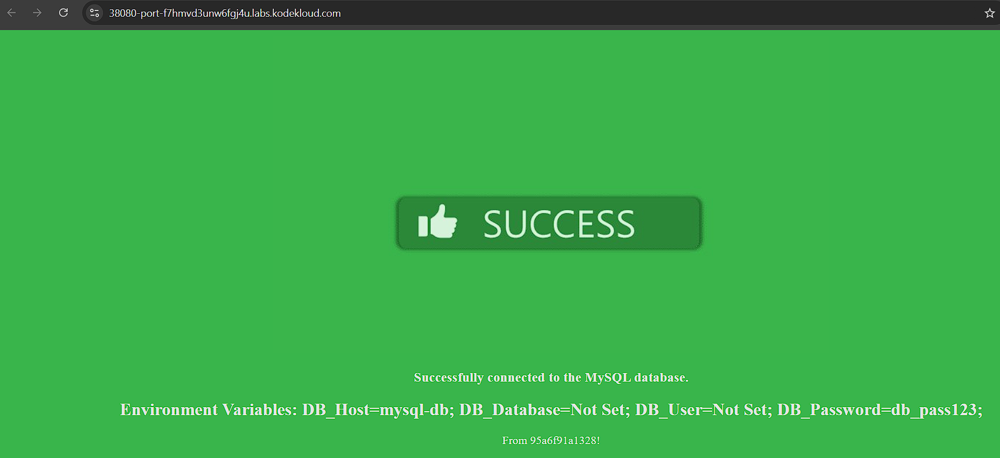
9. If you are successfull, you should be able to view the application by clicking on the HOST:38080 at the top of your terminal. You should see a green success message.
> Ok
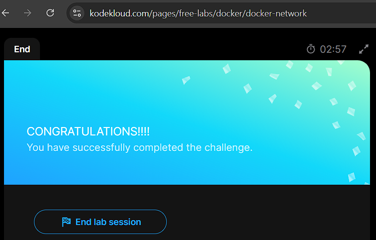
---

## Rejestry Dockera:
- Rejestr Docker to centralne repozytorium obrazów Dockerowych, w tym oficjalny rejestr Docker Hub (docker.io).
- Obrazy mogą być publiczne (np. library/nginx) lub prywatne.
- Tworzenie własnych obrazów: Obrazy można tworzyć i wysyłać do rejestrów za pomocą poleceń: `docker image tag` i `docker push`.
- Rejestry prywatne:
  - Możliwość hostowania prywatnych rejestrów lokalnie lub w chmurze (AWS, Azure, GCP).
  - Rejestr Dockerowy dostępny jest jako obraz (registry) i działa na porcie 5000.
- Dostęp do rejestrów prywatnych:
  - Przed użyciem rejestru prywatnego należy zalogować się za pomocą polecenia `docker login`.
  - Przy próbie pobrania lub wysłania obrazu bez logowania pojawia się błąd.
- Tagowanie obrazów w rejestrze prywatnym - Aby przesłać obraz do rejestru prywatnego, należy dodać do nazwy obrazu adres rejestru (np. localhost:5000/nazwa_obrazu).
- Wdrażanie rejestrów lokalnych - Rejestr Dockerowy można wdrożyć lokalnie jako kontener, a obrazy są dostępne w sieci lokalnej poprzez adres IP lub domenę hosta Dockera.

---

[Hands-on Lab: Docker Registry](https://kodekloud.com/pages/free-labs/docker/docker-registry)

Pytania i odpowiedzi:

1. In this lab we will explore some concepts related to Docker Registry and also practice setting up our own simple registry server.
> Ok
2. What is a Docker Registry?
> It is a storage and distribution system for named Docker images
3. By default, the Docker engine interacts with ?
> DockerHub
4. DockerHub is a hosted registry solution by Docker Inc.
Besides public and private repositories, it also provides:
automated builds,
integration with source control solutions like Github and Bitbucket etc.
> Ok
5. Which command is used for Login to a self-hosted registry?
> docker login [SERVER]
6. Let practice deploying a registry server on our own.
Run a registry server with name equals to my-registry using registry:2 image with host port set to 5000, and restart policy set to always.
Note: Registry server is exposed on port 5000 in the image.
Here we are hosting our own registry using the open source Docker Registry.
> `docker run -d --name my-registry -p 5000:5000 --restart always registry:2`
7. Now its time to push some images to our registry server. Let's push two images for now .i.e. nginx:latest and httpd:latest.
Note: Don't forget to pull them first.
To check the list of images pushed , use curl -X GET localhost:5000/v2/_catalog
> `docker pull nginx:latest`
> `docker pull httpd:latest`
> `docker tag nginx:latest localhost:5000/nginx:latest`
> `docker tag httpd:latest localhost:5000/httpd:latest`
> `docker push localhost:5000/nginx:latest`
> `docker push localhost:5000/httpd:latest`
> `curl -X GET localhost:5000/v2/_catalog`
8. Let's remove all the dangling images we have locally. Use docker image prune -a to remove them. How many images do we have now?
Note: Make sure we don't have any running containers except our registry-sever.
To get list of images use: docker image ls
> `docker image prune -a`
> `docker image ls`
> 1
9. Now we can pull images from our registry-server as well. Use docker pull [server-addr/image-name] to pull the images that we pushed earlier.
In our case we can use: docker pull localhost:5000/nginx
> docker pull localhost:5000/nginx
10. Let's clean up after ourselves.
Stop and remove the my-registry container.
> docker rm my-registry --force 

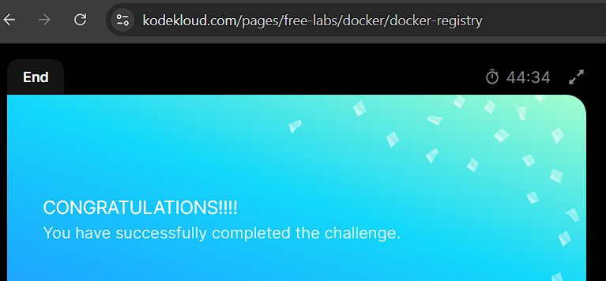

---

## Test nr 4 - Docker Networking and Registry

1. What keyword is used in a Docker command to attach a container to a network?
Please answer in all lowercase.

> connect

2.Which of the following are true when working with Docker networks?
- [ ] All containers are connected to the default network by Docker.
- [x] You can't delete a network if any container is connected to it.
- [x] Containers can communicate with each other without any explicit links.
- [x] Containers can be connected to more than one network.

3.What is the default network type when you run a new container in Docker if you don't specify a network?
Please answer in all lowercase.

> bridge

4.What is the Docker command to disconnect a container from a network?
Please answer in all lowercase.

> docker network disconnect

5.What is the command to create a custom network in Docker?
- [ ] docker network custom create
- [x] docker network create
- [ ] docker network new
- [ ] docker create network

6.In which scenarios would you require more than one custom network in Docker?
- [x] When running containers that should be isolated from each other.
- [ ] When running multiple containers of the same image.
- [ ] When running a single container.
- [ ] When you want to use the default network.

7.What will happen if you attempt to delete a Docker network that has containers attached to it?
- [ ] Docker will automatically detach the containers and then delete the network
- [ ] The network will be deleted but the containers will continue running without a network
- [x] The network will not be deleted and Docker will display an error message
- [ ] The network will be deleted and the containers will be stopped

8.What is the impact on a running container when it's disconnected from a network?
- [ ] The container will not be impacted.
- [ ] The container will stop running.
- [x] The container will lose access to the network resources.
- [ ] The container will restart.

9.Which of the following are default networks created by Docker?
- [ ] local
- [x] none
- [x] host
- [ ] custom
- [x] bridge

10.Which Docker command allows you to connect an existing container to a network?
- [ ] docker connect network
- [x] docker network connect
- [ ] docker attach network
- [ ] docker network attach

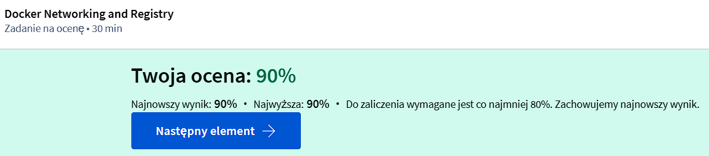
---
# Moduł 8 - Docker on Windows and Mac

## Docker na Windows:
- Wspólne jądro systemu: Kontenery współdzielą jądro systemu operacyjnego, co uniemożliwia uruchamianie kontenerów Windows na systemie Linux i odwrotnie.
- Dwie opcje dla Docker na Windows:
  - Docker Toolbox:
    - Używany na starszych systemach Windows (Windows 7 lub wyższy, 64-bitowy).
    - Wykorzystuje Oracle VirtualBox do uruchamiania lekkiej maszyny wirtualnej (VM) z systemem Linux i Dockerem.
    - Instalowany jest zestaw narzędzi (Docker Engine, Docker Machine, Docker Compose, Kitematic).
    - Rozwiązanie jest przestarzałe i przeznaczone dla systemów, które nie obsługują Hyper-V.
  - Docker Desktop for Windows:
    - Używa natywnej wirtualizacji Microsoft Hyper-V zamiast VirtualBox.
    - Wspierany tylko na Windows 10 Pro/Enterprise oraz Windows Server 2016.
    - Domyślnie działa z kontenerami Linux, ale można przełączyć na obsługę kontenerów Windows.
  - Kontenery Windows:
    - Wprowadzone w 2016 roku z Windows Server 2016.
    - Dwa typy kontenerów:
        - Windows Server Containers: Działają podobnie jak kontenery Linux, współdzieląc jądro systemu.
        - Hyper-V Isolation: Każdy kontener działa w zoptymalizowanej maszynie wirtualnej, zapewniając izolację jądra.
    - Opcje obrazów: Windows Server Core (cięższy) i Nano Server (lekki, porównywalny z Alpine w Linuxie).
- Ograniczenia:
  - VirtualBox i Hyper-V nie mogą działać równocześnie na tym samym hoście Windows.
  - Istnieje przewodnik migracji z VirtualBox do Hyper-V.

## Docker na Mac:
- Dwie opcje dla Docker na Mac:
  - Docker Toolbox:
    - Używa Oracle VirtualBox do uruchamiania lekkiej maszyny wirtualnej z systemem Linux i Dockerem.
    - Obsługuje macOS 10.8 i nowsze.
    - Zawiera zestaw narzędzi (Docker Engine, Docker Machine, Docker Compose, Kitematic).
  - Docker Desktop for Mac:
    - Używa technologii wirtualizacji HyperKit zamiast VirtualBox.
    - Wymaga macOS Sierra 10.12 lub nowszego oraz sprzętu Mac z 2010 roku lub nowszego.
    - Brak natywnego wsparcia dla Mac containers: Docker na Mac umożliwia jedynie uruchamianie kontenerów Linux.
- Różnica w technologii wirtualizacji - Docker Desktop zastępuje VirtualBox natywną wirtualizacją HyperKit, co upraszcza działanie na macOS.

---
# Moduł 9 - Container Orchestration

## Orkiestracja kontenerów:
- Orkiestracja kontenerów to zestaw narzędzi i skryptów do zarządzania kontenerami w środowisku produkcyjnym.
- Problemy, które rozwiązuje:
  - Skalowanie aplikacji w odpowiedzi na wzrost użytkowników.
  - Monitorowanie stanu kontenerów i ich restartowanie w razie awarii.
  - Obsługa awarii hostów Docker, które powodują niedostępność kontenerów.
- Zalety orkiestracji:
  - Automatyczne skalowanie instancji aplikacji.
  - Zaawansowane zarządzanie sieciami między kontenerami.
  - Równoważenie obciążenia pomiędzy hostami.
  - Współdzielenie pamięci między hostami.
  - Obsługa konfiguracji i zabezpieczeń klastra.

## Docker Swarm:
- Narzędzie do orkiestracji od Docker, proste w konfiguracji.
- Umożliwia tworzenie klastrów z wielu hostów Docker.
- Hosty są podzielone na:
  - Manager: zarządza klastrem i orkiestracją.
  - Worker: wykonuje zadania zlecone przez managera.
- Proces konfiguracji:
  - Użycie komendy `docker swarm init` na hostach managera.
  - Hosty worker dołączają do klastra za pomocą komendy wygenerowanej przez managera.
- Główne funkcje:
  - Tworzenie usług (docker service create) do uruchamiania wielu instancji aplikacji.
  - Automatyczne równoważenie obciążenia między hostami.
  - Obsługa sieci i publikowania portów.

## Kubernetes:
- Najpopularniejsze narzędzie do orkiestracji, bardziej zaawansowane, lecz trudniejsze w konfiguracji niż Docker Swarm.
- Obsługuje tysiące instancji aplikacji za pomocą prostych komend (kubectl).
- Funkcje:
  - Automatyczne skalowanie aplikacji (w górę i w dół) w odpowiedzi na obciążenie.
  - Rolling updates (aktualizacje aplikacji bez przestojów).
  - Możliwość rollbacku w przypadku błędów.
  - Testowanie nowych funkcji za pomocą metod A/B.
  - Integracja z różnymi dostawcami sieci i pamięci masowej.
- Architektura:
  - Cluster: zestaw hostów (workerów).
  - Node: fizyczny lub wirtualny host, na którym uruchamiane są kontenery.
  -Master: zarządza klastrem i kontroluje uruchamianie kontenerów na nodach.
- Kluczowe komponenty:
  - API Server: interfejs komunikacyjny dla użytkowników i narzędzi.
  - etcd: rozproszona baza danych klastrowa (przechowuje konfiguracje i informacje o klastrze).
  - Scheduler: przypisuje kontenery do hostów.
  - Controllers: odpowiadają za procesy orkiestracji, takie jak monitorowanie i restartowanie kontenerów.

### Porównanie narzędzi:
- Docker Swarm: łatwy w użyciu, brak zaawansowanych funkcji automatycznego skalowania.
- Kubernetes: zaawansowany, wymaga większej wiedzy technicznej, szeroko wspierany przez dostawców chmurowych.
- Mesos: skomplikowany w konfiguracji, oferuje wiele zaawansowanych funkcji, ale mniej popularny.

### Zastosowania praktyczne:
- Docker Swarm sprawdza się w prostych środowiskach.
- Kubernetes jest lepszym wyborem dla dużych, złożonych aplikacji wymagających zaawansowanego skalowania i konfiguracji.

---

Test nr 8 - Container Orchestration

1.If you want to bind Docker to another host/port or a Unix socket, which file would you need to manipulate?
- [ ] Dockerfile
- [x] daemon.json
- [ ] docker-cli.json
- [ ] docker-compose.yml

2.What is the command to pull a Docker image from Docker Hub?
Please answer in all lowercase.

> docker pull

3.Which of the following is true when comparing Docker Toolbox and Docker Desktop for Windows?
- [x] Docker Toolbox is a legacy solution for systems that do not meet the Docker Desktop for Windows requirements.
- [ ] Docker Toolbox has more features than Docker Desktop for Windows.
- [ ] Docker Desktop for Windows can run on older Windows versions.
- [ ] Docker Desktop for Windows and Docker Toolbox offer the same performance.

4.Select the options that are available for running Docker on Windows.
- [x] Docker Desktop for Windows
- [ ] Docker for Windows7
- [x] Docker Toolbox
- [ ] Docker Station

5.Which of the following is a requirement for running Docker on Windows?
- [ ] Windows7 Ultimate
- [ ] Windows8.1
- [ ] Windows10 Home
- [x] Windows10 Pro

6.Why would you use Docker Compose?
- [ ] To automate Docker container updates
- [x] To manage multiple containers as a single service
- [ ] To build Docker images
- [ ] To deploy applications to a Docker Swarm

7.Select the requirements for running Docker on Windows.
- [x] 64-bit processor
- [x] Windows 10 Pro, Enterprise or Education
- [ ] Windows Server 2016 or later
- [ ] VirtualBox installed
- [x] At least 4GB RAM
- [x] Enabled Hyper-V

8.Which of the following are advantages of using Docker?
- [x] Decreased resource usage
- [x] Portability
- [ ] Reduced security risks
- [ ] Single system dependency

9.What is the Docker tool that allows you to run Docker on older Windows systems?
Please answer in all lowercase.

> docker toolbox

10.What is a key difference between running Linux and Windows containers on a Windows host?
- [ ] Windows containers can run on any version of Windows, but Linux containers cannot
- [ ] Linux containers require the Hyper-V feature, but Windows containers do not
- [x] Windows containers require a virtual machine, but Linux containers do not
- [ ] Linux containers can be run with Docker Toolbox, but Windows containers cannot

11.Which of the following are valid Docker statuses?
- [x] restarting
- [x] stopped
- [ ] in progress
- [x] created
- [x] paused
- [x] running

12.What happens if a Docker container crashes?
- [ ] The host system crashes
- [x] The container can be restarted
- [ ] The crashed container corrupts the image
- [ ] Other containers on the system are affected

13.If you want to run Linux containers on a Windows host, which of the following would you use?
- [ ] Docker for Windows7
- [ ] Docker Desktop for Windows with Hyper-V backend
- [ ] Docker Toolbox
- [x] Docker Desktop for Windows with WSL2 backend

14.When running Docker on Windows, what type of backend does Docker Desktop for Windows use to run Windows containers?
Please answer in all lowercase.

>  hyper-v

15.What is the default file name that Docker Compose expects?
Please answer in all lowercase.

> docker-compose.yml

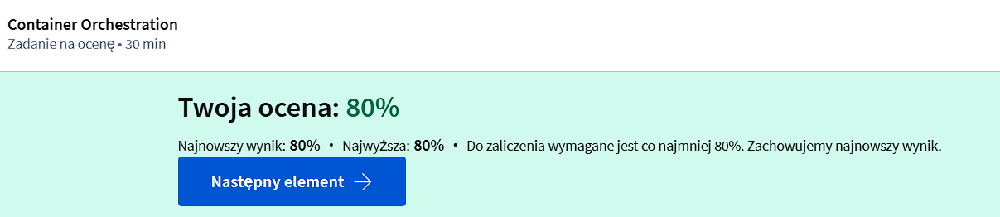

---

# Moduł 10 - Introduction to YAML

## Czym jest YAML:
- YAML to format danych używany głównie do konfiguracji.
- Dane w YAML są reprezentowane w formie klucz-wartość.
- YAML jest prostszy do zrozumienia w porównaniu do XML i JSON.
- Podstawy YAML:
  - Klucz i wartość oddzielone są dwukropkiem i spacją.
  - Tablica jest reprezentowana za pomocą listy z myślnikami przed elementami.
  - Słowniki (dictionary) grupują zestaw właściwości pod jednym elementem.
- Zasady formatowania:
  - Wcięcia muszą być konsekwentne, aby uniknąć błędów składniowych.
  -Dodatkowe spacje mogą prowadzić do błędnej interpretacji struktury danych.
- Zaawansowane struktury:
  - Można tworzyć listy zawierające słowniki, które z kolei mogą zawierać inne listy.
  - YAML pozwala na reprezentację złożonych danych, takich jak informacje o samochodach (np. kolor, model, cena) w strukturze list słowników.
- Kiedy używać list i słowników:
  - Słownik przechowuje właściwości jednego obiektu (np. samochodu).
  - Lista przechowuje wiele elementów tego samego typu (np. listę nazw samochodów).
  - Lista słowników umożliwia przechowywanie pełnych informacji o wielu obiektach.
- Różnice między listami a słownikami:
  - Słowniki są nieuporządkowane - kolejność właściwości nie ma znaczenia.
  - Listy są uporządkowane - kolejność elementów ma znaczenie.
- Uwagi końcowe:
  - Linie zaczynające się od znaku "#" są traktowane jako komentarze.
  - YAML jest elastyczny i łatwy do użycia w wielu przypadkach.
