# Basic Docker training

[Exercises from repository](https://github.com/delner/docker-training/tree/master) by [David Elner](https://github.com/delner)


## Basic Exercises:
1. [Running and managing Docker containers and images](#exercise-1-running-and-managing-docker-containers-and-images)
2. [Changing images](#exercise-2-changing-images)
3. [Building your own images](#exercise-3-building-your-own-images)
4. [Sharing images](#exercise-4-sharing-images)
5. [Volumes](#exercise-5-volumes)
6. [Networking](#exercise-6-networking)
---

## Exercise 1: Running and managing Docker containers and images

In this exercise, we'll learn the basics of pulling images, starting, stopping, and removing containers.

### Pulling an image

To run containers, we'll first need to pull some images.

1. Let's see what images we have currently on our machine, by running `docker images`:

    ```
    docker images
    ```

	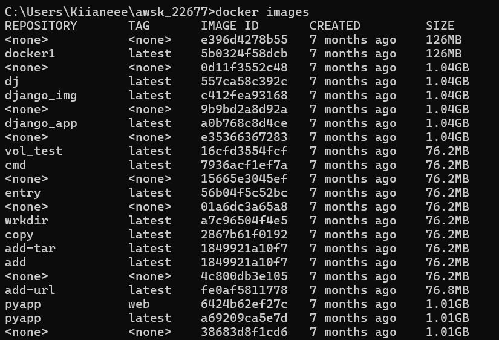

2. On a fresh Docker installation, we should have no images. Let's pull one from Dockerhub.

    We can search for images using `docker search <keyword>`

    ```
    docker search ubuntu
    ```

	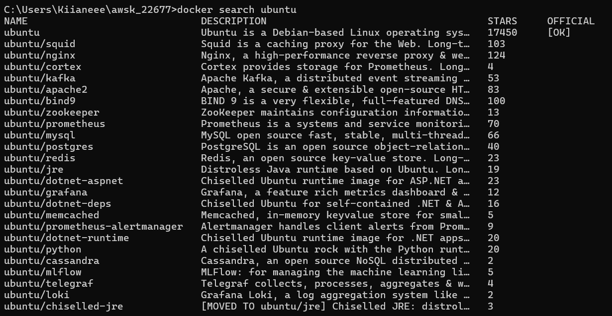


    Run `docker pull ubuntu:22.04` to pull an image of Ubuntu 22.04 from DockerHub.

	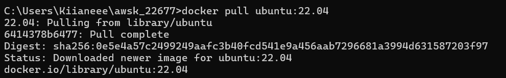

3. We can also pull different versions on the same image.

    Run `docker pull ubuntu:22.10` to pull an image of Ubuntu 22.10.

	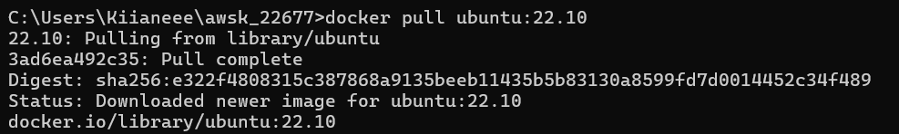
    
    Then, when we run `docker images` again, we should get:

    
	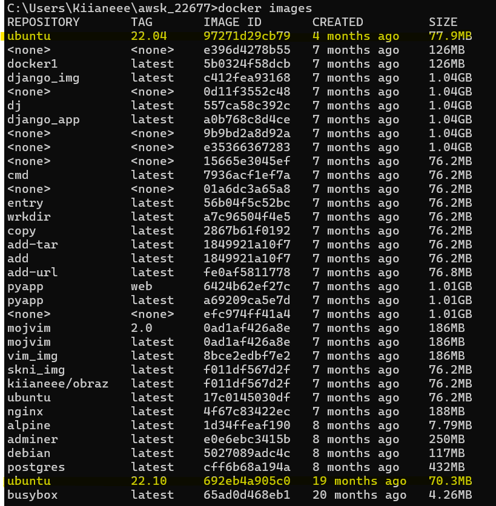

4.  Over time, your machine can collect a lot of images, so it's nice to remove unwanted images.
    `docker rmi 692eb4a905c0` to remove the Ubuntu 22.10 

    
	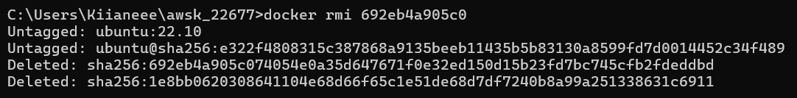

    Alternatively, you can delete images by tag or by a partial image ID. In the previous example, the following would have been equivalent:  
     - `docker rmi 69`
     - `docker rmi ubuntu:22.10`

    Running `docker images` should reflect the deleted image.

   
	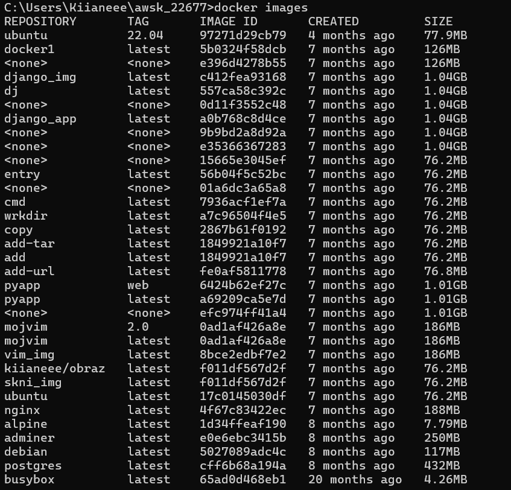

    Skrót do usuwania wszystkich obrazów z systemu to `docker rmi $(docker images -a -q)`

	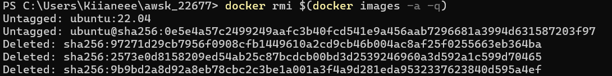

### Running our container

Using the Ubuntu 16.04 image we downloaded, we can run a first container. Unlike a traditional virtualization framework like VirtualBox or VMWare, we can't just start a virtual machine running this image without anything else: we have to give it a command to run.

The command can be anything you want, as long as it exists on the image. In the case of the Ubuntu image, it's a Linux kernel with many of the typical applications you'd find in a basic Linux environment.

1.  Let's do a very simple example. Run `docker run ubuntu:22.04 /bin/echo 'Hello world!'`
    If we removed images earlier, it will be pulledagain.

	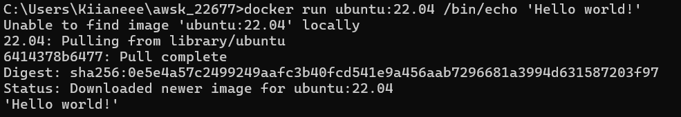

    The `/bin/echo` command is a really simple application that just prints whatever you give it to the terminal. 
    We passed it 'Hello world!', so it prints `Hello world!` to the terminal.

    When you run the whole `docker run` command, it creates a new container from the image specified, then runs the command inside the container. 
    From the previous example, the Docker container started, then ran the `/bin/echo` command in the container.  

2. Let's check what containers we have after running this. Run `docker ps`:  

   
	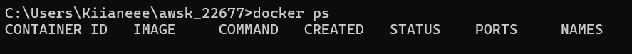

    That's strange: no containers right? 
    The `ps` command doesn't show stopped containers by default, add the `-a` flag.

    ```
    docker ps -a
    ```  
   
	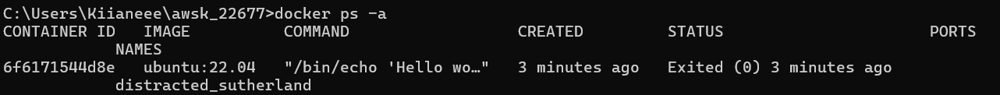

    Okay, there's our container. But why is the status "Exited"?  
    Documentation says:  *Docker containers only run as long as the command it starts with is running.*  
    In our example, it ran `/bin/echo` successfully, printed some output, then exited with status code 0 (which means no errors).  
    When Docker saw this command exit, the container stopped.  


3. Let's do something a bit more interactive. Run `docker run ubuntu:22.04 /bin/bash`

	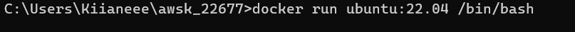

    Notice nothing happened. When we run `docker ps -a`:  

	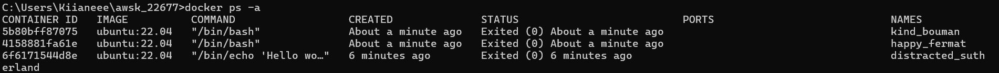

    The container exited instantly. Why? We were running the `/bin/bash` command, which is an interactive program. 
    However, the `docker run` command doesn't run interactively by default, therefore the `/bin/bash` command exited, and the container stopped.

    Instead, let's add the `-it` flags, which tells Docker to run the command interactively with your terminal.

    ```
    docker run -it ubuntu:22.04 /bin/bash
    ```

	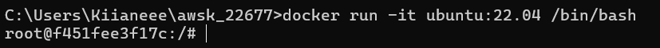

    This looks a lot better. This means you're in a BASH session inside the Ubuntu container. 
    Notice you're running as `root` and the container ID that follows.  
    You can now use this like a normal Linux shell. Try `pwd` and `ls` to look at the file system.  

	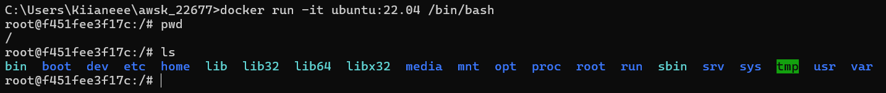

    You can type `exit` to end the BASH session, terminating the command and stopping the container.

   
4.  By default, your terminal remains attached to the container when you run `docker run`. 
    What if you don't want to remain attached?

    By adding the `-d` flag, we can run in detached mode, meaning the container will continue to run as long as the command is, 
    but it won't print the output.

    Let's run `/bin/sleep 3600`, which will run the container idly for 1 hour:

    ```
    docker run -d ubuntu:22.04 /bin/sleep 3600
    ```

	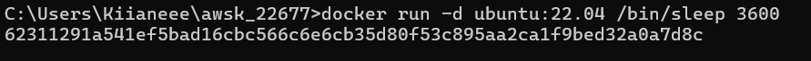

    If we check the container, we can see it's running the sleep command in a new container.

    ```
    docker ps
    ```

	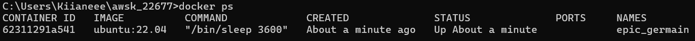

5. Now that the container is running in the background, what if we want to reattach to it?

    Maybe, if this were something like a web server or other process where we might like to inspect logs while it runs, 
    it'd be useful to run something on the container without interrupting the current process.
    To this end, there is another command, called `docker exec`. 
    `docker exec` runs a command within a container that is already running. 
    It works exactly like `docker run`, except instead of taking an image ID, it takes a container ID.
    This makes the `docker exec` command useful for tailing logs, or "SSHing" into an active container.

    Let's do that now, running the following, passing the first few characters of the container ID:

    ```
    docker exec -it 62311 /bin/bash
    ```
 
	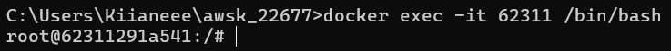

    The container ID appearing at the front of the BASH prompt tells us we're inside the container. 
    Once inside a session, we can interact with the container like any SSH session.

    Let's list the running processes:

    ```
    ps aux
    ```

	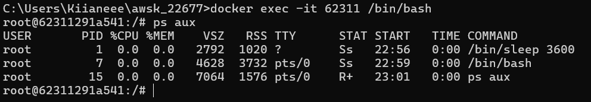

    There we can see our running `/bin/sleep 3600` command. 
    Whenever we're done, we can type `exit` to exit our current BASH session, and leave the container running.

    ```
    exit
    docker ps
    ```
	And finally checking `docker ps`, we can see the container is still running.

	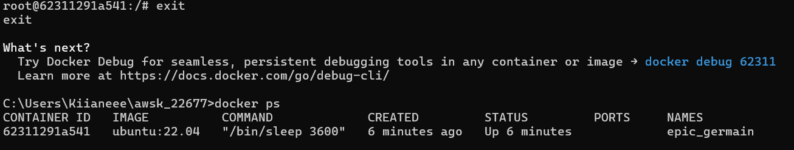

6. Instead of waiting 1 hour for this command to stop (and the container exit), what if we'd like to stop the Docker container now?

    To that end, we have the `docker stop` and the `docker kill` commands. The prior is a graceful stop, whereas the latter is a forceful one.

    Let's use `docker stop`, passing it the first few characters of the container name we want to stop.

    ```
    docker stop 62311
    ```

	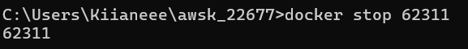

    Then checking `docker ps -a`

	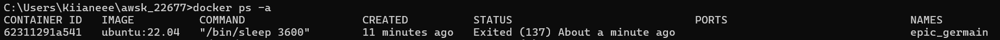

    We can see that it exited with code `137`, which in Linux world means the command was likely aborted with a `kill -9` command.

### Removing containers

7. After working with Docker containers, you might want to delete old, obsolete ones.

    ```
    docker ps -a
    ```
	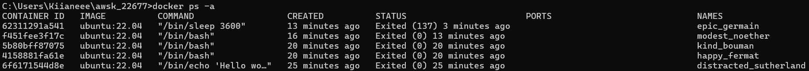

    From our previous example, we can see with `docker ps -a` that we have a container hanging around.

    To remove this we can use the `docker rm` command which removes stopped containers.

    A nice shortcut for removing all containers from your system is `docker rm $(docker ps -a -q)`:
    
    It can be tedious to remove old containers each time after you run them. 
    To address this, Docker also allows you to specify the `--rm` flag to the `docker run` command, 
    which will remove the container after it exits.


## END OF EXERCISE 1

---

## Exercise 2: Changing images

In this exercise, we'll learn how to modify an existing Docker image, and commit it as a new one.

To accomplish this, we'll modify the `ubuntu:16.04` image to include the `ping` utility.

### Getting setup

First download the `ubuntu:16.04` image with `docker pull`. (You might already have this if you have completed the previous tutorial.)

	```
	docker pull ubuntu:16.04
	```

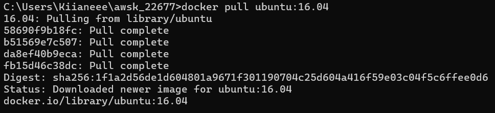


### Modifying an image

Let's run the image in a new container and install the `ping` utility.

1. First start the container with `/bin/bash`:

    ```
    docker run -it ubuntu:16.04 /bin/bash
    ```

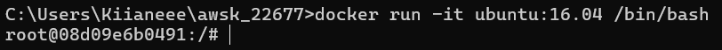

2. Try running `ping` in the terminal.

    ```
    ping google.com
    ```

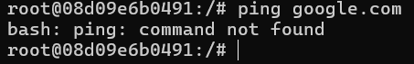

    The command doesn't exist. The Ubuntu image for Docker only has the bare minimum of software installed to operate the container. That's okay though: we can install the `ping` command.

2. But first we'll update our software list.

    In Debian-based Linux environments (such as Ubuntu), you can install new software using the `apt` package manager. For those who have experience with Macs, this program is the equivalent of `homebrew`.

    By default, to reduce the image size, the Ubuntu image doesn't have a list of the available software packages. We need to update the list of available software:

    ```
    apt-get update
    ```

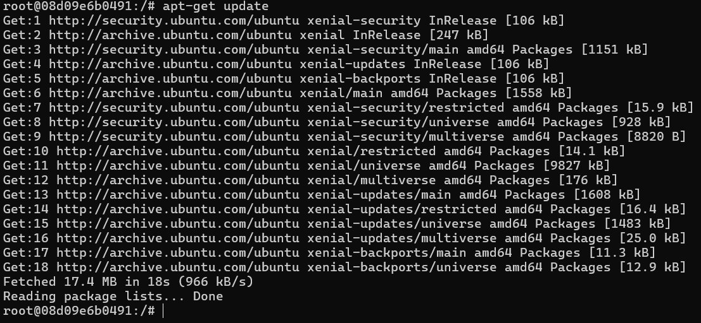

3. Now we can install the `ping` command.

    Call `apt-get install iputils-ping` to install the package containing `ping`:

    ```
    apt-get install iputils-ping
    ```
	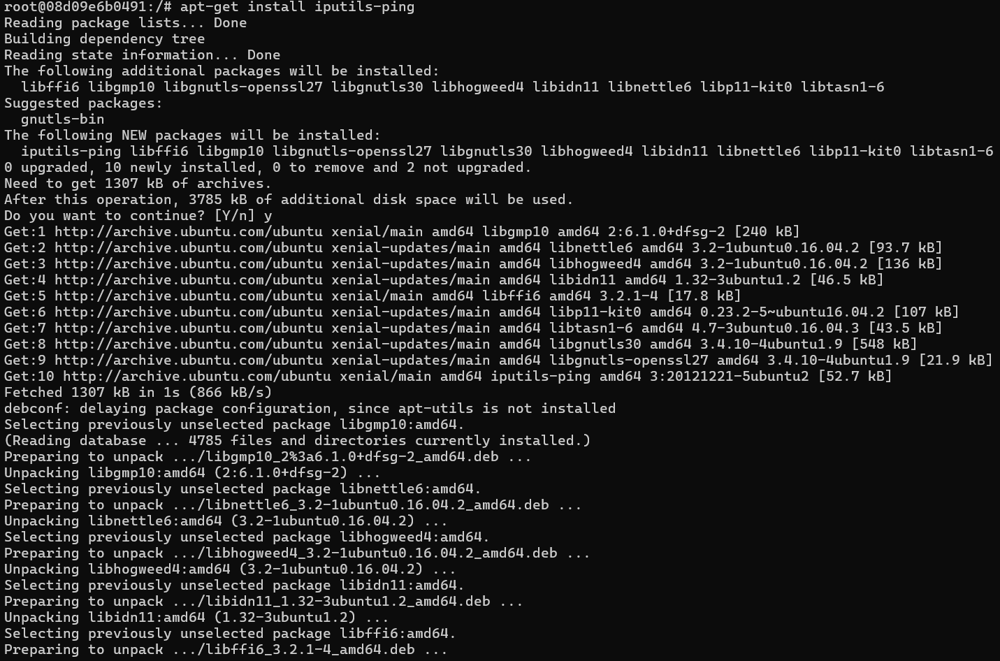
	cont.
	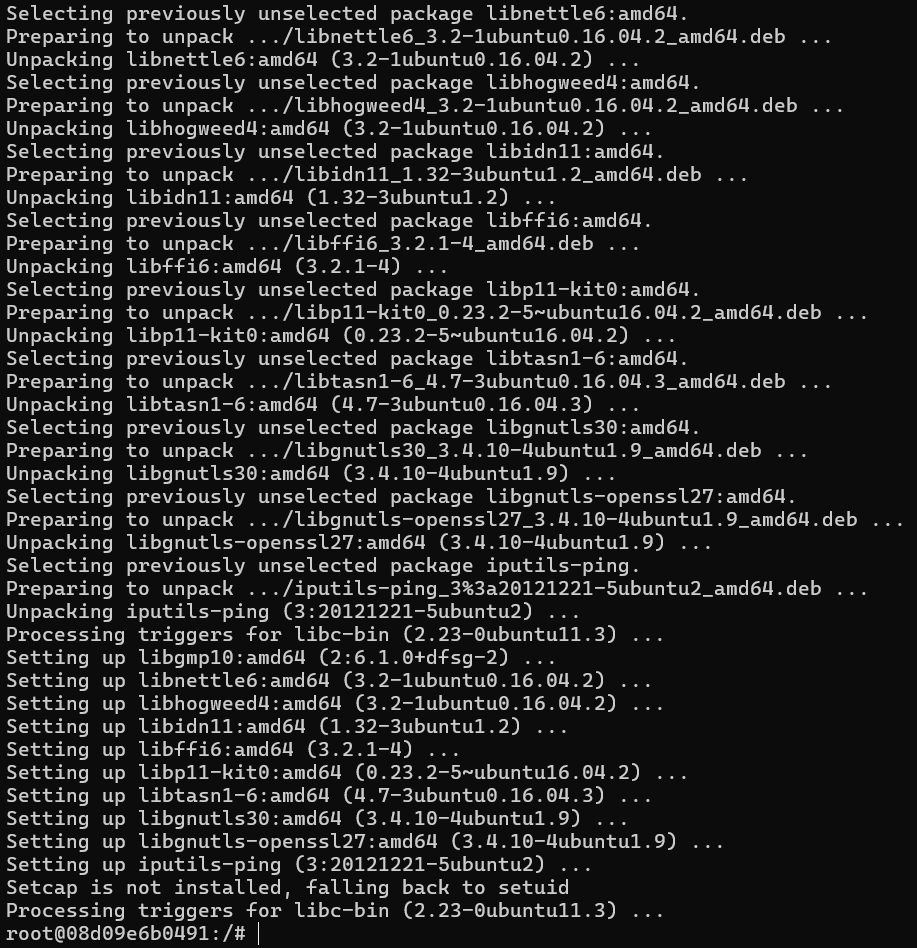

4. Finally, we should be able to use `ping`.

    Ping your favorite website. When you've seen enough, `Ctrl+C` to interrupt, then `exit` the container.

    ```
    ping google.com
    (Ctrl+C)
    exit
    ```

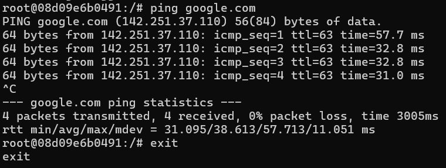

### Committing changes

Installing `ping` isn't very special in itself. But what if you wanted to have `ping` on all of your `ubuntu` containers? You'd have to redo this installation each time you spin up a new container, and that isn't much fun.

The Docker way is to create a new image. There are two ways to do this: 1) build a new image from scratch or 2) commit a container state as a new image. We'll cover how to do #1 in the "Building Images" exercise, but we can do #2 now.

1. Let's find our container to create the new image from.

    Fortunately, we have a Docker container with our `ping` utility already installed from the previous steps. It should be stopped right now, but let's find its container ID.

    ```
    docker ps -a
    ```

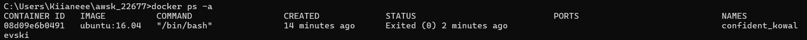

2. Now let's commit it as a new image.

    `docker commit` takes a container, and allows you to commit its changes as a new image.

    ```
    docker commit --help
    ```

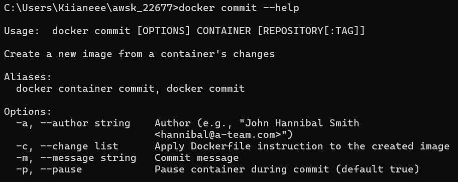

Pass the container ID, an author, commit message, and give it the name `<DockerHub username>/ping`:

 ```
    docker commit -a "Kinga" -m 'Added ping utility.' 08d09e6b0491 delner/ping
 ```

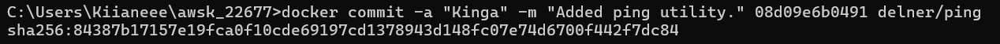

    Then check `docker images` to see your new image:

 ```
    docker images
 ```

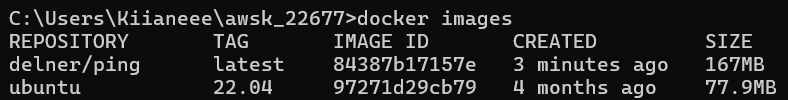

3. Finally run your new image in a new container to see it in action!

    ```
    docker run -it --rm delner/ping /bin/bash
    ```
<<<<<<< HEAD
	
=======
>>>>>>> d0fc78bab17043c1b44350323a2012b2ed13386f
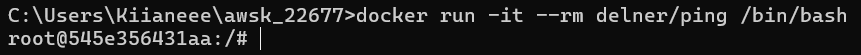

## END OF EXERCISE 2

---

## Exercise 3: Building your own images

In this exercise, we'll learn how to create a new Docker image.

To do this, like in "Changing Images", we'll add the `ping` utility to the `ubuntu:16.04` image. The outcome from each of these exercises should be equivalent.

### Getting setup

First download the `ubuntu:16.04` image with `docker pull`. (You might already have this if you have completed the previous tutorial.)

```
	docker pull ubuntu:16.04
```


If you still have the image from the previous "Changing Images", let's also remove that now. Be sure to `docker rm` any containers based on that image first, otherwise deleting the image will fail.

```
	docker rm 08d09e6b0491
	docker rmi 84387b17157e
```
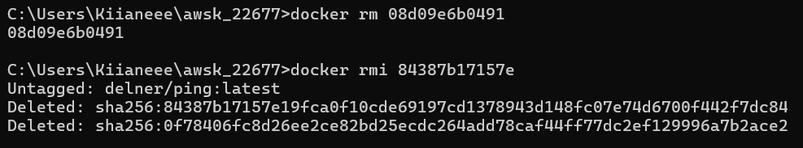


### Creating a Dockerfile

Like the "Changing Images" exercise, we'll install `ping` on top of `ubuntu` to create a new image. Unlike that exercise, however, we will not run or modify any containers to do so.

Instead, we'll use `Dockerfile`. The `Dockerfile` is a "recipe" of sorts, that contains a list of instructions on how to build a new image.

1. Create a new file named `Dockerfile` in your working directory:

    ```
    notepad Dockerfile
    ```

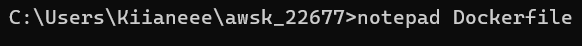

2. Open `Dockerfile` with your favorite text editor.
2. Inside the file, we'll need to add some important headers.

    The `FROM` directive specifies what base image this new image will be built upon. (Ubuntu in our case.)

    The `LABEL` directive adds a label the image. Useful for adding metadata.

    Add the following two lines to the top of your file:

    ```
    FROM ubuntu:16.04
    LABEL author="Kinga"
    ```
	

3. Then we'll need to add some commands to modify the image.

    The `RUN` directive runs a command inside the image, and rolls any changes to the filesystem into a commit. A typical Dockerfile will contain several `RUN` statements, each committing their changes on top of the previous.

    To install `ping`, we'll need to run `apt-get update` and `apt-get install`. First, add the `apt-get update` command:

    ```
    RUN apt-get update
    ```

    Then add the `apt-get install` command:

    ```
    RUN apt-get install -y iputils-ping
    ```

    Notice we added the `-y` flag. When building Docker images, these commands will run non-interactively. Normally the `apt-get` command will prompt you "Y/n?" if you want to proceed. The `-y` flag avoids that prompt by always answering "Y".

    Our file should now look something like this:

    ```
    FROM ubuntu:16.04
    LABEL author="Kinga"

    RUN apt-get update

    RUN apt-get install -y iputils-ping
    ```


    And with that, we should be ready to build our image.

### Building the Dockerfile

To build Docker images from Dockerfiles, we use the `docker build` command. The `docker build` command reads a Dockerfile, and runs its instructions to create a new image.

1. Let's build our image.

    Running the following builds and tags the image:

    ```
    docker build -t "delner/ping" .
    ```
	
	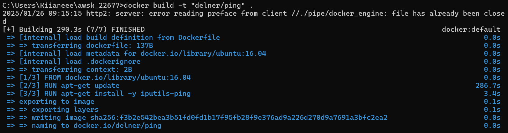

    The use of `.` in the arguments is significant here. `docker build` looks for files named `Dockerfile` by default to run. So by giving it a `.`, we're telling Docker to use the `Dockerfile` in our current directory. If this Dockerfile was actually named anything else, you'd change this to match the name of the file.

    Also notice the output about "steps" here. Each directive in your Dockerfile maps to a step here, and after each step is completed, it becomes a commit. Why does this matter though?

    Docker layers each commit on top of the other, like an onion. By doing so, it can keep image sizes small, and when rebuilding images, it can even reuse commits that are unaffected by changes to make builds run quicker.

    We can see this caching behavior in action if we simply rerun the same command again:

    ```
    docker build -t 'delner/ping' .
    ```
	
	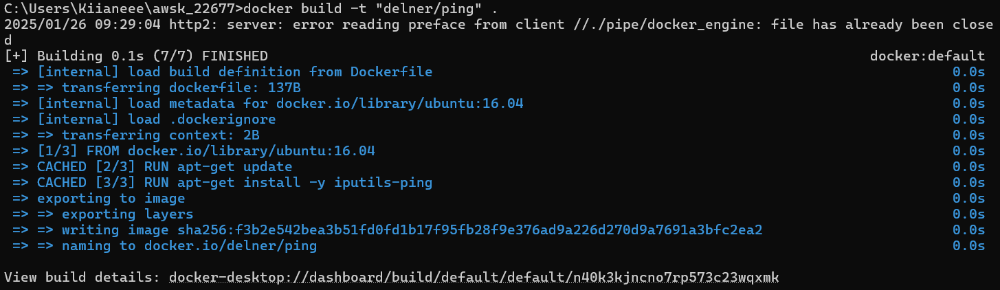

    Running `docker images`, we can see our newly built image.

    ```
	docker images
    ```
	
	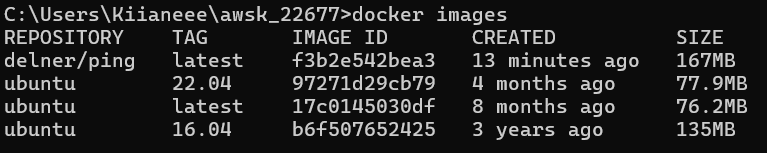

### Optimizing the Dockerfile

Looking at new image, we can see it is `167MB` in size versus its base image of `135MB`. That's a pretty big change in size for installing some utilities. That will take more disk space and add additional time to pushes/pulls of this image.

But why is it that much bigger? The secret is in the `RUN` commands. As mentioned before, any filesystem changes are committed after the `RUN` command completes. This includes any logs, or temporary data written to the filesystem which might be completely inconsequential to our image.

In our case, the use of `apt-get` generates a lot of this fluff we don't need in our image. We'll need to modify these `RUN` directives slightly.

We can start with removing any old logs after the install completes. Adding the following to the bottom of the Dockerfile:

```
	RUN apt-get clean \
		&& cd /var/lib/apt/lists && rm -fr *Release* *Sources* *Packages* \
		&& truncate -s 0 /var/log/*log
```
	
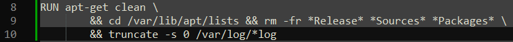

Then running `build` again yields...

```
	docker build -t 'delner/ping' .
 	docker images
```
	
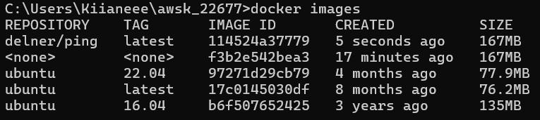
	
...yields no improvement? What's going on here?

Turns out because how commits are layered one upon the other, if there's fluff hanging around from a previous commit, it won't matter if you clean it up in a future `RUN` directive. It will be permanently apart of the history, thus the image size.

Our fluff actually happens to originate from the `apt-get update` command, which leaves a bunch of package lists around that we don't need. The easiest way to deal with this is to collapse all of the related `RUN` directives together.

The rewritten Dockerfile should like:

```
	FROM ubuntu:16.04
	LABEL author="Kinga"

	RUN apt-get update \
		&& apt-get install -y iputils-ping \
		&& apt-get clean \
		&& cd /var/lib/apt/lists && rm -fr *Release* *Sources* *Packages* \
		&& truncate -s 0 /var/log/*log
```

Then after rerunning `build`, our images now like:

```
	docker build -t 'delner/ping' .
	docker images
```
	
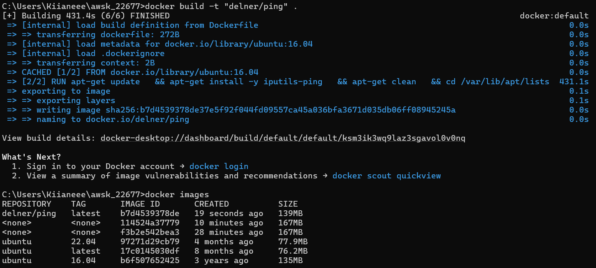
	
Now the new image is only 4MB larger in size. A major improvement.

### Other Dockerfile directives

There are [many other useful directives](https://docs.docker.com/engine/reference/builder/) available in the Dockerfile.

Some important ones:

 - `COPY`: Copy files from your host into the Docker image.
 - `WORKDIR`: Specify a default directory to execute commands from.
 - `CMD`: Specify a default command to run.
 - `ENV`: Specify a default environment variable.
 - `EXPOSE`: Expose a port by default.
 - `ARG`: Specify a build-time argument (for more configurable, advanced builds.)

Since our Dockerfile is build for `ping`, let's add the `ENV` and `CMD` directives.

```
	FROM ubuntu:16.04
	LABEL author="Kinga"

	ENV PING_TARGET "google.com"

	RUN apt-get update \
		&& apt-get install -y iputils-ping \
		&& apt-get clean \
		&& cd /var/lib/apt/lists && rm -fr *Release* *Sources* *Packages* \
		&& truncate -s 0 /var/log/*log

	CMD ["sh", "-c", "ping $PING_TARGET"]
```

These new directives mean that our image when run with `docker run -it delner/ping` will automatically run `ping google.com`.

```
	docker run -it delner/ping
```
	
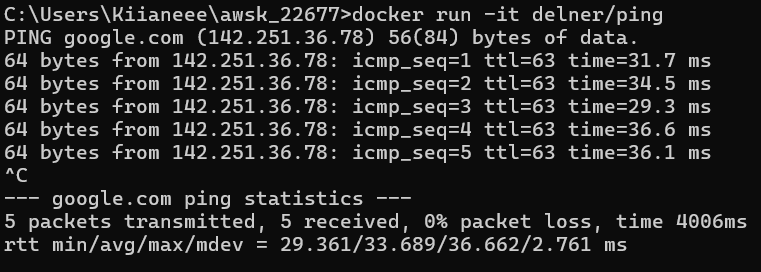

### Learning more about Dockerfiles

Most images in the Docker world are built from Dockerfiles, and looking at other Dockerfiles from your favorite repos can be a wonderful source of information about how they function, and how you can improve your own images. Seek them out on both DockerHub and GitHub!

## END OF EXERCISE 3

---

## Exercise 4: Sharing images

In this exercise, we'll learn how to share Docker images using DockerHub. DockerHub is GitHub for Docker: a great place to find community images, and upload your own to.

We'll need our `ping` image from the "Building Images" exercise, so be sure to complete that exercise first so you have an image to share.

### Getting Started

To share images on DockerHub, you'll need a DockerHub account. You can sign up [here](https://hub.docker.com/).

Most of the features on DockerHub should be pretty similar to GitHub: there's a search function for finding new images, repositories for your images, and organizations.

The `docker` CLI tool also has integration with DockerHub. In order to use certain features, you'll need to login first:

```
	docker login
```
	
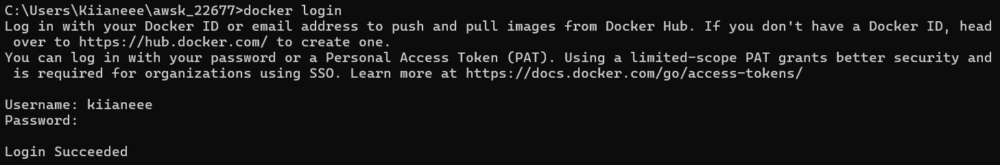

### Finding images

Use the `docker search` command to search for new images:

```
	docker search kiianeee
```
	
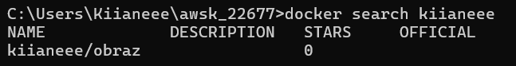

Once you found an image you like, you can pull it locally with `docker pull`, covered in the "Running Containers" exercise.

### Tagging images

In the previous exercise "Building Images", we built and tagged an image as `<DockerHub username>/ping`. If you mistagged this image with something other than your DockerHub user name, it's no problem: we can re-tag it.

Just use `docker tag` to add a new tag with your DockerHub user name, and give it a version:

```
	docker images
	docker tag ping kiianeee/ping:1.0
	docker images
```
	
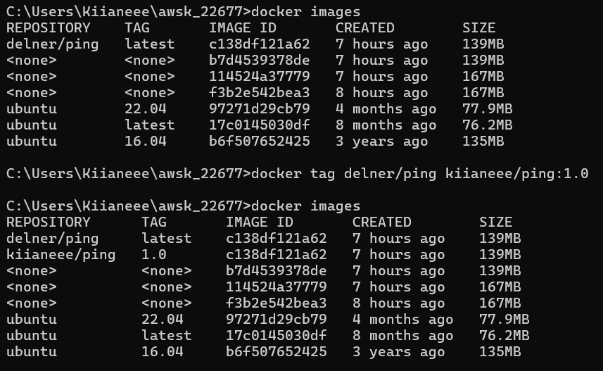
	
You can see the same image ID now maps to both the old and new tag. To remove the old tag, run `docker rmi` with the old image tag:

```
	docker rmi delner/ping b7d4539378de 114524a37779 f3b2e542bea3
	docker images
```
	
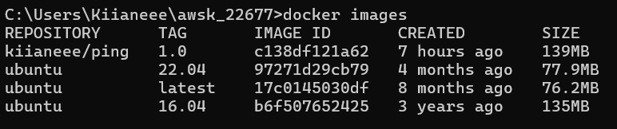

### Pushing images

To push an image, all you need to do is call `docker push` with the tag.

```
	docker push kiianeee/ping:1.0
```
	
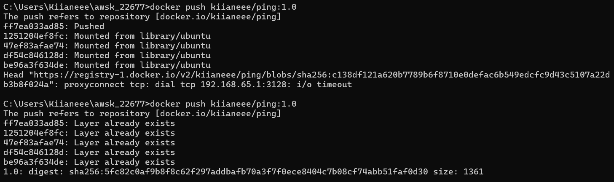

It will automatically create a new public repository on DockerHub under the organization in the tag. By providing it with your user name, it creates a new repository at `https://hub.docker.com/r/<USERNAME>/ping/`. Feel free to check out your new repo page!

It's also possible push images to non-DockerHub repositories, such as ones provided by AWS Elastic Container Registry, by changing the repository part of the tag to match the appropriate URL.

## END OF EXERCISE 4

---

## Exercise 5: Volumes

In this exercise, we'll learn to work with Docker volumes, for persisting data between containers.

To accomplish this, we'll setup an Apache HTTPD web server, and persist some HTML files in a volume.

### Setting up the server

To run our Apache HTTPD server, run this command:

```
	docker run --rm -d --name apache -p 80:80 httpd:2.4
```
	
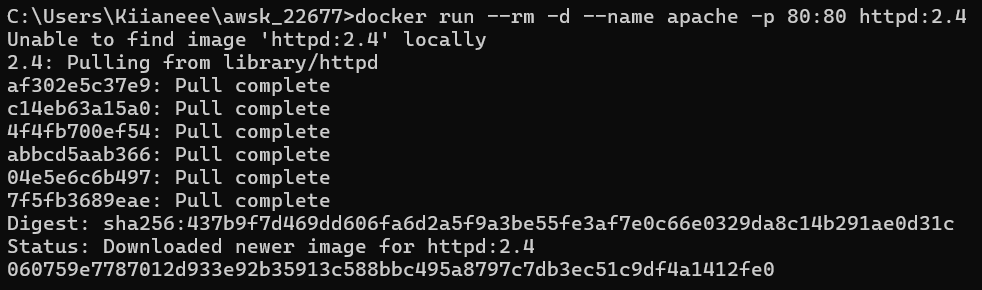

This command will start a new container from HTTP 2.4, name it `apache`, bind port `80` to the host machine (more on this later), and set a flag to delete the container when it stops.

After it starts, we can run `curl localhost` to query the web server for the default page:

```
 	curl localhost
```
	
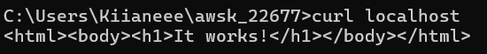

This is the default `index.html` file included with a new Apache 2.4 installation. Let's replace this HTML file with new content.

To do so, we'll use the `docker cp` command, similar to `scp`, which copies files between the host and containers. Let's give it the `index.html` file from the directory this README is sitting in:

```
	docker cp index.html apache:/usr/local/apache2/htdocs/
```
	
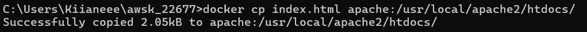

The first path is the source path, representing our new file on our host machine, and the second path our destination. `apache` is the name of the container we want to copy into, and `/usr/local/apache2/htdocs/` is where the web server serves HTML from.

Running `curl` again now looks a little different:

```
 	curl localhost
```
	


##### A possible data problem

This container, for its lifetime, will continue to serve our new HTML file.

However, containers in Docker are, in practice, considered ephemeral. They can die unexpectedly, and in certain deployments, be removed without warning. If you're depending upon the container state for your application, you might lose important data when such containers die. This is especially a concern for applications like databases, which are supposed to be considered permanent datastores.

In the case of our HTTPD server, simply stopping the container will cause it to be autoremoved. We can bring another container back up in it's place, but it won't have our changes any more.

```
	docker stop apache
	docker run --rm -d --name apache -p 80:80 httpd:2.4
	curl localhost
```
	
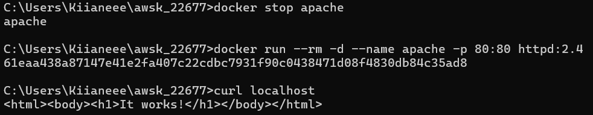

To preserve our data between outages or system upgrades, we can use volumes to persist our data across generations of containers.

### Managing volumes

Volumes in Docker are file stores, which sit independently of your Docker containers. The function like Amazon Web Services' EBS volumes, and other mountable media like USB thumb drives. They can be created, deleted, and mounted on containers at specific locations within an image, like you would with `mount` command in Linux.

To list your volumes, run `docker volume ls`:

```
 	docker volume ls
```
	
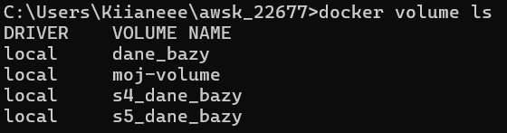

To create a new volume, run `docker volume create` and give it a volume name.

```
	docker volume create myvolume
	docker volume ls
```
	
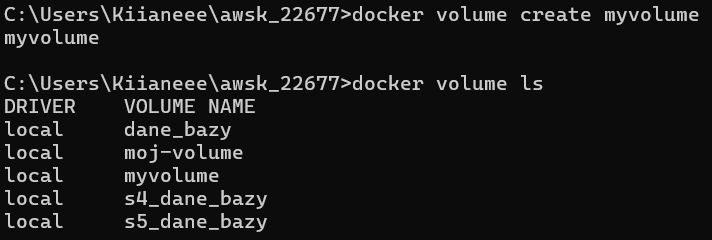

To remove a volume, run `docker volume rm` and give it the volume name.

```
	docker volume rm myvolume
	docker volume ls
```
	
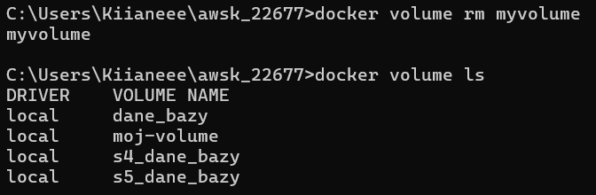

### Mounting volumes on containers

First create a new volume named `httpd_htdocs`:

```
	docker volume create httpd_htdocs
	httpd_htdocs
```
	
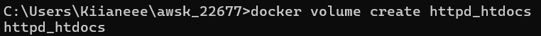

Then re-run our `docker run` command, providing the `-v` mount flag.

```
	docker run --rm -d --name apache -p 80:80 -v httpd_htdocs:/usr/local/apache2/htdocs/ httpd:2.4
```
	
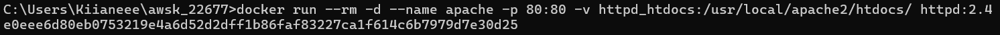

And re-copy in our modified HTML file.

```
 	docker cp index.html apache:/usr/local/apache2/htdocs/
```

And run `curl` to verify it worked.

```
 	curl localhost
```

Now to see the volume in action, let's stop the container. By providing the `--rm` flag during `run`, it should remove the container upon stopping.

```
 	docker stop apache
```

Then once again start httpd with the same run command as last time. This time, however, we can `curl` and see our file changes are still there from before.

```
	docker run --rm -d --name apache -p 80:80 -v httpd_htdocs:/usr/local/apache2/htdocs/ httpd:2.4
	curl localhost
```
	
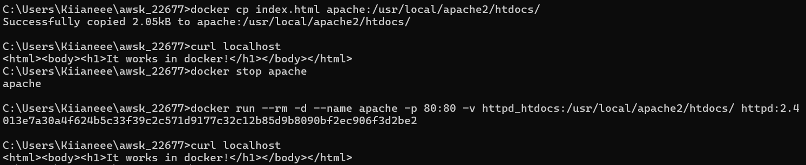

We can take this volume and mount it on any HTTPD container now, which gives us flexibility in swapping out our container for newer versions without losing our data, if we wish.

Go ahead and run `docker stop apache` to stop and remove the container, then `docker volume rm httpd_htdocs` to remove the volume.

### Mounting host directories on containers

As an alternative to using volumes, if you have a directory on your host machine you'd like to use like a volume, you can mount those too. This is technique is useful in development environments, where you might want to mount your local repo onto a Docker image, and actively modify the contents of a Docker container without rebuilding or copying files to it.

The `-v` flag to accomplish this is almost identical to the previous one. Simply specify an absolute path to a local directory instead. In our case, we'll pass `.` to specify the `5-volumes` directory in this repo, which conveniently contains a modified version of the HTML file.

```
	docker rm apache -f
	docker run --rm -d --name apache -p 80:80 -v /c/Users/Kiianeee/awsk_22677:/usr/local/apache2/htdocs/ httpd:2.4
	curl localhost
```
	
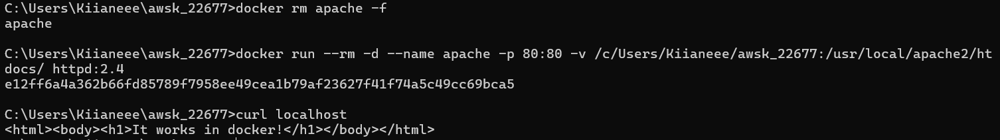

With the host directory mount in place, modify the `index.html` file in this directory with whatever message you like, then save the file and re-run `curl`.

```
	curl localhost
```
	
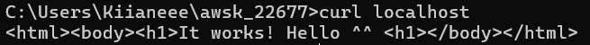

You can see file changes take place immediately on the Docker container without any need to run `docker cp`.

Go ahead and run `docker stop apache` to stop and remove the container.

## END OF EXERCISE 5

---

## Exercise 6: Networking

In this exercise, we'll learn to work with Docker networks, and interconnect containers.

To accomplish this, we'll setup two Postgres databases, and query between them.

### Listing networks

Docker defines networks, which groups containers for interoperability and DNS functions.

To list networks, run `docker network ls`:

```
 	docker network ls
```
	
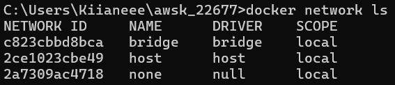

There are 3 default networks: `bridge`, `host`, and `none` listed here. Any other custom networks will also be listed here. The `host` and `none` networks are not important for this exercise, but `bridge` is of interest.

### The default `bridge` network

All new containers, if given no other configuration, will be automatically added the `bridge` network. This network acts as a pass through to your host's ethernet, so your Docker containers can access the internet.

We can inspect the `bridge` network by running `docker network inspect bridge`:

```
	docker network inspect bridge
```
	


There's some miscellaneous information about the network, but notice the `"Containers": {}` entry. You can see any containers that are currently connected to the network here.

Let's start a `ping` container, and inspect this again:

```
	docker run --rm -d --name dummy kiianeee/ping:1.0
 	docker network inspect bridge
```
	
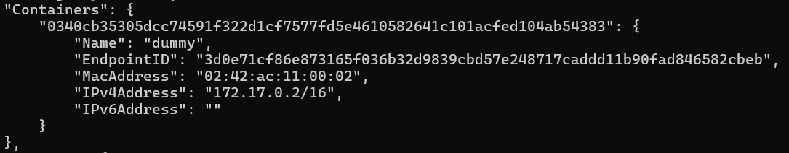

You can see the container was added to the default network. Now let's add another `ping` container, and set it to ping our first.

```
	docker run --rm -d -e PING_TARGET=172.17.0.2 --name pinger delner/ping:1.0
	docker ps
	docker logs pinger
```
	
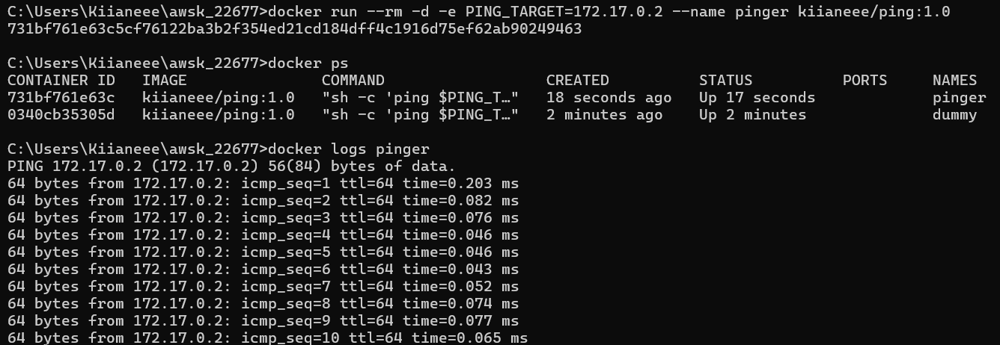

Inspecting the logs for `pinger` we can see it was able to successfully ping the other container in the network. While IP address does work, it's very cumbersome and prone to error if addresses change. It would be better to use a hostname, specifically the container name `dummy`, to always resolve to the correct container.

Running `ping` with the `dummy` as the target:

```
 	docker run --rm -d -e PING_TARGET=dummy --name pinger kiianeee/ping:1.0
 	docker ps
```
	
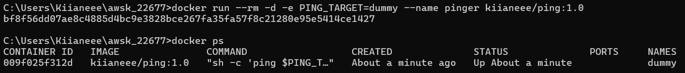

...results in failure. The host name couldn't be resolved, thus causing the command to error and the container exit and autoremove.

The default `bridge` network will not automatically allow you to network containers by container name. We can, however, easily accomplish host resolution using a custom network.

Stop and remove the `dummy` container by running `docker stop dummy`.

### Managing custom networks

To create a new network, use the `docker network create` command and provide it a network name.

```
 	docker network create skynet
	docker network ls
	docker network inspect skynet
```
	
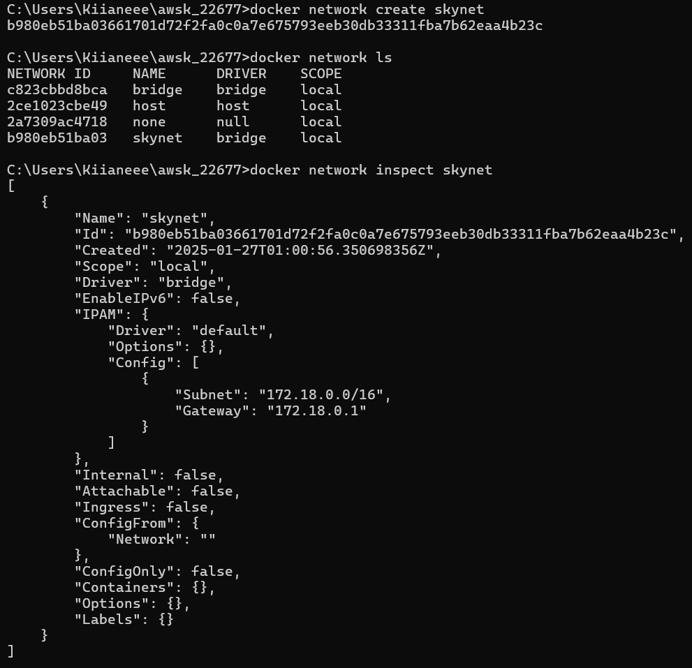

To remove networks, run `docker network rm` and provide it the network name.

### Adding containers to a network

Let's rerun the `ping` container, this time assigning it a network:

```
 	docker run --rm -d --network skynet --name dummy kiianeee/ping:1.0
```

Then the pinger, targeting the dummy `ping` container:

```
 	docker run --rm -d --network skynet -e PING_TARGET=dummy --name pinger kiianeee/ping:1.0
	docker logs pinger
```
	
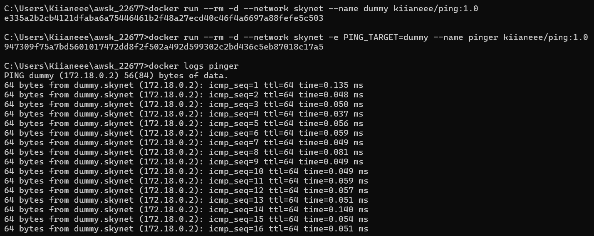

Notice this time the host name resolves successfully. This is Docker's Embedded DNS in action. It's most useful when orchestrating multiple containers in a single application, such as a web server, database, and cache. Instead of using IP addresses, you can define each of the respective connection strings using container names to leverage DNS resolution.

Stop and remove the containers by running `docker stop pinger` and `docker stop dummy`.
	```
	docker stop pinger dummy
	```

### Connecting between containers in a network

We can resolve host names and ping, but this isn't the same as connecting with TCP/UDP between containers.

Let's setup two `postgres` databases to connect to one another: a `widget` database, and `gadget` database.

Start each of the databases and add them to the network:

```
	docker run --rm -d --name widgetdb --network skynet -p 5432 -e POSTGRES_PASSWORD=p1 postgres
	docker run --rm -d --name gadgetdb --network skynet -p 5432 -e POSTGRES_PASSWORD=p2 postgres
	docker ps
```
	
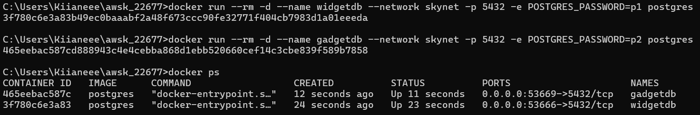

By default, port 5432 is blocked and inaccessible. However, by adding `-p 5432`, we are permitting other containers to access it through port 5432, the default Postgres port. 

Now that they're running, start a shell session in the `widgetdb` using `docker exec`:

```
	docker exec -it widgetdb /bin/bash
```

You can then connect to the local database using `psql`. (End the `psql` session by entering `\q`.)

```
	psql -U postgres
	\q
```

Or to the `gadget` database by referring to it by name:

```
	psql -U postgres -h gadgetdb
	\q
	exit
```
	
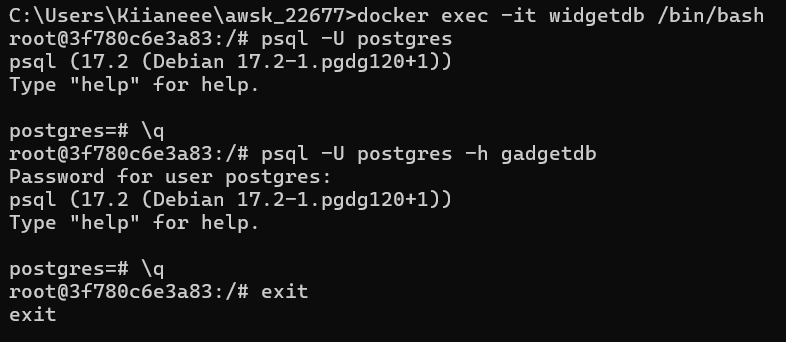

Type `exit` to end the session, then `docker stop widgetdb gadgetdb` to stop and remove the containers.
	```
	docker stop widgetdb gadgetdb
	```

### Binding ports to the host

Sometimes its useful to access an application running in a Docker container directly, as if it were running on your host machine.

To this end, you can bind ports from a container to a port on your host machine. To do this, the altered command from our previous Postgres example would look like:

```
	docker run --rm -d --name widgetdb --network skynet -p 5432:5432 -e POSTGRES_PASSWORD=p1 postgres
```

The `-p` flag given `<host port>:<container port>` does this mapping, making the server available as `localhost:5432`:

You can then run `psql` (if the utility is installed) on your host machine to access the Postgres database 

```
	docker exec -it widgetdb /bin/bash
 	psql -U postgres -h localhost
	\q
```
	
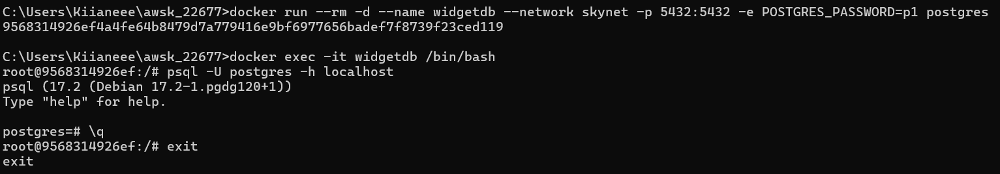

It's important to keep in mind that you can only bind one application to a host port at a time. If you try to start any applications on your host machine, or other Docker containers that want to bind to a port already in use, they will fail to do so. 

Type `docker stop widgetdb` to stop and remove the container.
	```
	docker stop widgetdb
	```

## END OF EXERCISE 6
