# DevOps with Docker (part 1)
### Kinga Wierzbicka 215IC_B2 22677

This part introduces containerization with Docker and relevant concepts such as *image* and *volume*. By the end of this part you are able to:

* Run containerized applications

* Containerize applications

* Utilize volumes to store data persistently outside of the containers.

* Use port mapping to enable access via TCP to containerized applications

* Share your own containers publicly

Shortcut to exercises:
* [Exercises 1.1-1.2](#exercises-11-12)
* [Exercise 1.3](#exercise-13)
* [Exercise 1.4](#exercise-14)
* [Exercises 1.5 - 1.6](#exercises-15---16)
* [Exercises 1.7-1.8](#exercises-17---18)
* [Exercise 1.9](#exercise-19)
* [Exercise 1.10](#exercise-110)
* [Exercises 1.11-1.14](#exercises-111-114)
* [Exercises 1.15-1.16](#exercises-115-116)

---

# Definitions and basic concepts

## What is DevOps?

Before we get started with Docker let's lay the groundwork for learning the right mindset. Defining DevOps is not a trivial task but the term itself consists of two parts, *Dev* and *Ops*. *Dev* refers to the development of software and *Ops* to operations. Simple definition for DevOps would be that it means the release, configuring, and monitoring of software is in the hands of the very people who develop it.

A more formal definition is offered by [Jabbari et al.](https://dl.acm.org/citation.cfm?id=2962707): "DevOps is a development methodology aimed at bridging the gap between Development and Operations, emphasizing communication and collaboration, continuous integration, quality assurance and delivery with automated deployment utilizing a set of development practices".


Image of DevOps toolchain by Kharnagy from [wikipedia](https://commons.wikimedia.org/wiki/File:Devops-toolchain.svg)

*Sometimes* DevOps is regarded as a role that one person or a team can fill. Here's some external motivation to learn DevOps skills: [Salary by Developer Type in StackOverflow survey](https://insights.stackoverflow.com/survey/2020#work-salary-and-experience-by-developer-type). You will not become a DevOps specialist solely from this course, but you will get the skills to help you navigate in the increasingly containerized world.

During this course we will focus mainly on the packaging, releasing and configuring of the applications. You will not be asked to plan or create new software. We will go over Docker and a few technologies that you may see in your daily life, these include e.g. Redis and Postgres. See [StackOverflow survey](https://insights.stackoverflow.com/survey/2020#technology-how-technologies-are-connected) on how closely they correlate these technologies.

## What is Docker?

"Docker is a set of platform as a service (PaaS) products that use OS-level virtualization to deliver software in packages called containers." - [from Wikipedia](https://en.wikipedia.org/wiki/Docker_(software)).

So stripping the jargon we get two definitions:
  1. Docker is a set of tools to deliver software in containers.
  2. Containers are packages of software.


The above image illustrates how containers include the application and its dependencies. These containers are isolated so that they don't interfere with each other or the software running outside of the containers. In case you need to interact with them or enable interactions between them, Docker offers tools to do so.

## Benefits from containers ##

Containers package applications. Sounds simple, right? To illustrate the potential benefits let's talk about different scenarios.

### Scenario 1: Works on my machine ###

Let's first take a closer look into what happens in web development without containers following the chain above starting from "Plan".

First you plan an application. Then your team of 1-n developers create the software. It works on your computer. It may even go through a testing pipeline working perfectly. You send it to the server and...

...it does not work.

This is known as the **"works on my machine"** problem. The only way to solve this is by finding out what in tarnation the developer had installed on their machine that made the application work.

Containers solve this problem by allowing the developer to personally run the application inside a container, which then includes all of the dependencies required for the app to work.

* You may still occasionally hear about "works in my **container**" issues - these are often just usage errors.

### Scenario 2: Isolated environments ###

You have 5 different Python applications. You need to deploy them to a server that already has an application requiring Python 2.7 and of course none of your applications are 2.7. What do you do?

Since containers package the software with all of its dependencies, you package the existing app and all 5 new ones with their respective Python versions and that's it.

I can only imagine the disaster that would result if you try to run them side by side on the same machine without isolating the environments. It sounds more like a time bomb. Sometimes different parts of a system may change over time, possibly leading to the application not working. These changes may be anything from an operating system update to changes in dependencies.

### Scenario 3: Development ###

You are brought into a dev team. They run a web app that uses other services when running: a Postgres database, MongoDB, Redis and a number of others. Simple enough, you install whatever is required to run the application and all of the applications that it depends on...

What a headache to start installing and then managing the development databases on your own machine.

Thankfully, by the time you are told to do that you are already a Docker expert. With one command you get an isolated application, like Postgres or Mongo, running in your machine.

### Scenario 4: Scaling ###

Starting and stopping a Docker container has little overhead. But when you run your own Netflix or Facebook, you want to meet the changing demand. With some advanced tooling that we will learn about in parts 2 and 3, we can spin up multiple containers instantly and load balance traffic between them.

Container orchestration will be discussed in parts 2 and 3. But the simplest example: what happens when one application dies? The orchestration system notices it, splits traffic between the working replicas, and spins up a new container to replace the dead one.

## Virtual machines ##

Isn't there already a solution for this? Virtual Machines are not the same as Containers - they solve different problems. We will not be looking into Virtual Machines in this course. However, here's a diagram to give you a rough idea of the difference.


The difference between a virtual machine and Docker solutions arises after moving Application A to an incompatible system "Operating System B". Running software on top of containers is almost as efficient as running it "natively" outside containers, at least when compared to virtual machines.

So containers have a direct access to your own Operating Systems kernel and resources. The resource usage overhead of using containers is minimized, as the applications behave as if there were no extra layers. As Docker is using Linux kernels, Mac and Windows can't run it without a few hoops and each have their own solutions on how to run Docker.

## Running containers ##

You already have Docker installed so let's run our first container!

The hello-world is a simple application that outputs "Hello from Docker!" and some additional info.

Simply run `docker container run hello-world`, the output will be the following:

```console
$ docker container run hello-world
  Unable to find image 'hello-world:latest' locally
  latest: Pulling from library/hello-world
  b8dfde127a29: Pull complete
  Digest: sha256:308866a43596e83578c7dfa15e27a73011bdd402185a84c5cd7f32a88b501a24
  Status: Downloaded newer image for hello-world:latest

  Hello from Docker!
  This message shows that your installation appears to be working correctly.

  To generate this message, Docker took the following steps:
   1. The Docker client contacted the Docker daemon.
   2. The Docker daemon pulled the "hello-world" image from the Docker Hub.
      (amd64)
   3. The Docker daemon created a new container from that image which runs the
      executable that produces the output you are currently reading.
   4. The Docker daemon streamed that output to the Docker client, which sent it
      to your terminal.

  To try something more ambitious, you can run an Ubuntu container with:
   $ docker run -it ubuntu bash

  Share images, automate workflows, and more with a free Docker ID:
   https://hub.docker.com/

  For more examples and ideas, visit:
   https://docs.docker.com/get-started/
```

The command `docker container run` has a shorthand form `docker run`, so instead of 

```console
$ docker container run hello-world
```

we could do the same with less typing and use just

```console
$ docker run hello-world
```


If you already ran hello-world previously it will skip the first 5 lines. The first 5 lines tell that an **image** "hello-world:latest" wasn't found and it was downloaded. Try it again:

```console
$ docker run hello-world

  Hello from Docker!
  ...
```

It found the **image** locally so it skipped right to running the hello-world.

:::tip Security reminder: Downloading from the internet

Keep in mind that we are downloading stuff from the internet. Double checking what you're running is always a good idea.

:::

So that's an image?

## Image and containers

Since we already know what containers are it's easier to explain images through them: Containers are instances of images. A basic mistake is to confuse images and containers.

Cooking metaphor:

Think of a container as a ready-to-eat meal that you can simply heat up and consume. An image, on the other hand, is the recipe or ingredients for that meal.

So just like how you need a recipe and ingredients to make a meal, you need an image and a container runtime (Docker engine) to create a container. The image provides all the necessary instructions and dependencies for the container to run, just like a recipe provides the steps and ingredients to make a meal.

In short, an image is like a blueprint or template, while a container is an instance of that blueprint or template.

### Image

A Docker image is a file. An image never changes; you can not edit an existing file. Creating a new image happens by starting from a base image and adding new **layers** to it. We will talk about layers later, but you should think of images as *immutable*, they can not be changed after they are created.

List all your images with `docker image ls`

```console
$ docker image ls
  REPOSITORY      TAG      IMAGE ID       CREATED         SIZE
  hello-world     latest   d1165f221234   9 days ago      13.3kB
```

Containers are created from images, so when we ran hello-world twice we downloaded one *image* and created two of them from the single image.

Well then, if images are used to create containers, where do images come from? This image file is built from an instructional file named **Dockerfile** that is parsed when you run `docker image build`.

Dockerfile is a file that is by default called _Dockerfile_, that looks something like this

**Dockerfile**
```Dockerfile
FROM <image>:<tag>

RUN <install some dependencies>

CMD <command that is executed on `docker container run`>
```

and is the instruction set for building an image. We will look into Dockerfiles later when we get to build our own image.

If we go back to the cooking metaphor, as Dockerfile provides the instructions needed to build an image you can think of that as the recipe for images. We're now 2 recipes deep, as Dockerfile is the recipe for an image and an image is the recipe for a container. The only difference is that Dockerfile is written by us, whereas image is written by our machine based on the Dockerfile!

### Container

Containers only contain what is required to execute an application; and you can start, stop and interact with them. They are **isolated** environments in the host machine with the ability to interact with each other and the host machine itself via defined methods (TCP/UDP).

List all your containers with `docker container ls`

```console
$ docker container ls
  CONTAINER ID   IMAGE     COMMAND   CREATED   STATUS    PORTS     NAMES
```

Without `-a` flag it will only print running containers. The hello-worlds we ran already exited.

```console
$ docker container ls -a
  CONTAINER ID   IMAGE           COMMAND      CREATED          STATUS                      PORTS     NAMES
  b7a53260b513   hello-world     "/hello"     5 minutes ago    Exited (0) 5 minutes ago              brave_bhabha
  1cd4cb01482d   hello-world     "/hello"     8 minutes ago    Exited (0) 8 minutes ago              vibrant_bell
```

The command `docker container ls` has also a shorter form `docker ps` that is preferred by many since it requires much less typing...

## Docker CLI basics

We are using the command line to interact with the "Docker Engine" that is made up of 3 parts: CLI, a REST API and Docker daemon. When you run a command, e.g. `docker container run`, behind the scenes the client sends a request through the REST API to the **Docker daemon** which takes care of images, containers and other resources.

You can read the [docs for more information](https://docs.docker.com/engine/reference/commandline/cli/). But even though you will find over 50 commands in the documentation, only a handful of them is needed for general use. There's a list of the most commonly used basic commands at the end of this section.

One of them is already familiar: `docker container run <image>`, which instructs daemon to create a container from the image and downloading the image if it is not available.

Let's remove the image since we will not need it anymore, `docker image rm hello-world` sounds about right. However, this should fail with the following error:

```console
$ docker image rm hello-world
  Error response from daemon: conflict: unable to remove repository reference "hello-world" (must force) - container <container ID> is using its referenced image <image ID>
```

This means that a container that was created from the image *hello-world* still exists and that removing *hello-world* could have consequences. So before removing images, you should have the referencing container removed first. Forcing is usually a bad idea, especially as we are still learning.

Run `docker container ls -a` to list all containers again.

```console
$ docker container ls -a
  CONTAINER ID   IMAGE           COMMAND        CREATED          STATUS                      PORTS     NAMES
  b7a53260b513   hello-world     "/hello"       35 minutes ago   Exited (0) 35 minutes ago             brave_bhabha
  1cd4cb01482d   hello-world     "/hello"       41 minutes ago   Exited (0) 41 minutes ago             vibrant_bell
```

Notice that containers have a *CONTAINER ID* and *NAME*. The names are currently autogenerated. When we have a lot of different containers, we can use grep (or another similar utility) to filter the list:

```console
$ docker container ls -a | grep hello-world
```

Let's remove the container with `docker container rm` command. It accepts a container's name or ID as its arguments.

Notice that the command also works with the first few characters of an ID. For example, if a container's ID is 3d4bab29dd67, you can use `docker container rm 3d` to delete it. Using the shorthand for the ID will not delete multiple containers, so if you have two IDs starting with 3d, a warning will be printed, and neither will be deleted. You can also use multiple arguments: `docker container rm id1 id2 id3`

If you have hundreds of stopped containers and you wish to delete them all, you should use `docker container prune`. Prune can also be used to remove "dangling" images with `docker image prune`. Dangling images are images that do not have a name and are not used. They can be created manually and are automatically generated during build. Removing them just saves some space.

And finally you can use `docker system prune` to clear almost everything. We aren't yet familiar with the exceptions that `docker system prune` does not remove.

After removing all of the *hello-world* containers, run `docker image rm hello-world` to delete the image. You can use `docker image ls` to confirm that the image is not listed.

You can also use the `image pull` command to download images without running them: `docker image pull hello-world`

Let's try starting a new container:

```console
$ docker run nginx
```

With some containers the command line appears to freeze after pulling and starting the container. This might be because that particular container is now running in the current terminal, blocking the input. You can observe this with `docker container ls` from another terminal. In this situation one can exit by pressing `control + c` and try again with the `-d` flag.

```console
$ docker run -d nginx
  c7749cf989f61353c1d433466d9ed6c45458291106e8131391af972c287fb0e5
```

The `-d` flag starts a container *detached*, meaning that it runs in the background. The container can be seen with

```console
$ docker container ls
  CONTAINER ID        IMAGE               COMMAND                  CREATED             STATUS              PORTS               NAMES
  c7749cf989f6        nginx               "nginx -g 'daemon of…"   35 seconds ago      Up 34 seconds       80/tcp              blissful_wright
```

Now if we try to remove it, it will fail:

```console
$ docker container rm blissful_wright
  Error response from daemon: You cannot remove a running container c7749cf989f61353c1d433466d9ed6c45458291106e8131391af972c287fb0e5. Stop the container before attempting removal or force remove
```

We should first stop the container using `docker container stop blissful_wright`, and then use `rm`.

Forcing is also a possibility and we can use `docker container rm --force blissful_wright` safely in this case. Again for both of them instead of name we could have used the ID or parts of it, e.g. c77.

It's common for the Docker daemon to become clogged over time with old images and containers.

### Most used commands

| command | explain | shorthand  |
|---|---|---|
| `docker image ls` | Lists all images | `docker images` |
| `docker image rm <image>` | Removes an image | `docker rmi` |
| `docker image pull <image>` | Pulls image from a docker registry | `docker pull`|
| `docker container ls -a` | Lists all containers | `docker ps -a` |
| `docker container run <image>` | Runs a container from an image | `docker run` |
| `docker container rm <container>` | Removes a container | `docker rm` |
| `docker container stop <container>` | Stops a container | `docker stop`|
| `docker container exec <container>` | Executes a command inside the container | `docker exec` |

For all of them container can be either the container id or the container name. Same for images. In the future we may use the shorthands in the material.

Some of the shorthands are legacy version of doing the same thing. You can use either.

## Exercises 1.1-1.2

Exercise 1.1: Getting started

  Since we already did "Hello, World!" in the material let's do something else.

  Start 3 containers from an image that does not automatically exit (such as nginx) in detached mode.

  Stop two of the containers and leave one container running.

  Submit the output for `docker ps -a` which shows 2 stopped containers and one running.

```
docker run -d --name k1 nginx
docker run -d --name k2 nginx
docker run -d --name k3 nginx
docker stop k1 k3
docker ps -a
```
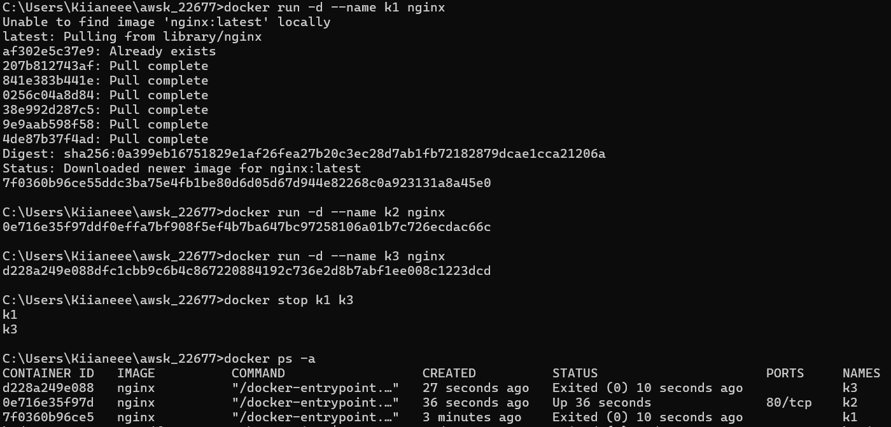

Exercise 1.2: Cleanup

  We have containers and an image that are no longer in use and are taking up space. Running `docker ps -a` and `docker image ls` will confirm this.

  Clean the Docker daemon by removing all images and containers.

  Submit the output for `docker ps -a` and `docker image ls`

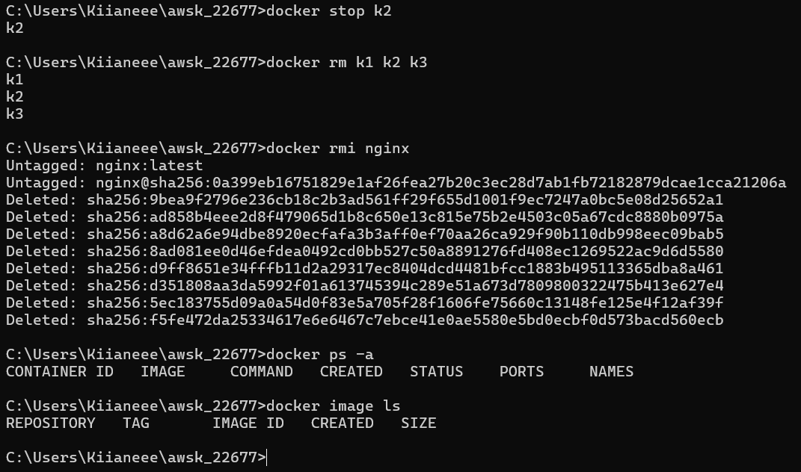


---

# Running and stopping containers


Next we will start using a more useful image than hello-world. We can run Ubuntu just with `docker run ubuntu`.

```console
$ docker run ubuntu
  Unable to find image 'ubuntu:latest' locally
  latest: Pulling from library/ubuntu
  83ee3a23efb7: Pull complete
  db98fc6f11f0: Pull complete
  f611acd52c6c: Pull complete
  Digest: sha256:703218c0465075f4425e58fac086e09e1de5c340b12976ab9eb8ad26615c3715
  Status: Downloaded newer image for ubuntu:latest
```

Anticlimactic as nothing really happened. The image was downloaded and ran and that was the end of that. It actually tried to open a shell but we will need to add a few flags to interact with it. `-t` will create a [tty](https://itsfoss.com/what-is-tty-in-linux/).

```console
$ docker run -t ubuntu
  root@f83969ce2cd1:/#
```

Now we're inside the container and if we input `ls` and press enter... nothing happens. Because our terminal is not sending the messages into the container. The `-i` flag will instruct to pass the STDIN to the container. If you're stuck with the other terminal you can just stop the container.

```console
$ docker run -it ubuntu
  root@2eb70ecf5789:/# ls
  bin  boot  dev  etc  home  lib  lib32  lib64  libx32  media  mnt  opt  proc  root  run  sbin  srv  sys  tmp  usr  var
```

Great! Now we know at least 3 useful flags. `-i` (interactive), `-t` (tty) and `-d` (detached).

Let's throw in a few more and run a container in the background:

```console
$ docker run -d -it --name looper ubuntu sh -c 'while true; do date; sleep 1; done'
```

:::tip Quotes

If you are command prompt (Windows) user you must use double quotes around the script i.e. `docker run -d -it --name looper ubuntu sh -c "while true; do date; sleep 1; done"`. The quote or double-quote may haunt you later during the course.

:::

- The first part, `docker run -d`. Should be familiar by now, run container detached.

- Followed by `-it` is short for `-i` and `-t`. Also familiar, `-it` allows you to interact with the container by using the command line.

- Because we ran the container with `--name looper`, we can now reference it easily.

- The image is `ubuntu` and what follows it is the command given to the container.

And to check that it's running, run `docker container ls`

Let's follow `-f` the output of logs with

```console
$ docker logs -f looper
  Thu Mar  1 15:51:29 UTC 2023
  Thu Mar  1 15:51:30 UTC 2023
  Thu Mar  1 15:51:31 UTC 2023
  ...
```

Let's test pausing the looper without exiting or stopping it. In another terminal run `docker pause looper`. Notice how the logs output has paused in the first terminal. To unpause run `docker unpause looper`.

Keep the logs open and attach to the running container from the second terminal using 'attach':

```console
$ docker attach looper
  Thu Mar  1 15:54:38 UTC 2023
  Thu Mar  1 15:54:39 UTC 2023
  ...
```

Now you have process logs (STDOUT) running in two terminals. Now press control+c in the attached window. The container is stopped because the process is no longer running.

If we want to attach to a container while making sure we don't close it from the other terminal we can specify to not attach STDIN with `--no-stdin` option. Let's start the stopped container with `docker start looper` and attach to it with `--no-stdin`.

Then try control+c.

```console
$ docker start looper

$ docker attach --no-stdin looper
  Thu Mar  1 15:56:11 UTC 2023
  Thu Mar  1 15:56:12 UTC 2023
  ^C
```

The container will continue running. Control+c now only disconnects you from the STDOUT.

### Running processes inside a container with docker exec ###

We often encounter situations where we need to execute commands within a running container. This can be achieved using the `docker exec` command.

We could e.g. list all the files inside the container default directory (which is the root) as follows:

```console
$ docker exec looper ls -la
total 56
drwxr-xr-x   1 root root 4096 Mar  6 10:24 .
drwxr-xr-x   1 root root 4096 Mar  6 10:24 ..
-rwxr-xr-x   1 root root    0 Mar  6 10:24 .dockerenv
lrwxrwxrwx   1 root root    7 Feb 27 16:01 bin -> usr/bin
drwxr-xr-x   2 root root 4096 Apr 18  2022 boot
drwxr-xr-x   5 root root  360 Mar  6 10:24 dev
drwxr-xr-x   1 root root 4096 Mar  6 10:24 etc
drwxr-xr-x   2 root root 4096 Apr 18  2022 home
lrwxrwxrwx   1 root root    7 Feb 27 16:01 lib -> usr/lib
drwxr-xr-x   2 root root 4096 Feb 27 16:01 media
drwxr-xr-x   2 root root 4096 Feb 27 16:01 mnt
drwxr-xr-x   2 root root 4096 Feb 27 16:01 opt
dr-xr-xr-x 293 root root    0 Mar  6 10:24 proc
drwx------   2 root root 4096 Feb 27 16:08 root
drwxr-xr-x   5 root root 4096 Feb 27 16:08 run
lrwxrwxrwx   1 root root    8 Feb 27 16:01 sbin -> usr/sbin
drwxr-xr-x   2 root root 4096 Feb 27 16:01 srv
dr-xr-xr-x  13 root root    0 Mar  6 10:24 sys
drwxrwxrwt   2 root root 4096 Feb 27 16:08 tmp
drwxr-xr-x  11 root root 4096 Feb 27 16:01 usr
drwxr-xr-x  11 root root 4096 Feb 27 16:08 var
```

We can execute the Bash shell in the container in interactive mode and then run any commands within that Bash session:

```console
$ docker exec -it looper bash

  root@2a49df3ba735:/# ps aux

  USER       PID %CPU %MEM    VSZ   RSS TTY      STAT START   TIME COMMAND
  root         1  0.2  0.0   2612  1512 pts/0    Ss+  12:36   0:00 sh -c while true; do date; sleep 1; done
  root        64  1.5  0.0   4112  3460 pts/1    Ss   12:36   0:00 bash
  root        79  0.0  0.0   2512   584 pts/0    S+   12:36   0:00 sleep 1
  root        80  0.0  0.0   5900  2844 pts/1    R+   12:36   0:00 ps aux
```

From the `ps aux` listing we can see that our `bash` process got PID (process ID) of 64.

Now that we're inside the container it behaves as you'd expect from Ubuntu, and we can exit the container with `exit` and then either kill or stop the container.

Our looper won't stop for a SIGTERM signal sent by a stop command. To terminate the process, stop follows the SIGTERM with a SIGKILL after a grace period. In this case, it's simply faster to use kill.

```console
$ docker kill looper
$ docker rm looper
```

Running the previous two commands is basically equivalent to running `docker rm --force looper`

Let's start another process with `-it` and add `--rm` in order to remove it automatically after it has exited. The `--rm` ensures that there are no garbage containers left behind. It also means that `docker start` can not be used to start the container after it has exited.

```console
$ docker run -d --rm -it --name looper-it ubuntu sh -c 'while true; do date; sleep 1; done'
```

Now let's attach to the container and hit control+p, control+q to detach us from the STDOUT.

```console
$ docker attach looper-it

  Mon Jan 15 19:50:42 UTC 2018
  Mon Jan 15 19:50:43 UTC 2018
  ^P^Qread escape sequence
```

Instead, if we had used ctrl+c, it would have sent a kill signal followed by removing the container as we specified `--rm` in `docker run` command.

### Exercise 1.3

Exercise 1.3: Secret message

Now that we've warmed up it's time to get inside a container while it's running!

Image `devopsdockeruh/simple-web-service:ubuntu` will start a container that outputs logs into a file. Go inside the running container and use `tail -f ./text.log` to follow the logs. Every 10 seconds the clock will send you a "secret message".

Submit the secret message and command(s) given as your answer.

```
docker run -d --name secret devopsdockeruh/simple-web-service:ubuntu
docker exec -it secret bash
tail -f ./text.log
```
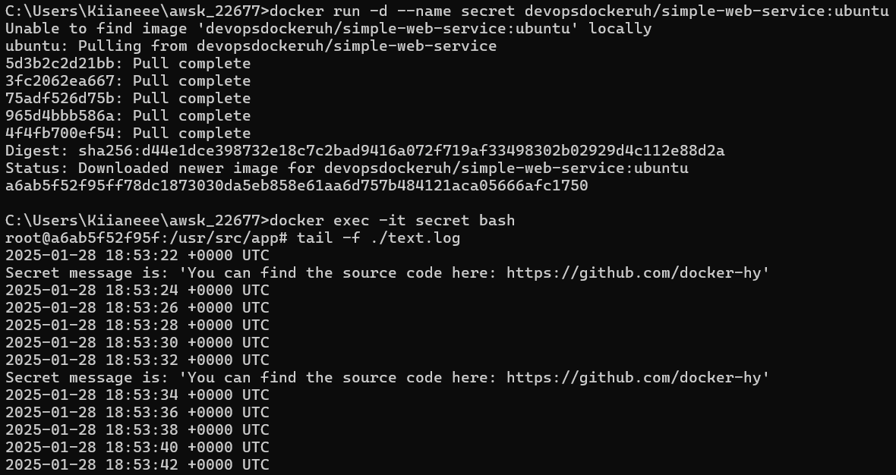

## Nonmatching host platform

If you are working with M1/M2 Mac, you quite likely end up with the following warning when running the image _devopsdockeruh/simple-web-service:ubuntu_:

```console
WARNING: The requested image's platform (linux/amd64) does not match the detected 
host platform (linux/arm64/v8) and no specific platform was requested
```

Despite this warning, you can run the container. The warning basically says what's wrong, the image uses a different processor architecture than your machine.

The image can be used because Docker Desktop for Mac employs an emulator by default when the image's processor architecture does not match the host's. However, it's important to note that emulated execution may be less efficient in terms of performance than running the image on a compatible native processor architecture.

When you run `docker run ubuntu` for example, you don't get a warning, why is that? Quite a few popular images are so-called [multi platform images](https://docs.docker.com/build/building/multi-platform/), which means that one image contains variations for different architectures. When you are about to pull or run such an image, Docker will detect the host architecture and give you the correct type of image.


## Ubuntu in a container is just... Ubuntu

A container that is running a Ubuntu image works quite like a normal Ubuntu:

```console
$ docker run -it ubuntu
root@881a1d4ecff2:/# ls
bin   dev  home  media  opt   root  sbin  sys  usr
boot  etc  lib   mnt    proc  run   srv   tmp  var
root@881a1d4ecff2:/# ps
  PID TTY          TIME CMD
    1 pts/0    00:00:00 bash
   13 pts/0    00:00:00 ps
root@881a1d4ecff2:/# date
Wed Mar  1 12:08:24 UTC 2023
root@881a1d4ecff2:/#
```

An image like Ubuntu contains already a nice set of tools but sometimes just the one that we need is not within the standard distribution. Let us assume that we would like to edit some files inside the container. The good old [Nano](https://www.nano-editor.org/) editor is a perfect fit for our purposes. We can install it in the container by using [apt-get](https://help.ubuntu.com/community/AptGet/Howto):

```console
$ docker run -it ubuntu
root@881a1d4ecff2:/# apt-get update
root@881a1d4ecff2:/# apt-get -y install nano
root@881a1d4ecff2:/# cd tmp/
root@881a1d4ecff2:/tmp# nano temp_file.txt
```

As can be seen, installing a program or library to a container happens just like the installation is done in "normal" Ubuntu. The remarkable difference is that the installation of Nano is not permanent, that is, if we remove our container, all is gone. We shall soon see how to get a more permanent solution for building images that are perfect to our purposes.

## Exercise 1.4

Exercise 1.4: Missing dependencies

Start a Ubuntu image with the process `sh -c 'while true; do echo "Input website:"; read website; echo "Searching.."; sleep 1; curl http://$website; done'`

If you're on Windows, you'll want to switch the `'` and `"` around: `sh -c "while true; do echo 'Input website:'; read website; echo 'Searching..'; sleep 1; curl http://$website; done"`.

You will notice that a few things required for proper execution are missing. Be sure to remind yourself which flags to use so that the container actually waits for input.

> Note also that curl is NOT installed in the container yet. You will have to install it from inside of the container.

Test inputting `helsinki.fi` into the application. It should respond with something like

```html
<html>
  <head>
    <title>301 Moved Permanently</title>
  </head>

  <body>
    <h1>Moved Permanently</h1>
    <p>The document has moved <a href="http://www.helsinki.fi/">here</a>.</p>
  </body>
</html>
```

This time return the command you used to start process and the command(s) you used to fix the ensuing problems.

**Hint** for installing the missing dependencies you could start a new process with `docker exec`.

* This exercise has multiple solutions, if the curl for helsinki.fi works then it's done. Can you figure out other (smart) solutions?

```
docker run --rm -it --name website ubuntu sh -c "apt-get update && apt-get -y install curl && echo 'Input website:'; read website; echo 'Searching..'; sleep 1; curl http://$website;"
helsinki.fi
```
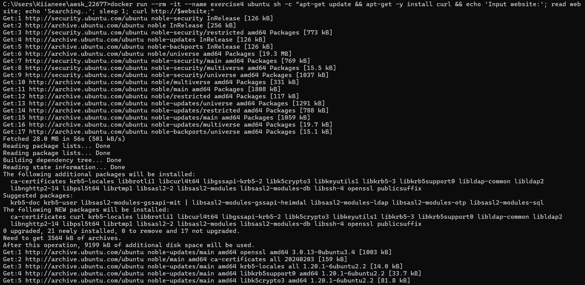

Final start of application:

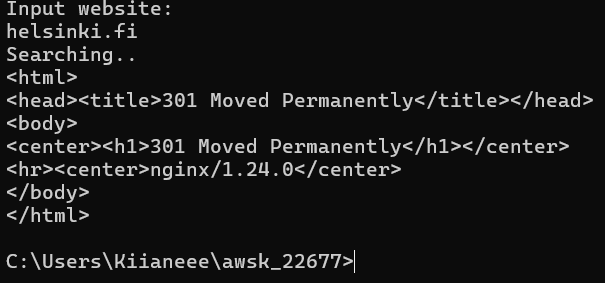

---

# In-depth dive into images

Images are the basic building blocks for containers and other images. When you "containerize" an application you work towards creating the image.

By learning what images are and how to create them you are ready to start utilizing containers in your own projects.

## Where do the images come from?

When running a command such as `docker run hello-world`, Docker will automatically search [Docker Hub](https://hub.docker.com/) for the image if it is not found locally.

This means that we can pull and run any public image from Docker's servers. For example‚ if we wanted to start an instance of the PostgreSQL database, we could just run `docker run postgres`, which would pull and run [https://hub.docker.com/\_/postgres/](https://hub.docker.com/_/postgres/).

We can search for images in the Docker Hub with `docker search`. Try running `docker search hello-world`.

The search finds plenty of results, and prints each image's name, short description, amount of stars, and "official" and "automated" statuses.

```console
$ docker search hello-world

  NAME                         DESCRIPTION    STARS   OFFICIAL   AUTOMATED
  hello-world                  Hello World!…  1988     [OK]
  kitematic/hello-world-nginx  A light-weig…  153
  tutum/hello-world            Image to tes…  90                 [OK]
  ...
```

Let's examine the list.

The first result, `hello-world`, is an official image. [Official images](https://docs.docker.com/docker-hub/official_images/) are curated and reviewed by Docker, Inc. and are usually actively maintained by the authors. They are built from repositories in the [docker-library](https://github.com/docker-library).

When browsing the CLI's search results, you can recognize an official image from the "[OK]" in the "OFFICIAL" column and also from the fact that the image's name has no prefix (aka organization/user). When browsing Docker Hub, the page will show "Docker Official Images" as the repository, instead of a user or organization. For example, see the [Docker Hub page](https://hub.docker.com/_/hello-world/) of the `hello-world` image.

The third result, `tutum/hello-world`, is marked as "automated". This means that the image is [automatically built](https://docs.docker.com/docker-hub/builds/) from the source repository. Its [Docker Hub page](https://hub.docker.com/r/tutum/hello-world/) shows its previous "Builds" and a link to the image's "Source Repository" (in this case, to GitHub) from which Docker Hub builds the image.

The second result, `kitematic/hello-world-nginx`, is neither an official nor an automated image. We can't know what the image is built from, since its [Docker Hub page](https://hub.docker.com/r/kitematic/hello-world-nginx/) has no links to any repositories. The only thing its Docker Hub page reveals is that the image is 9 years old. Even if the image's "Overview" section had links to a repository, we would have no guarantees that the published image was built from that source.

There are also other Docker registries competing with Docker Hub, such as [Quay](https://quay.io/). By default, `docker search` will only search from Docker Hub, but to search a different registry, you can add the registry address before the search term, for example, `docker search quay.io/hello`. Alternatively, you can use the registry's web pages to search for images. Take a look at the page of [the `nordstrom/hello-world` image on Quay](https://quay.io/repository/nordstrom/hello-world). The page shows the command to use to pull the image, which reveals that we can also pull images from hosts other than Docker Hub:

`docker pull quay.io/nordstrom/hello-world`

So, if the host's name (here: `quay.io`) is omitted, it will pull from Docker Hub by default.

NOTE: Trying the above command may fail giving manifest errors as the default tag latest is not present in quay.io/nordstrom/hello-world image. Specifying a correct tag for a image will pull the image without any errors, for ex.
`docker pull quay.io/nordstrom/hello-world:2.0`

## A detailed look into an image

Let's go back to a more relevant image than 'hello-world', the Ubuntu image, one of the most common Docker images to use as a base for your own image.

Let's pull Ubuntu and look at the first lines:

```console
$ docker pull ubuntu
  Using default tag: latest
  latest: Pulling from library/ubuntu
```

Since we didn't specify a tag, Docker defaulted to `latest`, which is usually the latest image built and pushed to the registry. **However**, in this case, the repository's [README](https://hub.docker.com/_/ubuntu) says that the `ubuntu:latest` tag points to the "latest LTS" instead since that's the version recommended for general use.

Images can be tagged to save different versions of the same image. You define an image's tag by adding `:<tag>` after the image's name.

Ubuntu's [Docker Hub page](https://hub.docker.com/r/library/ubuntu/tags/) reveals that there's a tag named 22.04 which promises us that the image is based on Ubuntu 22.04. Let's pull that as well:

```console
$ docker pull ubuntu:22.04

  22.04: Pulling from library/ubuntu
  c2ca09a1934b: Downloading [============================================>      ]  34.25MB/38.64MB
  d6c3619d2153: Download complete
  0efe07335a04: Download complete
  6b1bb01b3a3b: Download complete
  43a98c187399: Download complete
```

Images are composed of different layers that are downloaded in parallel to speed up the download. Images being made of layers also have other aspects and we will talk about them in part 3.

We can also tag images locally for convenience, for example, `docker tag ubuntu:22.04 ubuntu:jammy_jellyfish` creates the tag `ubuntu:jammy_jellyfish` which refers to `ubuntu:22.04`.

Tagging is also a way to "rename" images. Run `docker tag ubuntu:22.04 fav_distro:jammy_jellyfish` and check `docker image ls` to see what effects the command had.

To summarize, an image name may consist of 3 parts plus a tag. Usually like the following: `registry/organisation/image:tag`. But may be as short as `ubuntu`, then the registry will default to Docker hub, organisation to _library_ and tag to _latest_. The organisation may also be a user, but calling it an organisation may be more clear.

## Exercises 1.5 - 1.6

Exercise 1.5: Sizes of images

In the [Exercise 1.3](/part-1/section-2#exercise-13) we used `devopsdockeruh/simple-web-service:ubuntu`.

Here is the same application but instead of Ubuntu is using [Alpine Linux](https://www.alpinelinux.org/): `devopsdockeruh/simple-web-service:alpine`.

Pull both images and compare the image sizes.
Go inside the Alpine container and make sure the secret message functionality is the same. Alpine version doesn't have `bash` but it has `sh`, a more bare-bones shell.

```
docker pull devopsdockeruh/simple-web-service:ubuntu
docker pull devopsdockeruh/simple-web-service:alpine
docker images
docker run -d --rm -it --name secret2 devopsdockeruh/simple-web-service:alpine
docker exec -it secret-msg sh
tail -f ./text.log
```
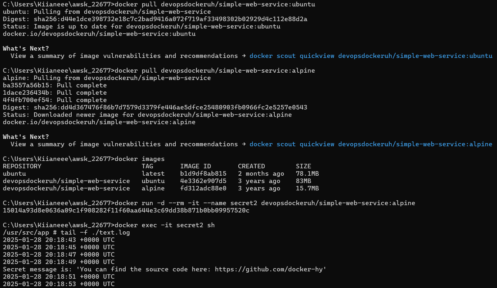

Exercise 1.6: Hello Docker Hub

Run `docker run -it devopsdockeruh/pull_exercise`.

The command will wait for your input.

Navigate through the [Docker hub](https://hub.docker.com/) to find the docs and Dockerfile that was used to create the image.

Read the Dockerfile and/or docs to learn what input will get the application to answer a "secret message".

Submit the secret message and command(s) given to get it as your answer.

```
docker run -it devopsdockeruh/pull_exercise
basics
```

Screen from: https://hub.docker.com/r/devopsdockeruh/pull_exercise

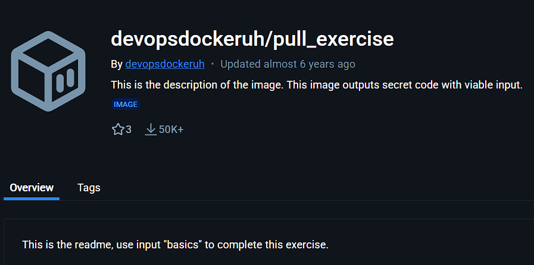

Screen from CMD

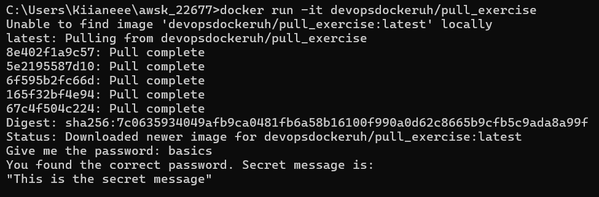

## Building images

Finally, we get to build our own images and get to talk about [`Dockerfile`](https://docs.docker.com/engine/reference/builder/) and why it's so great.

Dockerfile is simply a file that contains the build instructions for an image. You define what should be included in the image with different instructions. We'll learn about the best practices here by creating one.

Let's take a most simple application and containerize it first. Here is a script called "hello.sh"

**hello.sh**

```sh
#!/bin/sh

echo "Hello, docker!"
```

First, we will test that it even works. Create the file, add execution permissions and run it:

```console
$ chmod +x hello.sh

$ ./hello.sh
  Hello, docker!
```

* If you're using Windows you can skip these two and add chmod +x hello.sh to the Dockerfile.

And now to create an image from it. We'll have to create the `Dockerfile` that declares all of the required dependencies. At least it depends on something that can run shell scripts. We will choose [Alpine](https://www.alpinelinux.org/), a small Linux distribution that is often used to create small images.

Even though we're using Alpine here, you can use Ubuntu during exercises. Ubuntu images by default contain more tools to debug what is wrong when something doesn't work. In part 3 we will talk more about why small images are important.

We will choose exactly which version of a given image we want to use. This guarantees that we don't accidentally update through a breaking change, and we know which images need updating when there are known security vulnerabilities in old images.

Now create a file and name it "Dockerfile" and put the following instructions inside it:

**Dockerfile**

```Dockerfile
# Start from the alpine image that is smaller but no fancy tools
FROM alpine:3.19

# Use /usr/src/app as our workdir. The following instructions will be executed in this location.
WORKDIR /usr/src/app

# Copy the hello.sh file from this directory to /usr/src/app/ creating /usr/src/app/hello.sh
COPY hello.sh .

# Alternatively, if we skipped chmod earlier, we can add execution permissions during the build.
# RUN chmod +x hello.sh

# When running docker run the command will be ./hello.sh
CMD ./hello.sh
```

Great! We can use the command [docker build](https://docs.docker.com/engine/reference/commandline/build/) to turn the Dockerfile to an image.

By default `docker build` will look for a file named Dockerfile. Now we can run `docker build` with instructions where to build (`.`) and give it a name (`-t <name>`):

```console
$ docker build . -t hello-docker
 => [internal] load build definition from Dockerfile                                                                                                                                              0.0s
 => => transferring dockerfile: 478B                                                                                                                                                              0.0s
 => [internal] load metadata for docker.io/library/alpine:3.19                                                                                                                                    2.1s
 => [auth] library/alpine:pull token for registry-1.docker.io                                                                                                                                     0.0s
 => [internal] load .dockerignore                                                                                                                                                                 0.0s
 => => transferring context: 2B                                                                                                                                                                   0.0s
 => [1/3] FROM docker.io/library/alpine:3.19@sha256:c5b1261d6d3e43071626931fc004f70149baeba2c8ec672bd4f27761f8e1ad6b                                                                              0.0s
 => [internal] load build context                                                                                                                                                                 0.0s
 => => transferring context: 68B                                                                                                                                                                  0.0s
 => [2/3] WORKDIR /usr/src/app                                                                                                                                                                    0.0s
 => [3/3] COPY hello.sh .                                                                                                                                                                         0.0s
 => exporting to image                                                                                                                                                                            0.0s
 => => exporting layers                                                                                                                                                                           0.0s
 => => writing image sha256:5f8f5d7445f34b0bcfaaa4d685a068cdccc1ed79e65068337a3a228c79ea69c8                                                                                                      0.0s
 => => naming to docker.io/library/hello-docker
```

Let us ensure that the image exists:

```console
$ docker image ls
  REPOSITORY            TAG          IMAGE ID       CREATED         SIZE
  hello-docker          latest       5f8f5d7445f3   4 minutes ago   7.73MB
```

:::tip Permission denied

If you're now getting "/bin/sh: ./hello.sh: Permission denied" it's because the `chmod +x hello.sh` was skipped earlier. You can simply uncomment the RUN instruction between COPY and CMD instructions

:::

:::tip not found

If you're now getting "/bin/sh: ./hello.sh: not found" and you're using Windows it might be because by default Windows uses [CRLF](https://www.cs.toronto.edu/~krueger/csc209h/tut/line-endings.html) as line ending. Unix, in our case Alpine, uses just LF which makes the copying of our `hello.sh` invalid bash script in the build phase. To overcome this error change the line endings to LF before running `docker build`

:::

Now executing the application is as simple as running `docker run hello-docker`. Try it!

During the build we see from the output that there are three steps: [1/3], [2/3] and [3/3]. The steps here represent [layers](https://docs.docker.com/build/guide/layers/) of the image so that each step is a new layer on top of the base image (alpine:3.19 in our case).

Layers have multiple functions. We often try to limit the number of layers to save on storage space but layers can work as a cache during build time. If we just edit the last lines of Dockerfile the build command can start from the previous layer and skip straight to the section that has changed. COPY automatically detects changes in the files, so if we change the hello.sh it'll run from step 3/3, skipping 1 and 2. This can be used to create faster build pipelines. We'll talk more about optimization in part 3.


It is also possible to manually create new layers on top of a image. Let us now create a new file called `additional.txt` and copy it inside a container.

We'll need two terminals, that shall be called 1 and 2 in the following listings. Let us start by running the image: 

```console
# do this in terminal 1
$ docker run -it hello-docker sh
/usr/src/app #
```

Now we're inside of the container. We replaced the CMD we defined earlier with `sh` and used -i and -t to start the container so that we can interact with it.

In the second terminal we will copy the file inside the container:

```console
# do this in terminal 2
$ docker ps
  CONTAINER ID   IMAGE          COMMAND   CREATED         STATUS         PORTS     NAMES
  9c06b95e3e85   hello-docker   "sh"      4 minutes ago   Up 4 minutes             zen_rosalind

$ touch additional.txt
$ docker cp ./additional.txt zen_rosalind:/usr/src/app/
```

The file is created with command `touch` right before copying it in.

Let us ensure that the file is copied inside the container:

```console
# do this in terminal 1
/usr/src/app # ls
additional.txt  hello.sh
```

Great! Now we've made a change to the container. We can use command [docker diff](https://docs.docker.com/reference/cli/docker/container/diff/) to check what has changed

```console
# do this in terminal 2
$ docker diff zen_rosalind
  C /usr
  C /usr/src
  C /usr/src/app
  A /usr/src/app/additional.txt
  C /root
  A /root/.ash_history
```

The character in front of the file name indicates the type of the change in the container's filesystem: A = added, D = deleted, C = changed. The additional.txt was created and our `ls` created .ash_history.

Next we will save the changes as _a new image_ with the command [docker commit](https://docs.docker.com/engine/reference/commandline/container_commit/):

```console
# do this in terminal 2
$ docker commit zen_rosalind hello-docker-additional
  sha256:2f63baa355ce5976bf89fe6000b92717f25dd91172aed716208e784315bfc4fd
$ docker image ls
  REPOSITORY                   TAG          IMAGE ID       CREATED          SIZE
  hello-docker-additional      latest       2f63baa355ce   3 seconds ago    7.73MB
  hello-docker                 latest       444f21cf7bd5   31 minutes ago   7.73MB
```

Technically the command `docker commit` added a new layer on top of the image `hello-docker`, and the resulting image was given the name `hello-docker-additional`.

We will actually not use the command `docker commit` again during this course. This is because defining the changes to the Dockerfile is much more sustainable method of managing changes. No magic actions or scripts, just a Dockerfile that can be version controlled.

Let's do just that and create hello-docker with v2 tag that includes the file additional.txt. The new file can be added with a [RUN](https://docs.docker.com/engine/reference/builder/#run) instruction:

**Dockerfile**

```Dockerfile
# Start from the alpine image
FROM alpine:3.19

# Use /usr/src/app as our workdir. The following instructions will be executed in this location.
WORKDIR /usr/src/app

# Copy the hello.sh file from this location to /usr/src/app/ creating /usr/src/app/hello.sh.
COPY hello.sh .

# Execute a command with `/bin/sh -c` prefix.
RUN touch additional.txt

# When running Docker run the command will be ./hello.sh
CMD ./hello.sh
```

Now we used the RUN instruction to execute the command `touch additional.txt` which creates a file inside the resulting image. Pretty much anything that can be executed in the container based on the created image, can be instructed to be run with the RUN instruction during the build of a Dockerfile.

Build now the Dockerfile with `docker build . -t hello-docker:v2` and we are done! Let's compare the output of ls:

```
$ docker run hello-docker-additional ls
  additional.txt
  hello.sh

$ docker run hello-docker:v2 ls
  additional.txt
  hello.sh
```

Now we know that all instructions in a Dockerfile **except** CMD (and one other that we will learn about soon) are executed during build time. **CMD** is executed when we call docker run, unless we overwrite it.

## Exercises 1.7 - 1.8

Exercise 1.7: Image for script

We can improve our previous solutions now that we know how to create and build a Dockerfile.

Let us now get back to [Exercise 1.4](/part-1/section-2#exercise-14).

Create a new file `script.sh` on your local machine with the following contents:

```bash
while true
do
  echo "Input website:"
  read website; echo "Searching.."
  sleep 1; curl http://$website
done
```

Create a Dockerfile for a new image that starts from _ubuntu:22.04_ and add instructions to install `curl` into that image. Then add instructions to copy the script file into that image and finally set it to run on container start using CMD.

After you have filled the Dockerfile, build the image with the name "curler".

* If you are getting permission denied, use `chmod` to give permission to run the script.

The following should now work:

```bash
$ docker run -it curler

  Input website:
  helsinki.fi
  Searching..
  <!DOCTYPE HTML PUBLIC "-//IETF//DTD HTML 2.0//EN">
  <html><head>
  <title>301 Moved Permanently</title>
  </head><body>
  <h1>Moved Permanently</h1>
  <p>The document has moved <a href="https://www.helsinki.fi/">here</a>.</p>
  </body></html>
```

Remember that [RUN](https://docs.docker.com/engine/reference/builder/#run) can be used to execute commands while building the image!

Submit the Dockerfile.

Dockerfile:

```
FROM ubuntu:22.04
RUN apt-get update && apt-get install -y curl
COPY script.sh /usr/local/bin/script.sh
RUN chmod +x /usr/local/bin/script.sh
CMD ["/usr/local/bin/script.sh"]
```

Used commands:

```
docker build . -t curler
docker run -it curler

```

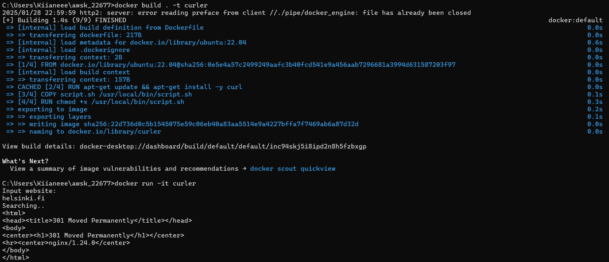


Exercise 1.8: Two line Dockerfile

By default our `devopsdockeruh/simple-web-service:alpine` doesn't have a CMD. Instead, it uses _ENTRYPOINT_ to declare which application is run.

We'll talk more about _ENTRYPOINT_ in the next section, but you already know that the last argument in `docker run` can be used to give a command or an argument.

As you might've noticed it doesn't start the web service even though the name is "simple-web-service". A suitable argument is needed to start the server!

Try `docker run devopsdockeruh/simple-web-service:alpine hello`. The application reads the argument "hello" but will inform that hello isn't accepted.

In this exercise create a Dockerfile and use FROM and CMD to create a brand new image that automatically runs `server`.

The Docker documentation [CMD](https://docs.docker.com/engine/reference/builder/#cmd) says a bit indirectly that if a image has ENTRYPOINT defined, CMD is used to define it the default arguments.

Tag the new image as "web-server"

Return the Dockerfile and the command you used to run the container.

Running the built "web-server" image should look like this:

```console
$ docker run web-server
[GIN-debug] [WARNING] Creating an Engine instance with the Logger and Recovery middleware already attached.

[GIN-debug] [WARNING] Running in "debug" mode. Switch to "release" mode in production.
- using env:   export GIN_MODE=release
- using code:  gin.SetMode(gin.ReleaseMode)

[GIN-debug] GET    /*path                    --> server.Start.func1 (3 handlers)
[GIN-debug] Listening and serving HTTP on :8080
```

* We don't have any method of accessing the web service yet. As such confirming that the console output is the same will suffice.

* The exercise title may be a useful hint here.

Dockerfile:

```
FROM devopsdockeruh/simple-web-service:alpine
CMD server
```

Commands:

```
docker build . -t web-server
docker run web-server
```

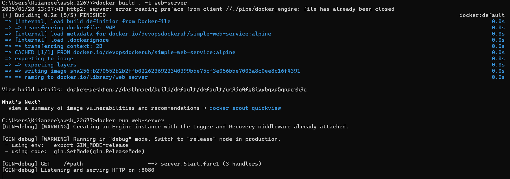

---

# Defining start conditions for the container

Next, we will start moving towards a more meaningful image. [yt-dlp](https://github.com/yt-dlp/yt-dlp) is a program that downloads YouTube and [Imgur](https://imgur.com/) videos. Let's add it to an image - but this time, we will change our process. Instead of our current process where we add things to the Dockerfile and hope it works, let's try another approach. This time we will open up an interactive session and test stuff before "storing" it in our Dockerfile.

By following the [yt-dlp installation instructions](https://github.com/yt-dlp/yt-dlp/wiki/Installation) we will start as follows:

```console
$ docker run -it ubuntu:22.04

  root@8c587232a608:/# curl -L https://github.com/yt-dlp/yt-dlp/releases/latest/download/yt-dlp -o /usr/local/bin/yt-dlp
  bash: curl: command not found
```

..and, as we already know, curl is not installed - let's add `curl` with `apt-get` again.

```console
$ apt-get update && apt-get install -y curl
$ curl -L https://github.com/yt-dlp/yt-dlp/releases/latest/download/yt-dlp -o /usr/local/bin/yt-dlp
```

At some point, you may have noticed that _sudo_ is not installed either, but since we are _root_ we don't need it.

Next, we will add permissions and run the downloaded binary:

```console
$ chmod a+rx /usr/local/bin/yt-dlp
$ yt-dlp
/usr/bin/env: 'python3': No such file or directory
```

Okay, [documentation](https://github.com/yt-dlp/yt-dlp?tab=readme-ov-file#dependencies) mentions that Python 3.8 or later is needed to run yt-dlp. So let us install that:

```console
$ apt-get install -y python3
```

We can now try to run the app again:

```console
$ yt-dlp

  Usage: yt-dlp [OPTIONS] URL [URL...]

  yt-dlp: error: You must provide at least one URL.
  Type yt-dlp --help to see a list of all options.
```

It works, we just need to give it a URL.

So now when we know exactly what we need. Starting FROM ubuntu:22.04, we'll add the above steps to our `Dockerfile`. We should always try to keep the most prone to change rows at the bottom, by adding the instructions to the bottom we can preserve our cached layers - this is a handy practice to speed up the build process when there are time-consuming operations like downloads in the Dockerfile. We also added WORKDIR, which will ensure the videos will be downloaded there.

```dockerfile
FROM ubuntu:22.04

WORKDIR /mydir

RUN apt-get update && apt-get install -y curl python3
RUN curl -L https://github.com/yt-dlp/yt-dlp/releases/latest/download/yt-dlp -o /usr/local/bin/yt-dlp
RUN chmod a+x /usr/local/bin/yt-dlp

CMD ["/usr/local/bin/yt-dlp"]
```

We have also overridden `bash` as our image command (set on the base image) with _yt-dlp_ itself. This will not quite work, but let's see why.

Let us now build the Dockerfile as image `yt-dlp` and run it:

```console
$ docker build -t yt-dlp .
  ...

$ docker run yt-dlp

  Usage: yt-dlp [OPTIONS] URL [URL...]

  yt-dlp: error: You must provide at least one URL.
  Type yt-dlp --help to see a list of all options.
```

So far so good. The natural way to use this image would be to give the URL as an argument but unfortunately, it does not work:

```console
$ docker run yt-dlp https://www.youtube.com/watch?v=uTZSILGTskA

  docker: Error response from daemon: failed to create task for container: failed to create shim task: OCI runtime create failed: runc create failed: unable to start container process: exec: "https://www.youtube.com/watch?v=uTZSILGTskA": stat https://www.youtube.com/watch?v=uTZSILGTskA: no such file or directory: unknown.
  ERRO[0000] error waiting for container: context canceled
```

As we now know, _the argument we gave it is replacing the command_ or `CMD`:

```console
$ docker run -it yt-dlp ps
  PID TTY          TIME CMD
    1 pts/0    00:00:00 ps
$ docker run -it yt-dlp ls -l
total 0
$ docker run -it yt-dlp pwd
/mydir
```

We need a way to have something _before_ the command. Luckily we have a way to do this: we can use [ENTRYPOINT](https://docs.docker.com/engine/reference/builder/#entrypoint) to define the main executable and then Docker will combine our run arguments for it.

```dockerfile
FROM ubuntu:22.04

WORKDIR /mydir

RUN apt-get update && apt-get install -y curl python3
RUN curl -L https://github.com/yt-dlp/yt-dlp/releases/latest/download/yt-dlp -o /usr/local/bin/yt-dlp
RUN chmod a+x /usr/local/bin/yt-dlp

# Replacing CMD with ENTRYPOINT
ENTRYPOINT ["/usr/local/bin/yt-dlp"]
```

And now it works like it should:

```console
$ docker build -t yt-dlp .
$ docker run yt-dlp https://www.youtube.com/watch?v=XsqlHHTGQrw
[youtube] Extracting URL:https://www.youtube.com/watch?v=XsqlHHTGQrw
[youtube] uTZSILGTskA: Downloading webpage
[youtube] uTZSILGTskA: Downloading ios player API JSON
[youtube] uTZSILGTskA: Downloading android player API JSON
[youtube] uTZSILGTskA: Downloading m3u8 information
[info] uTZSILGTskA: Downloading 1 format(s): 22
[download] Destination: Master’s Programme in Computer Science ｜ University of Helsinki [XsqlHHTGQrw].mp4
[download] 100% of    6.29MiB in 00:00:00 at 9.95MiB/s
```

With _ENTRYPOINT_ `docker run` now executed the combined `/usr/local/bin/yt-dlp https://www.youtube.com/watch?v=uTZSILGTskA` inside the container!

`ENTRYPOINT` vs `CMD` can be confusing - in a properly set up image, such as our yt-dlp, the command represents an argument list for the entrypoint. By default, the entrypoint in Docker is set as `/bin/sh -c` and this is passed if no entrypoint is set. This is why giving the path to a script file as CMD works: you're giving the file as a parameter to `/bin/sh -c`.

If an image defines both, then the CMD is used to give [default arguments](https://docs.docker.com/engine/reference/builder/#cmd) to the entrypoint. Let us now add a CMD to the Dockerfile:

```dockerfile
FROM ubuntu:22.04

WORKDIR /mydir

RUN apt-get update && apt-get install -y curl python3
RUN curl -L https://github.com/yt-dlp/yt-dlp/releases/latest/download/yt-dlp -o /usr/local/bin/yt-dlp
RUN chmod a+x /usr/local/bin/yt-dlp

ENTRYPOINT ["/usr/local/bin/yt-dlp"]

# define a default argument
CMD ["https://www.youtube.com/watch?v=Aa55RKWZxxI"]
```

Now (after building again) the image can be run without arguments to download the video defined in CMD:

```console
$ docker run yt-dlp

  youtube] Extracting URL: https://www.youtube.com/watch?v=Aa55RKWZxxI
  [youtube] Aa55RKWZxxI: Downloading webpage
  [youtube] Aa55RKWZxxI: Downloading ios player API JSON
  [youtube] Aa55RKWZxxI: Downloading android player API JSON
  ...
  [download] 100% of    5.60MiB in 00:00:00 at 7.91MiB/s
```

The argument defined by CMD can be _overridden_ by giving one in the command line:

```console
$ docker run yt-dlp https://www.youtube.com/watch?v=DptFY_MszQs
[youtube] Extracting URL: https://www.youtube.com/watch?v=DptFY_MszQs
[youtube] DptFY_MszQs: Downloading webpage
[youtube] DptFY_MszQs: Downloading ios player API JSON
[youtube] DptFY_MszQs: Downloading android player API JSON
[youtube] DptFY_MszQs: Downloading player 9bb09009
[youtube] DptFY_MszQs: Downloading m3u8 information
[info] DptFY_MszQs: Downloading 1 format(s): 22
[download] Destination: Welcome to Kumpula campus! ｜ University of Helsinki [DptFY_MszQs].mp4
[download] 100% of   29.92MiB in 00:00:04 at 7.10MiB/s
```

In addition to all seen, there are two ways to set the ENTRYPOINT and CMD: **exec** form and **shell** form. We've been using the exec form where the command itself is executed. In shell form the command that is executed is wrapped with `/bin/sh -c` - it's useful when you need to evaluate environment variables in the command like `$MYSQL_PASSWORD` or similar.

In the shell form, the command is provided as a string without brackets. In the exec form the command and it's arguments are provided as a list (with brackets), see the table below:

| Dockerfile                                                 | Resulting command                                |
| ---------------------------------------------------------- | ------------------------------------------------ |
| ENTRYPOINT /bin/ping -c 3 <br /> CMD localhost             | /bin/sh -c '/bin/ping -c 3' /bin/sh -c localhost |
| ENTRYPOINT ["/bin/ping","-c","3"] <br /> CMD localhost     | /bin/ping -c 3 /bin/sh -c localhost              |
| ENTRYPOINT /bin/ping -c 3 <br /> CMD ["localhost"]         | /bin/sh -c '/bin/ping -c 3' localhost            |
| ENTRYPOINT ["/bin/ping","-c","3"] <br /> CMD ["localhost"] | /bin/ping -c 3 localhost                         |

As the command at the end of Docker run will be the CMD we want to use ENTRYPOINT to specify what to run, and CMD to specify which command (in our case url) to run.

**Most of the time** we can ignore ENTRYPOINT when building our images and only use CMD. For example, Ubuntu image defaults the ENTRYPOINT to bash so we do not have to worry about it. And it gives us the convenience of allowing us to overwrite the CMD easily, for example, with bash to go inside the container.

We can test how some other projects do this. Let's try Python:

```console
$ docker pull python:3.11
...
$ docker run -it python:3.11
Python 3.11.8 (main, Feb 13 2024, 09:03:56) [GCC 12.2.0] on linux
Type "help", "copyright", "credits" or "license" for more information.
>>> print("Hello, World!")
Hello, World!
>>> exit()

$ docker run -it python:3.11 --version
  docker: Error response from daemon: OCI runtime create failed: container_linux.go:370: starting container process caused: exec: "--version": executable file not found in $PATH: unknown.

$ docker run -it python:3.11 bash
  root@1b7b99ae2f40:/#

```

From this experiment, we learned that they have ENTRYPOINT as something other than Python, but the CMD is Python and we can overwrite it, here with bash. If they had ENTRYPOINT as Python we'd be able to run `--version`. We can create our own image for personal use as we did in a previous exercise with a new Dockerfile:

```dockerfile
FROM python:3.11
ENTRYPOINT ["python3"]
CMD ["--help"]
```

The result is an image that has Python as ENTRYPOINT and you can add the commands at the end, for example --version to see the version. Without overwriting the command, it will output the help.

Now we have two problems with the yt-dlp project:

- Major: The downloaded files stay in the container

- Minor: Our container build process creates many layers resulting in increased image size

We will fix the major issue first. The minor issue will get our attention in part 3.

By inspecting `docker container ls -a` we can see all our previous runs. When we filter this list with

```console
$ docker container ls -a --last 3

  CONTAINER ID        IMAGE               COMMAND                   CREATED                  STATUS                          PORTS               NAMES
  be9fdbcafb23        yt-dlp          "/usr/local/bin/yout…"    Less than a second ago   Exited (0) About a minute ago                       determined_elion
  b61e4029f997        f2210c2591a1        "/bin/sh -c \"/usr/lo…"   Less than a second ago   Exited (2) About a minute ago                       vigorous_bardeen
  326bb4f5af1e        f2210c2591a1        "/bin/sh -c \"/usr/lo…"   About a minute ago       Exited (2) 3 minutes ago                            hardcore_carson
```

We see that the last container was `be9fdbcafb23` or `determined_elion` for us humans.

```console
$ docker diff determined_elion
  C /root
  A /root/.cache
  A /root/.cache/yt-dlp
  A /root/.cache/yt-dlp/youtube-nsig
  A /root/.cache/yt-dlp/youtube-nsig/9bb09009.json
  C /mydir
  A /mydir/Welcome to Kumpula campus! ｜ University of Helsinki [DptFY_MszQs].mp4
```

Let's try `docker cp` command to copy the file from the container to the host machine. We should use quotes now since the filename has spaces.

```console
$ docker cp "determined_elion://mydir/Welcome to Kumpula campus! ｜ University of Helsinki [DptFY_MszQs].mp4" .
```

And now we have our file locally and we can watch it if the machine has a suitable player installed. Sadly, the use of `docker cp` is not proper to fix our issue. In the next section, we will improve this.

## Improved curler

With `ENTRYPOINT` we can make the curler of the [Exercise 1.7.](/part-1/section-3#exercises-17---18) more flexible.

Change the script so that it takes the first argument as the input:

```bash
#!/bin/bash

echo "Searching..";
sleep 1;
curl http://$1;
```

And change the CMD to ENTRYPOINT with the format `["./script.sh"]`. Now we can run

```bash
$ docker build . -t curler-v2
$ docker run curler-v2 helsinki.fi

  Searching..
    % Total    % Received % Xferd  Average Speed   Time    Time     Time  Current
                                   Dload  Upload   Total   Spent    Left  Speed
  100   232  100   232    0     0  13647      0 --:--:-- --:--:-- --:--:-- 13647
  <!DOCTYPE HTML PUBLIC "-//IETF//DTD HTML 2.0//EN">
  <html><head>
  <title>301 Moved Permanently</title>
  </head><body>
  <h1>Moved Permanently</h1>
  <p>The document has moved <a href="https://www.helsinki.fi/">here</a>.</p>
  </body></html>
```
---

# Interacting with the container via volumes and ports


Let us get back to yt-dlp. It works yes, but it is quite laborious to get the downloaded videos to the host machine.

We can use Docker [volumes](https://docs.docker.com/storage/volumes/) to make it easier to store the downloads outside the container's ephemeral storage. With [bind mount](https://docs.docker.com/storage/bind-mounts/) we can mount a file or directory from our own machine (the host machine) into the container.

Let's start a container with `-v` option, that requires an absolute path. We mount our current folder as `/mydir` in our container, overwriting everything that we have put in that folder in our Dockerfile.

```console
$ docker run -v "$(pwd):/mydir" yt-dlp https://www.youtube.com/watch?v=DptFY_MszQs
```

So a volume is simply a folder (or a file) that is shared between the host machine and the container. If a file in volume is modified by a program that's running inside the container the changes are also saved from destruction when the container is shut down as the file exists on the host machine. This is the main use for volumes as otherwise all of the files wouldn't be accessible when restarting the container. Volumes also can be used to share files between containers and run programs that are able to load changed files.

In our yt-dlp we wanted to mount the whole directory since the files are fairly randomly named. If we wish to create a volume with only a single file we could also do that by pointing to it. For example `-v "$(pwd)/material.md:/mydir/material.md"` this way we could edit the material.md locally and have it change in the container (and vice versa). Note also that `-v` creates a directory if the file does not exist.

## Exercise 1.9

Exercise 1.9: Volumes

In this exercise we won't create a new Dockerfile.

Image `devopsdockeruh/simple-web-service` creates a timestamp every two seconds to `/usr/src/app/text.log` when it's not given a command. Start the
container with a bind mount so that the logs are created into your filesystem.

Submit the command you used to complete the exercise.

**Hint:** read the note that was made just before this exercise!

```
docker run -v C:\Users\Kiianeee\awsk_22677\logs\text.log:/usr/src/app/text.log devopsdockeruh/simple-web-service
```


## Allowing external connections into containers

This course does not provide an in-depth exploration of inter-program communication mechanisms. If you want to learn that in-depth, you should look at classes about Operating Systems or Networking. Here, you just need to know a few simple things:

- Sending messages: Programs can send messages to [URL](https://en.wikipedia.org/wiki/URL) addresses such as this: http://127.0.0.1:3000 where HTTP is the [_protocol_](https://en.wikipedia.org/wiki/Hypertext_Transfer_Protocol), 127.0.0.1 is an IP address, and 3000 is a [_port_](<https://en.wikipedia.org/wiki/Port_(computer_networking)>). Note the IP part could also be a [_hostname_](https://en.wikipedia.org/wiki/Hostname): 127.0.0.1 is also called [_localhost_](https://en.wikipedia.org/wiki/Localhost) so instead you could use http://localhost:3000.

- Receiving messages: Programs can be assigned to listen to any available port. If a program is listening for traffic on port 3000, and a message is sent to that port, the program will receive and possibly process it.

The address _127.0.0.1_ and hostname _localhost_ are special ones, they refer to the machine or container itself, so if you are on a container and send a message to _localhost_, the target is the same container. Similarly, if you are sending the request from outside of a container to _localhost_, the target is your machine.

It is possible to **map your host machine port to a container port**. For example, if you map port 1000 on your host machine to port 2000 in the container, and then you send a message to http://localhost:1000 on your computer, the container will get that message if it's listening to its port 2000.

Opening a connection from the outside world to a Docker container happens in two steps:

- Exposing port

- Publishing port

Exposing a container port means telling Docker that the container listens to a certain port. This doesn't do much, except it helps humans with the configuration.

Publishing a port means that Docker will map host ports to the container ports.

To expose a port, add the line `EXPOSE <port>` in your Dockerfile

To publish a port, run the container with `-p <host-port>:<container-port>`

If you leave out the host port and only specify the container port, Docker will automatically choose a free port as the host port:

```console
$ docker run -p 4567 app-in-port
```

We could also limit connections to a certain protocol only, e.g. UDP by adding the protocol at the end: `EXPOSE <port>/udp` and `-p <host-port>:<container-port>/udp`.

:::tip Security reminder: Opening a door to the internet

Since we are opening a port to the application, anyone from the internet could come in and access what you're running.

Don't haphazardly open just any ports - a way for an attacker to get in is by exploiting a port you opened to an insecure server. An easy way to avoid this is by defining the host-side port like this `-p 127.0.0.1:3456:3000`. This will only allow requests from your computer through port 3456 to the application port 3000, with no outside access allowed.

The short syntax, `-p 3456:3000`, will result in the same as `-p 0.0.0.0:3456:3000`, which truly is opening the port to everyone.

Usually, this isn't risky. But depending on the application, it is something you should consider!

:::

## Exercise 1.10

Exercise 1.10: Ports open

In this exercise, we won't create a new Dockerfile.

The image `devopsdockeruh/simple-web-service` will start a web service in port `8080` when given the argument "server". In [Exercise 1.8](/part-1/section-3#exercises-17---18) you already did an image that can be used to run the web service without any argument.

Use now the -p flag to access the contents with your browser. The output to your browser should be something like:
`{ message: "You connected to the following path: ...`

Submit your used commands for this exercise.

```
docker run -p 8080:8080 web-server
```
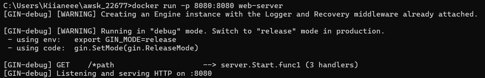

---

# Utilizing tools from the Registry

As we've already seen it should be possible to containerize almost any project. Since we are in between Dev and Ops let's pretend that some developer teammates of ours did an application with a README that instructs what to install and how to run the application. Now we as the container experts can containerize it in seconds.

Open this <https://github.com/docker-hy/material-applications/tree/main/rails-example-project> project, and read through the README and think about how to transform it into a Dockerfile. Thanks to the README we should be able to decipher what we will need to do even if we have no clue about the language or technology!

We will need to clone the [repository](https://github.com/docker-hy/material-applications), which you may have already done. After that is done, let's start with a Dockerfile. We know that we need to install Ruby and whatever dependencies it has. Let's place the Dockerfile in the project root.

**Dockerfile**

```Dockerfile
# We need ruby 3.1.0. I found this from Docker Hub
FROM ruby:3.1.0

EXPOSE 3000

WORKDIR /usr/src/app
```

Ok these are the basics, we have FROM a Ruby version, EXPOSE 3000 was told at the bottom of the README and WORKDIR /usr/src/app is the convention.

The next are told to us by the README. We won't need to copy anything from outside of the container to run these:

```Dockerfile
# Install the correct bundler version
RUN gem install bundler:2.3.3

# Copy the files required for dependencies to be installed
COPY Gemfile* ./

# Install all dependencies
RUN bundle install
```

Here we did a quick trick to separate installing dependencies from the part where we copy the source code in. The COPY will copy both files Gemfile and Gemfile.lock to the current directory. This will help us by caching the dependency layers if we ever need to make changes to the source code. The same kind of caching trick works in many other languages or frameworks, such as Node.js.

And finally, we copy the project and follow the instructions in the README:

```Dockerfile
# Copy all of the source code
COPY . .

# We pick the production mode since we have no intention of developing the software inside the container.
# Run database migrations by following instructions from README
RUN rails db:migrate RAILS_ENV=production

# Precompile assets by following instructions from README
RUN rake assets:precompile

# And finally the command to run the application
CMD ["rails", "s", "-e", "production"]
```

Ok. Let's see how well monkeying the README worked for us and run the following oneliner that builds the image and then runs it with the port 3000 published:

```console
docker build . -t rails-project && docker run -p 3000:3000 rails-project
```

After a while of waiting, the application starts in port 3000 in production mode... unless you have a Mac with M1 or M2 processor.

:::tip Building the image with a more recent Mac

If you have a more recent Mac that has the [M1 or M2](https://support.apple.com/en-us/HT211814) processor, building the image fails:

```bash
 => ERROR [7/8] RUN rails db:migrate RAILS_ENV=production
------
 > [7/8] RUN rails db:migrate RAILS_ENV=production:
#11 1.142 rails aborted!
#11 1.142 LoadError: cannot load such file -- nokogiri
```

This can be fixed by changing the following line in the file <i>Gemfile.lock</i>


```bash
nokogiri (1.13.1-x86_64-darwin)
```

to the form:

```bash
nokogiri (1.14.2-arm64-darwin)
```

The reason for the problem is that the file Gemfile.lock that defines the <i>exact</i> versions of the installed libraries (or Gems in Ruby lingo) is generated with a Linux that has an Intel processor. The Gem
[Nokogiri](https://nokogiri.org/) has different versions for Intel and Apple M1/M2 processors and to get the right version of the Gem to a more recent Mac, it is now just easiest to make a change in the file Gemfile.lock.

:::

## Exercises 1.11-1.14

Exercise 1.11: Spring

Create a Dockerfile for an old Java Spring project that can be found from the [course repository](https://github.com/docker-hy/material-applications/tree/main/spring-example-project).

The setup should be straightforward with the README instructions. Tips to get you started:

There are many options for running Java, you may use eg. [amazoncorretto](https://hub.docker.com/_/amazoncorretto) `FROM amazoncorretto:_tag_` to get Java instead of installing it manually. Pick the tag by using the README and Docker Hub page.

You've completed the exercise when you see a 'Success' message in your browser.

Submit the Dockerfile you used to run the container.

Dockerfile:

```
FROM openjdk:8
WORKDIR /usr/src/app
COPY . .
EXPOSE 8080
RUN apt-get update && apt-get install -y
RUN ./mvnw package
CMD ["java", "-jar", "./target/docker-example-1.1.3.jar"]
```

```
docker build . -t spring
docker run -p 8080:8080 spring
```

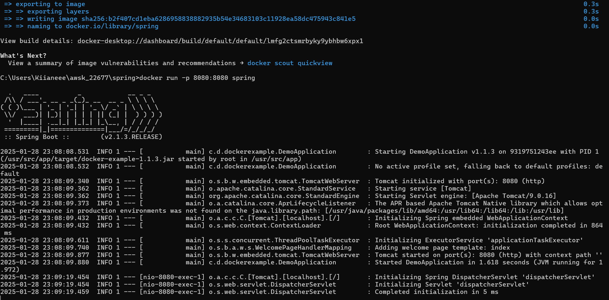

On [http://localhost:8080](http://localhost:8080):

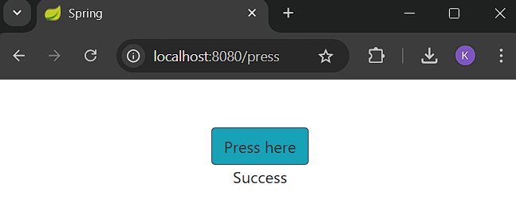


The following three exercises will start a larger project that we will configure in parts 2 and 3. They will require you to use everything you've learned up until now. If you need to modify a Dockerfile in some later exercises, feel free to do it on top of the Dockerfiles you create here.

:::warning Mandatory exercises
  The next exercises are the first mandatory ones. Mandatory exercises can not be skipped.
:::

:::caution Mandatory Exercise 1.12: Hello, frontend!

A good developer creates well-written READMEs. Such that they can be used to create Dockerfiles with ease.

Clone, fork or download the project from
[https://github.com/docker-hy/material-applications/tree/main/example-frontend](https://github.com/docker-hy/material-applications/tree/main/example-frontend).

Create a Dockerfile for the project (example-frontend) and give a command so that the project runs in a Docker container with port 5000
exposed and published so when you start the container and navigate to [http://localhost:5000](http://localhost:5000)
you will see message if you're successful.
* note that the port 5000 is reserved in the more recent OSX versions (Monterey, Big Sur), so you have to use some other host port

Submit the Dockerfile.

_As in other exercises, do not alter the code of the project_

TIPS: 
- The project has install instructions in README.
- Note that the app starts to accept connections when "Accepting connections at http://localhost:5000" has been printed to the screen, this takes a few seconds
- You do not have to install anything new outside containers.
- The project might not work with too new Node.js versions

:::

Dockerfile:

```
FROM node:14
WORKDIR /usr/src/app
COPY . .
EXPOSE 5000
RUN npm install
RUN npm run build
RUN npm install -g serve
CMD ["serve", "-s", "-l", "5000", "build"]
```

Commands:

```
docker build . -t frontend
docker run -p 5000:5000 frontend
```
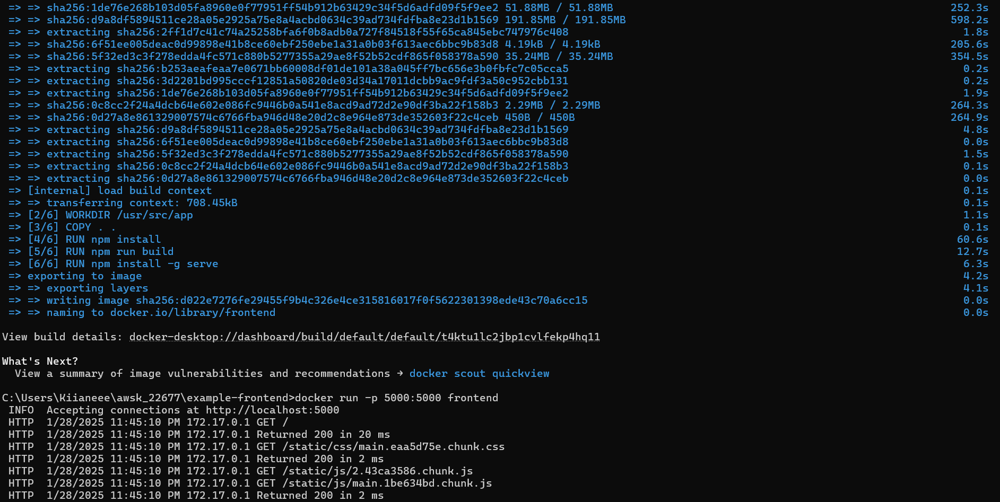

On [http://localhost:5000](http://localhost:5000):


:::caution Mandatory Exercise 1.13: Hello, backend!

Clone, fork or download a project from
[https://github.com/docker-hy/material-applications/tree/main/example-backend](https://github.com/docker-hy/material-applications/tree/main/example-backend).

Create a Dockerfile for the project (example-backend). Start the container with port 8080 published.

When you start the container and navigate to [http://localhost:8080/ping](http://localhost:8080/ping) you should get a "pong" as a response.

Submit the Dockerfile and the command used.

_Do not alter the code of the project_

TIPS:
- you might need [this](https://docs.docker.com/reference/dockerfile/#env)
- If you have M1/M2 Mac, you might need to build the image with an extra option `docker build --platform linux/amd64 -t imagename .`

:::

Dockerfile:

```
FROM golang:1.16-alpine
WORKDIR /usr/src/app
COPY . .
EXPOSE 8080
RUN go build
CMD ["./server"]
```

Commands:

```
docker build . -t backend
docker run -p 8080:8080 backend
```
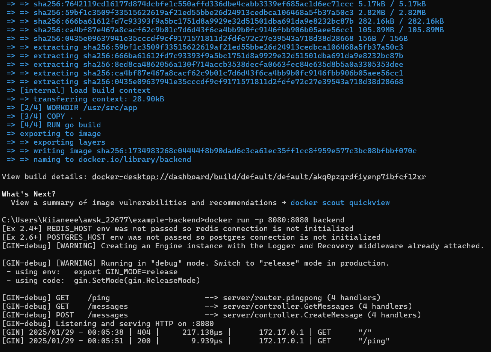

On [http://localhost:8080/ping](http://localhost:8080/ping):


:::caution Mandatory Exercise 1.14: Environment

Start both the frontend and the backend with the correct ports exposed and add [ENV](https://docs.docker.com/reference/dockerfile/#env) to Dockerfile with the necessary information from both READMEs
([front](https://github.com/docker-hy/material-applications/tree/main/example-frontend), [back](https://github.com/docker-hy/material-applications/tree/main/example-backend)).

Ignore the backend configurations until the frontend sends requests to `_backend_url_/ping` when you press the button.

You know that the configuration is ready when the button for 1.14 of frontend responds and turns green.

_Do not alter the code of either project_

Submit the edited Dockerfiles and commands used to run.


The frontend will first talk to your browser. Then the code will be executed from your browser and that will send a message to the backend.


TIPS:
* When configuring web applications keep the browser developer console ALWAYS open, F12 or cmd+shift+I when the browser window is open. Information about configuring cross-origin requests is in the README of the backend project.
* The developer console has multiple views, the most important ones are Console and Network. Exploring the Network tab can give you a lot of information on where messages are being sent and what is received as a response!

:::

backend Dockerfile:

```
FROM golang:1.16-alpine
WORKDIR /usr/src/app
COPY . .
ENV REQUEST_ORIGIN=http://localhost:5000
EXPOSE 8080
RUN go build
CMD ["./server"]
```

frontend Dockerfile:

```
FROM node:14
WORKDIR /usr/src/app
COPY . .
EXPOSE 5000
ENV REACT_APP_BACKEND_URL=http://localhost:8080
RUN npm install
RUN npm run build
RUN npm install -g serve
CMD ["serve", "-s", "-l", "5000", "build"]
```

Commands:

```
docker build . -t backend
docker run -p 8080:8080 backend
docker build . -t frontend
docker run -p 5000:5000 frontend
```
Backend:

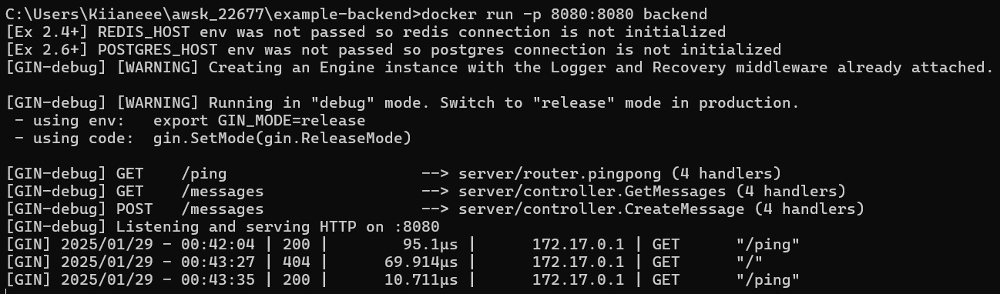

Frontend:

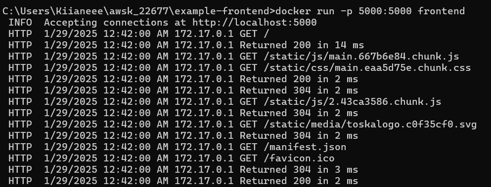

On [http://localhost:5000](http://localhost:5000):

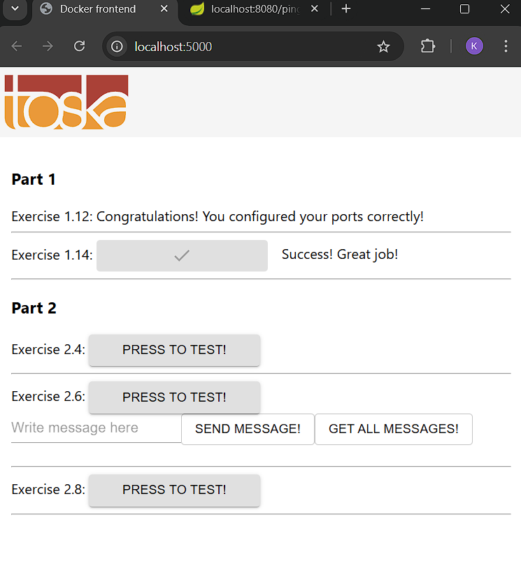

## Publishing projects

Go to <https://hub.docker.com/> to create an account. You can configure Docker hub to build your images for you, but using `push` works as well.

Let's publish the youtube-dl image. Log in and navigate to your [dashboard](https://hub.docker.com/repositories) and press Create Repository. The namespace can be either your personal account or an organization account. For now, let's stick to personal accounts and write something descriptive such as youtube-dl to repository name. We will need to remember it in part 2.

Set visibility to _public_.

And the last thing we need is to authenticate our push by logging in:

```console
$ docker login
```

Next, you will need to rename the image to include your username, and then you can push it:

```console
$ docker tag youtube-dl <username>/<repository>
  ...

$ docker push <username>/<repository>
  ...
```

## Exercises 1.15-1.16

:::info Exercise 1.15: Homework

Create Dockerfile for an application or any other dockerised project in any of your own repositories and publish it to Docker Hub. This can be any project, except the clones or forks of backend-example or frontend-example.

For this exercise to be complete you have to provide the link to the project in Docker Hub, make sure you at least have a basic description and instructions for how to run the application in a [README](https://help.github.com/en/articles/about-readmes) that's available through your submission.

:::

:::info Exercise 1.16: Cloud deployment

It is time to wrap up this part and run a containerized app in the cloud.

You can take any web-app, eg. an example or exercise from this part, your own app, or even the course material (see [devopsdockeruh/coursepage](https://hub.docker.com/r/devopsdockeruh/coursepage)) and deploy it to some cloud provider.

There are plenty of alternatives, and most provide a free tier. Here are some alternatives that are quite simple to use:

- [fly.io](https://fly.io) (easy to use but needs a credit card even in the free tier)
- [render.com](https://render.com) (bad documentation, you most likely need google)
- [heroku.com](https://heroku.com) (has a free student plan through [GitHub Student Developer Pack](https://www.heroku.com/github-students))

If you know a good cloud service for the purposes of this exercise, please tell us (yes, we know about Amazon AWS, Google Cloud and Azure already... ).

Submit the Dockerfile, a brief description of what you did, and a link to the running app.

:::

---

# Summary

We started by learning what Docker container and image mean. Basically we started from an empty ubuntu with nothing installed into it. It's also possible to start from something else, but for now ubuntu had been enough.

This meant that we had to install almost everything manually, either from the command line or by using a setup file "Dockerfile" to install whatever we needed for the task at hand.

The process of dockerizing the applications meant a bit of configuration on our part, but now that we've done it and built the image anyone can pick up and run the application; no possible dependency or versioning issues.

Understanding the architecture and the technologies used is also part of making correct choices with the setup. This lead us to read the READMEs and documentation of the software involved in the setup, not just Docker. Fortunately in real life it's often us who are developing and creating the Dockerfile.

The starting and stopping of containers is a bit annoying, not to mention running two applications at the same time. If only there was some way, a tool, to make it simpler... to [compose](/part-2).

**Remember to mark your exercises into the submission application! Instructions on how and what to submit are on the getting started page.**


