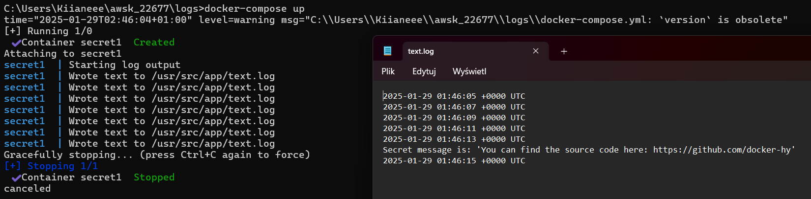
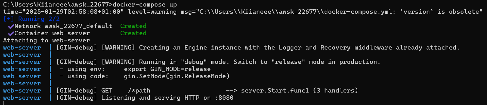
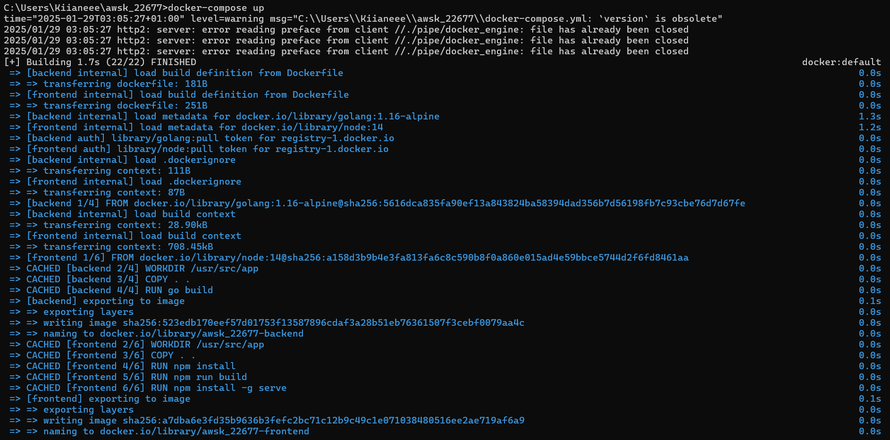
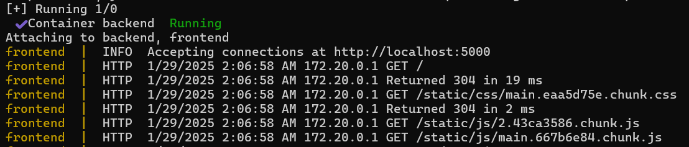
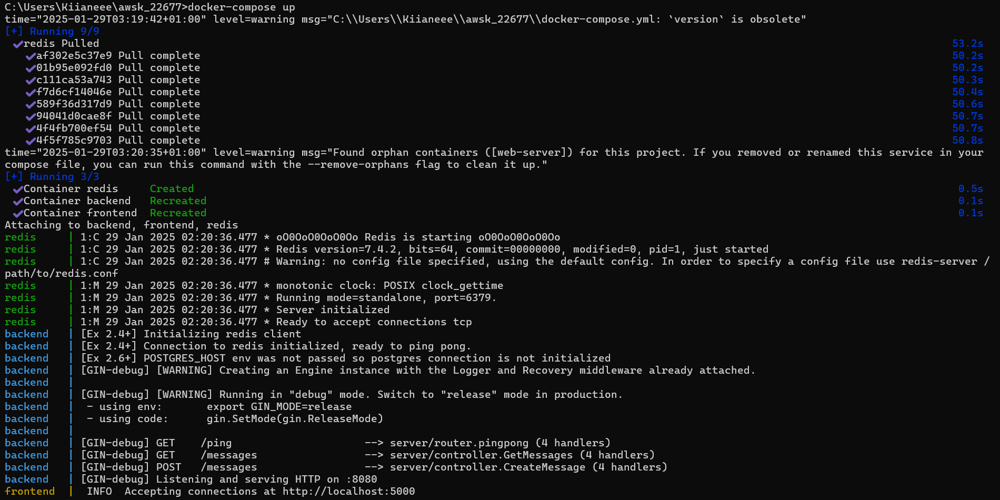
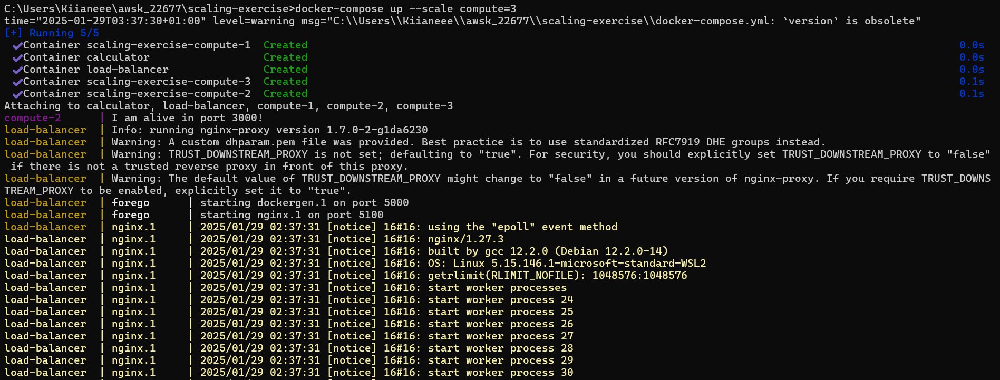
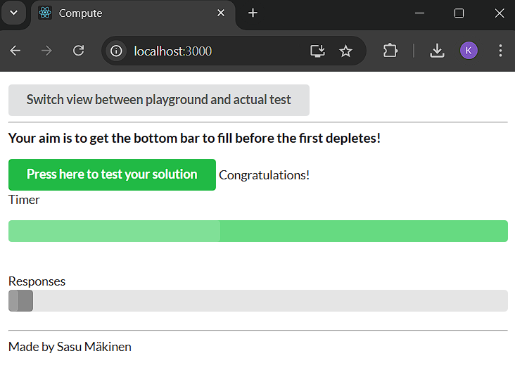
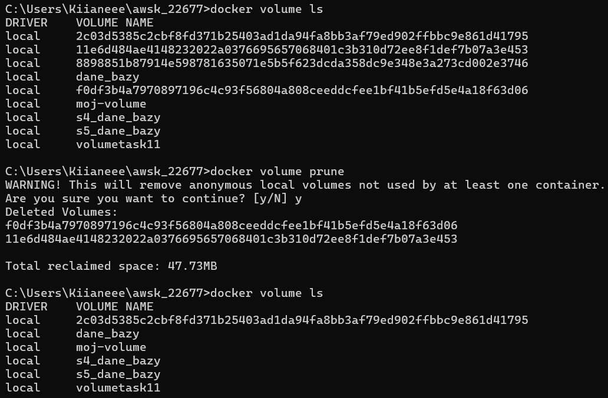
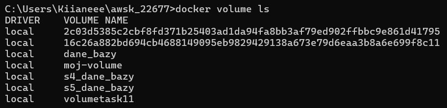
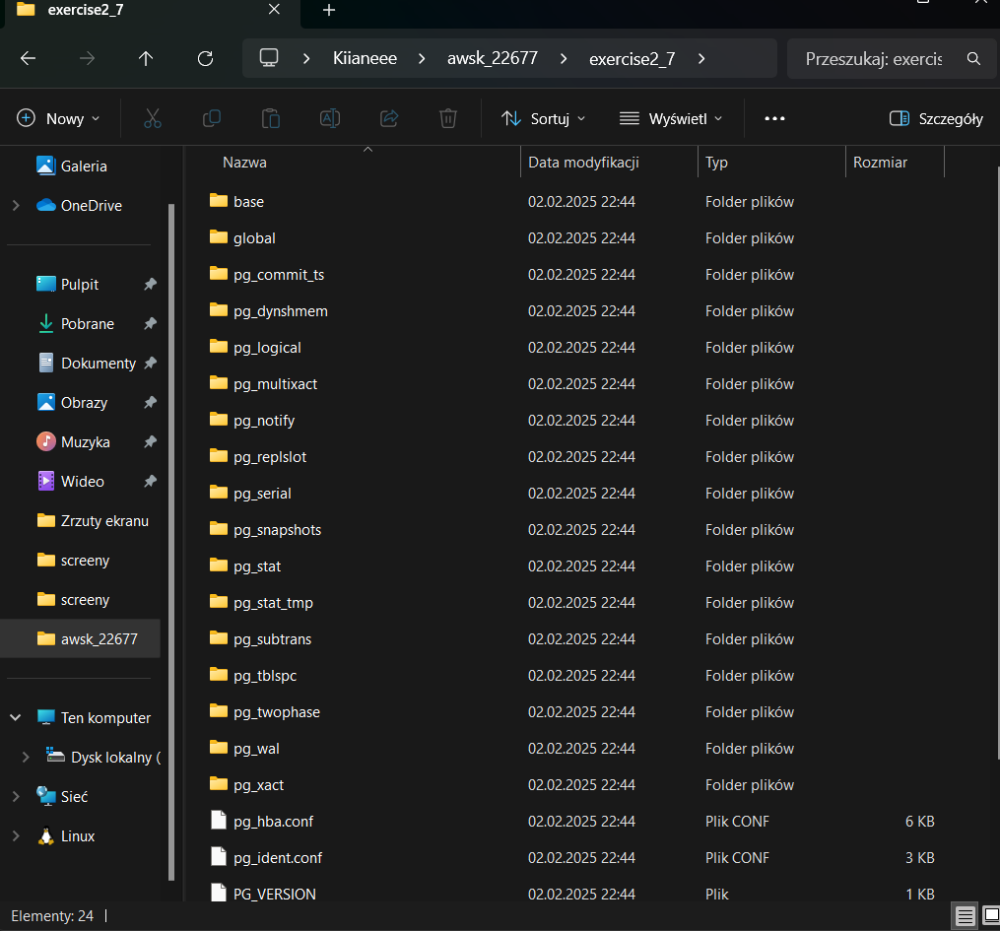

# DevOps with Docker (part 2)
### Kinga Wierzbicka 215IC_B2 22677

This part introduces container orchestration with Docker Compose and relevant concepts such as *docker network*. By the end of this part you are able to:

* Run a group of containerized applications that interact with each other via HTTP

* Run a group of containerized applications that interact with each other via volumes

* Manually scale applications

* Use 3rd party services, such as databases, inside containers as part of your project

Shortcut to exercises:
* [Exercise 2.1](#exercise-21)
* [Exercises 2.2 - 2.3](#exercises-22---23)
* [Exercise 2.4](#exercise-24)
* [Exercise 2.5](#exercise-25)
* [Exercises 2.6 - 2.10](#exercises-26---210)
* [Exercise 2.11](#exercise-211)

---

# Migrating to Docker Compose

Even with a simple image, we've already been dealing with plenty of command line options in both building, pushing and running the image.

Next we will switch to a tool called [Docker Compose](https://docs.docker.com/compose/) to manage these. Docker Compose used to be a separate tool but now it is integrated into Docker and can be used like the rest of the Docker commands.

Docker Compose is designed to simplify running multi-container applications using a single command.

Assume that we are in the folder where we have our Dockerfile with the following content:

```dockerfile
FROM ubuntu:22.04

WORKDIR /mydir

RUN apt-get update && apt-get install -y curl python3
RUN curl -L https://github.com/yt-dlp/yt-dlp/releases/latest/download/yt-dlp -o /usr/local/bin/yt-dlp
RUN chmod a+x /usr/local/bin/yt-dlp

ENTRYPOINT ["/usr/local/bin/yt-dlp"]
```

Let us now create a file called `docker-compose.yml`:

```yaml
version: '3.8'

services:
  yt-dlp-ubuntu:
    image: <username>/<repositoryname>
    build: .
```

The version setting is not very strict, it just needs to be above 2 because otherwise the syntax is significantly different. See <https://docs.docker.com/compose/compose-file/> for more info.

The value of the key `build` can be a file system path (in the example it is the current directory `.`) or an object with keys `context` and `dockerfile`, see the [documentation](https://docs.docker.com/compose/compose-file/build/) for more

Now we can build and push with just these commands:

```console
$ docker compose build
$ docker compose push
```

## Volumes in Docker Compose

To run the image as we did previously, we will need to add the volume bind mounts. Volumes in Docker Compose are defined with the following syntax `location-in-host:location-in-container`. Compose can work without an absolute path:

```yaml
version: '3.8'

services:

  yt-dlp-ubuntu:
    image: <username>/<repositoryname>
    build: .
    volumes:
      - .:/mydir
    container_name: yt-dlp
```

We can also give the container a name it will use when running with container_name. The service name can be used to run it:

```console
$ docker compose run yt-dlp-ubuntu https://imgur.com/JY5tHqr
```

## Exercise 2.1

:::info Exercise 2.1

  Let us now leverage the Docker Compose with the simple webservice that we used in the [Exercise 1.3](/part-1/section-2#exercise-13)

  Without a command `devopsdockeruh/simple-web-service` will create logs into its `/usr/src/app/text.log`.

  Create a docker-compose.yml file that starts `devopsdockeruh/simple-web-service` and saves the logs into your
  filesystem.

  Submit the docker-compose.yml, and make sure that it works simply by running `docker compose up` if the log file exists.


:::

docker-compose.yml:

```
version: "3"

services:
    secret1:
        image: devopsdockeruh/simple-web-service
        build: .
        volumes: 
            - ./log/text.log:/usr/src/app/text.log
        container_name: secret1
```

Commands:

```
docker-compose up
```



## Web services in Docker Compose

Compose is really meant for running web services, so let's move from simple binary wrappers to running a HTTP service.

<https://github.com/jwilder/whoami> is a simple service that prints the current container id (hostname).

```console
$ docker container run -d -p 8000:8000 jwilder/whoami
  736ab83847bb12dddd8b09969433f3a02d64d5b0be48f7a5c59a594e3a6a3541
```

Navigate with a browser or curl to localhost:8000, they both will answer with the id.

Take down the container so that it's not blocking port 8000.

```console
$ docker container stop 736ab83847bb
$ docker container rm 736ab83847bb
```

Let's create a new folder and a Docker Compose file `whoami/docker-compose.yml` from the command line options.

```yaml
version: '3.8'

services:
  whoami:
    image: jwilder/whoami
    ports:
      - 8000:8000
```

Test it:

```console
$ docker compose up -d
$ curl localhost:8000
```

Environment variables can also be given to the containers in Docker Compose as follows:

```yaml
version: '3.8'

services:
  backend:
    image:
    environment:
      - VARIABLE=VALUE
      - VARIABLE2=VALUE2
```

Note that there are also [other](https://docs.docker.com/compose/environment-variables/set-environment-variables/), perhaps more elegant ways to define the environment variables in Docker compose.

## Exercises 2.2 - 2.3

:::info Exercise 2.2

  Read about how to add the command to docker-compose.yml from the [documentation](https://docs.docker.com/compose/compose-file/compose-file-v3/#command).

  The familiar image `devopsdockeruh/simple-web-service` can be used to start a web service, see the [exercise 1.10](/part-1/section-5#exercise-110).

  Create a docker-compose.yml, and use it to start the service so that you can use it with your browser.

  Submit the docker-compose.yml, and make sure that it works simply by running `docker compose up`

:::

docker-compose.yml:

```
version: "3"

services:
    web-server:
        image: devopsdockeruh/simple-web-service
        build: .
        ports: 
            - 8080:8080 
        command: server
        container_name: web-server
```

Commands:

```
docker-compose up
```



:::caution Mandatory Exercise 2.3

  As we saw previously, starting an application with two programs was not trivial and the commands got a bit long.

  In the [previous part](/part-1/section-6) we created Dockerfiles for both [frontend](https://github.com/docker-hy/material-applications/tree/main/example-frontend) and [backend](https://github.com/docker-hy/material-applications/tree/main/example-backend) of the example application. Next, simplify the usage into one docker-compose.yml.

  Configure the backend and frontend from [part 1](/part-1/section-6#exercises-111-114) to work in Docker Compose.

  Submit the docker-compose.yml

:::

docker-compose.yml:

```
version: "3"

services:
    backend:
        build: ./example-backend
        ports:
            - 8080:8080
        container_name: backend

    frontend:
        build: ./example-frontend
        ports:
            - 5000:5000
        container_name: frontend
```

Commands:

```
docker-compose up
```



cd.



---

# Docker networking

Connecting two services such as a server and its database in docker can be achieved with a [Docker network](https://docs.docker.com/network/). In addition to starting services listed in docker-compose.yml Docker Compose automatically creates and joins both containers into a network with a [DNS](https://docs.docker.com/network/#dns-services). Each service is named after the name given in the docker-compose.yml file. As such, containers can reference each other simply with their service names, which is different from the container name.


Here are two services in a single network: webapp and webapp-helper. The webapp-helper has a server, listening for requests in port 3000, that webapp wants to access. Because they were defined in the same docker-compose.yml file the access is trivial. Docker Compose has already taken care of creating a network and webapp can simply send a request to webapp-helper:3000, the internal DNS will translate that to the correct access and ports do not have to be published outside of the network.

:::tip Security reminder: Plan your infrastructure and keep to your plan

In the next exercise, and in some later exercises, there is an illustration of the infrastructure. Have a look at it and use it to write the configuration.

For example, in Exercise 2.4 we don't want to open ports to Redis to the outside world. Do not add a `ports` configuration under Redis! The backend will be able to access the application within the Docker network.

:::

## Exercise 2.4

:::info Exercise 2.4

In this exercise you should expand the configuration done in [Exercise 2.3](/part-2/section-1#exercises-22---23) and set up the example backend to use the key-value database [Redis](https://redis.com/).

Redis is quite often used as a [cache](https://en.wikipedia.org/wiki/Cache_(computing)) to store data so that future requests for data can be served faster.

The backend uses a slow API to fetch some information. You can test the slow API by requesting `/ping?redis=true` with curl. The frontend app has a button to test this.

So you should improve the performance of the app and configure a Redis container to cache information for the backend. The
[documentation](https://hub.docker.com/_/redis/) of the Redis image might contain some useful info.

The backend [README](https://github.com/docker-hy/material-applications/tree/main/example-backend) should have all the information that is needed for configuring the backend.

When you've correctly configured the button will turn green.

Submit the docker-compose.yml

  

The [restart: unless-stopped](https://docs.docker.com/compose/compose-file/compose-file-v3/#restart) configuration can help if the Redis takes a while to get ready.

:::

docker-compose.yml:

```
version: "3"

services:
    backend:
        build: ./example-backend
        ports:
            - 8080:8080
        container_name: backend
        depends_on:
            - redis
        environment:
            REDIS_HOST: redis
    frontend:
        build: ./example-frontend
        ports:
            - 5000:5000
        container_name: frontend
        depends_on:
            - backend
    redis:
        image: redis
        restart: unless-stopped
        container_name: redis
```

Commands:

```
docker-compose up
```



On [http://localhost:5000](http://localhost:5000):


## Manual network definition

It is also possible to define the network manually in a Docker Compose file. A major benefit of a manual network definition is that it makes it easy to set up a configuration where containers defined in two different Docker Compose files share a network, and can easily interact with each other.

Let us now have a look how a network is defined in docker-compose.yml:

```yaml
version: "3.8"

services:
  db:
    image: postgres:13.2-alpine
    networks:
      - database-network # Name in this Docker Compose file

networks:
  database-network: # Name in this Docker Compose file
    name: database-network # Name that will be the actual name of the network
```

This defines a network called `database-network` which is created with `docker compose up` and removed with `docker compose down`.

As can be seen, services are configured to use a network by adding `networks` into the definition of the service.

Establishing a connection to an external network (that is, a network defined in another docker-compose.yml, or by some other means) is done as follows:

```yaml
version: "3.8"

services:
  db:
    image: backend-image
    networks:
      - database-network

networks:
  database-network:
    external:
      name: database-network # Must match the actual name of the network
```

By default all services are added to a network called `default`. The default network can be configured and this makes it possible to connect to an external network by default as well:

```yaml
version: "3.8"

services:
  db:
    image: backend-image

networks:
  default:
    external:
      name: database-network # Must match the actual name of the network
```

## Scaling

Compose can also scale the service to run multiple instances:

```console
$ docker compose up --scale whoami=3

  WARNING: The "whoami" service specifies a port on the host. If multiple containers for this service are created on a single host, the port will clash.

  Starting whoami_whoami_1 ... done
  Creating whoami_whoami_2 ... error
  Creating whoami_whoami_3 ... error
```

The command fails due to a port clash, as each instance will attempt to bind to the same host port (8000).

We can get around this by only specifying the container port. As mentioned in [part 1](/part-1/section-5#allowing-external-connections-into-containers), when leaving the host port unspecified, Docker will automatically choose a free port.

Update the ports definition in `docker-compose.yml`:

```yaml
ports:
  - 8000
```

Then run the command again:

```console
$ docker compose up --scale whoami=3
  Starting whoami_whoami_1 ... done
  Creating whoami_whoami_2 ... done
  Creating whoami_whoami_3 ... done
```

All three instances are now running and listening on random host ports. We can use `docker compose port` to find out which ports the instances are bound to.

```console
$ docker compose port --index 1 whoami 8000
  0.0.0.0:32770

$ docker compose port --index 2 whoami 8000
  0.0.0.0:32769

$ docker compose port --index 3 whoami 8000
  0.0.0.0:32768
```

We can now curl from these ports:

```console
$ curl 0.0.0.0:32769
  I'm 536e11304357

$ curl 0.0.0.0:32768
  I'm 1ae20cd990f7
```

In a server environment you'd often have a [load balancer](https://en.wikipedia.org/wiki/Load_balancing_(computing)) in front of the service. For containerized local environment (or a single server) one good solution is to use <https://github.com/jwilder/nginx-proxy>.

Let's add the nginx-proxy to our compose file and remove the port bindings from the whoami service. We'll mount our [docker.sock](https://stackoverflow.com/questions/35110146/can-anyone-explain-docker-sock) (the socket that is used to communicate with the [Docker Daemon](https://docs.docker.com/engine/reference/commandline/dockerd/)) inside of the container in `:ro` read-only mode:

```yaml
version: "3.8"

services:
  whoami:
    image: jwilder/whoami
  proxy:
    image: jwilder/nginx-proxy
    volumes:
      - /var/run/docker.sock:/tmp/docker.sock:ro
    ports:
      - 80:80
```

Let test the configuration:

```console
$ docker compose up -d --scale whoami=3
$ curl localhost:80
  <html>
  <head><title>503 Service Temporarily Unavailable</title></head>
  <body bgcolor="white">
  <center><h1>503 Service Temporarily Unavailable</h1></center>
  <hr><center>nginx/1.13.8</center>
  </body>
  </html>
```

It's "working", but the Nginx just doesn't know which service we want. The `nginx-proxy` works with two environment variables: `VIRTUAL_HOST` and `VIRTUAL_PORT`. `VIRTUAL_PORT` is not needed if the service has `EXPOSE` in it's Docker image. We can see that `jwilder/whoami` sets it: <https://github.com/jwilder/whoami/blob/master/Dockerfile#L9>

- Note: Mac users with the M1 processor you may see the following error message: `runtime: failed to create new OS thread`. In this case you can use the Docker Image `ninanung/nginx-proxy` instead which offers a temporary fix until `jwilder/nginx-proxy` is updated to support M1 Macs.

The domain `colasloth.com` is configured so that all subdomains point to `127.0.0.1`. More information about how this works can be found at [colasloth.github.io](https://colasloth.github.io), but in brief it's a simple DNS "hack". Several other domains serving the same purpose exist, such as `localtest.me`, `lvh.me`, and `vcap.me`, to name a few. In any case, let's use `colasloth.com` here:

```yaml
version: "3.8"

services:
  whoami:
    image: jwilder/whoami
    environment:
      - VIRTUAL_HOST=whoami.colasloth.com
  proxy:
    image: jwilder/nginx-proxy
    volumes:
      - /var/run/docker.sock:/tmp/docker.sock:ro
    ports:
      - 80:80
```

Now the proxy works:

```console
$ docker compose up -d --scale whoami=3
$ curl whoami.colasloth.com
  I'm f6f85f4848a8
$ curl whoami.colasloth.com
  I'm 740dc0de1954
```

Let's add couple of more containers behind the same proxy. We can use the official `nginx` image to serve a simple static web page. We don't have to even build the container images, we can just mount the content to the image. Let's prepare some content for two services called "hello" and "world".

```console
$ echo "hello" > hello.html
$ echo "world" > world.html
```

Then add these services to the `docker-compose.yml` file where you mount just the content as `index.html` in the default nginx path:

```yaml
hello:
  image: nginx:1.19-alpine
  volumes:
    - ./hello.html:/usr/share/nginx/html/index.html:ro
  environment:
    - VIRTUAL_HOST=hello.colasloth.com
world:
  image: nginx:1.19-alpine
  volumes:
    - ./world.html:/usr/share/nginx/html/index.html:ro
  environment:
    - VIRTUAL_HOST=world.colasloth.com
```

Now let's test:

```console
$ docker compose up -d --scale whoami=3
$ curl hello.colasloth.com
  hello

$ curl world.colasloth.com
  world

$ curl whoami.colasloth.com
  I'm f6f85f4848a8

$ curl whoami.colasloth.com
  I'm 740dc0de1954
```

Now we have a basic single-machine hosting setup up and running.

Test updating the `hello.html` without restarting the container, does it work?

## Exercise 2.5

:::info Exercise 2.5

The project [https://github.com/docker-hy/material-applications/tree/main/scaling-exercise](https://github.com/docker-hy/material-applications/tree/main/scaling-exercise) is a barely working application. Go ahead and clone it for yourself. The project already includes docker-compose.yml so you can start it by running `docker compose up`.

The application should be accessible through [http://localhost:3000](http://localhost:3000). However it doesn't work well enough and we've added a load balancer for scaling. Your task is to scale the `compute` containers so that the button in the application turns green.

This exercise was created with [Sasu Mäkinen](https://github.com/sasumaki)

Please return the used commands for this exercise.

:::

```
docker-compose up
docker-compose up --scale compute=3

```



On [http://localhost:3000](http://localhost:3000):



---

# Volumes in action

Next we're going to set up the project management application [Redmine](https://www.redmine.org/), a PostgreSQL database and [Adminer](https://www.adminer.org/), a graphical interface for database administration.

All of the above have official Docker images available as we can see from [Redmine](https://hub.docker.com/_/redmine), [Postgres](https://hub.docker.com/_/postgres) and [Adminer](https://hub.docker.com/_/adminer) respectively. The officiality of the containers is not that important, just that we can expect that it will have some support. We could also, for example, setup Wordpress or a MediaWiki inside containers in the same manner if you're interested in running existing applications inside Docker. You could even set up an application monitoring tool such as [Sentry](https://hub.docker.com/_/sentry/).

In <https://hub.docker.com/_/redmine> there is a list of different tagged versions:


We can most likely use any of the available images.

From the section _Environment Variables_ we can see that all versions can use `REDMINE_DB_POSTGRES` environment variable to set up a Postgres database. So before moving forward, let's setup Postgres for us.

In <https://hub.docker.com/_/postgres> there's a sample compose file under the section "via docker-compose or docker stack deploy". Let's strip that down as follows

```yaml
version: "3.8"

services:
  db:
    image: postgres:13.2-alpine
    restart: unless-stopped
    environment:
      POSTGRES_PASSWORD: example
    container_name: db_redmine
```

Note:

- `restart: always` was changed to `unless-stopped`, that will keep the container running unless we explicitly stop it. With `always` the stopped container is started after reboot, for example, see [here](https://docs.docker.com/config/containers/start-containers-automatically/) for more.

Under the section [Where to store data](https://github.com/docker-library/docs/blob/master/postgres/README.md#where-to-store-data), we can see that the `/var/lib/postgresql/data` should be mounted separately to preserve the data.

There are two options for doing the mounting. We could use a bind mount like previously and mount an easy-to-locate directory for storing the data. Let us now use the other option, a [Docker managed volume](https://docs.docker.com/storage/volumes/).


Let's run the Docker Compose file without setting anything new:

```console
$ docker compose up

  ✔ Network redmine_default  Created                                                                                              0.0s
  ✔ Container db_redmine     Created                                                                                              0.2s
  Attaching to db_redmine
  db_redmine  | The files belonging to this database system will be owned by user "postgres".
  db_redmine  | This user must also own the server process.
  ...
  db_redmine  | 2024-03-11 14:05:52.340 UTC [1] LOG:  starting PostgreSQL 13.2 on aarch64-unknown-linux-musl, compiled by gcc (Alpine 10.2.1_pre1) 10.2.1 20201203, 64-bit
  db_redmine  | 2024-03-11 14:05:52.340 UTC [1] LOG:  listening on IPv4 address "0.0.0.0", port 5432
  db_redmine  | 2024-03-11 14:05:52.340 UTC [1] LOG:  listening on IPv6 address "::", port 5432
  db_redmine  | 2024-03-11 14:05:52.342 UTC [1] LOG:  listening on Unix socket "/var/run/postgresql/.s.PGSQL.5432"
  db_redmine  | 2024-03-11 14:05:52.345 UTC [46] LOG:  database system was shut down at 2024-03-11 14:05:52 UTC
  db_redmine  | 2024-03-11 14:05:52.347 UTC [1] LOG:  database system is ready to accept connections
```

The image initializes the data files in the first start. Let's terminate the container with ^C. Compose uses the current directory as a prefix for container and volume names so that different projects don't clash (The prefix can be overridden with `COMPOSE_PROJECT_NAME` environment variable if needed).

Let's **inspect** if there was a volume created with `docker container inspect db_redmine | grep -A 5 Mounts`

```json
"Mounts": [
    {
        "Type": "volume",
        "Name": "2d86a2480b60743147ce88e8e70b612d10b4c4151779b462baf4e81b84061ef5",
        "Source": "/var/lib/docker/volumes/2d86a2480b60743147ce88e8e70b612d10b4c4151779b462baf4e81b84061ef5/_data",
        "Destination": "/var/lib/postgresql/data",
```

An indeed there is one! So despite us **not** configuring one explicitly, an anonymous volume was automatically created for us.

Now if we check out `docker volume ls` we can see that a volume with the name "2d86a2480b60743147ce88e8e70b612d10b4c4151779b462baf4e81b84061ef5" exists.

```console
$ docker volume ls
  DRIVER              VOLUME NAME
  local     2d86a2480b60743147ce88e8e70b612d10b4c4151779b462baf4e81b84061ef5
```

There may be more volumes on your machine. If you want to get rid of them you can use `docker volume prune`. Let's put the whole "application" down now with `docker compose down`.

Instead of the randomly named volume we better define one explicitly.
Let us change the definition as follows:

```yaml
version: "3.8"

services:
  db:
    image: postgres:13.2-alpine
    restart: unless-stopped
    environment:
      POSTGRES_PASSWORD: example
    container_name: db_redmine
    volumes:
      - database:/var/lib/postgresql/data

volumes:
  database:
```

Now, after running `docker compose up` again, let us check what it looks like:

```console
$ docker volume ls
  DRIVER              VOLUME NAME
  local               redmine_database

$ docker container inspect db_redmine | grep -A 5 Mounts
"Mounts": [
    {
        "Type": "volume",
        "Name": "redmine_database",
        "Source": "/var/lib/docker/volumes/ongoing_redminedata/_data",
        "Destination": "/var/lib/postgresql/data",
```

Ok, looks a bit more human-readable! Now when the Postgres is running, it is time to add [Redmine](https://hub.docker.com/_/redmine).

The container seems to require just two environment variables.

```yaml
redmine:
  image: redmine:5.1-alpine
  environment:
    - REDMINE_DB_POSTGRES=db
    - REDMINE_DB_PASSWORD=example
  ports:
    - 9999:3000
  depends_on:
    - db
```

Notice the [depends_on](https://docs.docker.com/compose/compose-file/compose-file-v3/#depends_on) declaration. This makes sure that the `db` service is started first. `depends_on` does not guarantee that the database is up, just that it is started first. The Postgres server is accessible with the DNS name "db" from the Redmine service as discussed in the section [Docker networking](/part-2/section-2).

Now when you run `docker compose up` you will see a bunch of database migrations running first.

```console
  redmine_1  | I, [2024-03-03T10:59:20.956936 #25]  INFO -- : Migrating to Setup (1)
  redmine_1  | == 1 Setup: migrating =========================================================
  ...
  redmine_1  | [2024-03-03 11:01:10] INFO  ruby 3.2.3 (2024-01-30) [x86_64-linux]
  redmine_1  | [2024-03-03 11:01:10] INFO  WEBrick::HTTPServer#start: pid=1 port=3000
```

As the [documentation](https://hub.docker.com/_/redmine) mentions, the image creates files to `/usr/src/redmine/files` and those are better to be persisted. The Dockerfile has this [line](https://github.com/docker-library/redmine/blob/cea16044e97567c28802fc8cc06f6cd036c49a5c/4.0/Dockerfile#L155) where it declares that a volume should be created. Again Docker will create the volume, but it will be handled as an anonymous volume that is not managed by the Docker Compose, so it's better to create it explicitly.

With that in mind, our configuration changes to this:

```yaml
version: "3.8"

services:
  db:
    image: postgres:13.2-alpine
    restart: unless-stopped
    environment:
      POSTGRES_PASSWORD: example
    container_name: db_redmine
    volumes:
      - database:/var/lib/postgresql/data
  redmine:
    image: redmine:4.1-alpine
    environment:
      - REDMINE_DB_POSTGRES=db
      - REDMINE_DB_PASSWORD=example
    ports:
      - 9999:3000
    volumes:
      - files:/usr/src/redmine/files
    depends_on:
      - db

volumes:
  database:
  files:
```

Now we can use the application with our browser through <http://localhost:9999>. After some changes inside the application, we can inspect the changes that happened in the image and check that no extra meaningful files got written to the container:

```console
$ docker container diff $(docker compose ps -q redmine)
  C /usr/src/redmine/config/environment.rb
  ...
  C /usr/src/redmine/tmp/pdf
```

Probably not.

We could use command `psql` inside the Postgres container to interact with the database by running

```console
docker container exec -it db_redmine psql -U postgres
```

The same method can be used to create backups with pg_dump

```console
docker container exec db_redmine pg_dump -U postgres > redmine.dump
```

Rather than using the archaic command line interface to access Postgres, let us now set up the database [Adminer](https://www.adminer.org/) to the application.

After a look at the [documentation](https://hub.docker.com/_/adminer), the setup is straightforward:

```yaml
adminer:
  image: adminer:4
  restart: always
  environment:
    - ADMINER_DESIGN=galkaev
  ports:
    - 8083:8080
```

Now when we run the application we can access the adminer from <http://localhost:8083>:


Setting up the adminer is straightforward since it will be able to access the database through the Docker network. You may wonder how the adminer finds the Postgres database container. We provide this information to Redmine using an environment variable:

```yaml
  redmine:
    environment:
      - REDMINE_DB_POSTGRES=db
```

Adminer actually assumes that the database has DNS name  _db_ so with this name selection, we did not have to specify anything. If the database has some other name, we have to pass it to adminer using an environment variable:

```yaml
  adminer:
    environment:
      - ADMINER_DEFAULT_SERVER=database_server
```

## Exercises 2.6 - 2.10

:::info Exercise 2.6

Let us continue with the example app that we worked with in [Exercise 2.4](/part-2/section-2#exercise-24).

Now you should add a database to the example backend.

Use a Postgres database to save messages. For now, there is no need to configure a volume since the official Postgres image sets a default volume for us. Use the Postgres image documentation to your advantage when configuring: [https://hub.docker.com/\_/postgres/](https://hub.docker.com/_/postgres/). Especially part _Environment Variables_ is a valuable one.

The backend [README](https://github.com/docker-hy/material-applications/tree/main/example-backend) should have all the information needed to
connect.

There is again a button (and a form!) in the frontend that you can use to ensure your configuration is done right.

Submit the docker-compose.yml

TIPS:
* When configuring the database, you might need to destroy the automatically created volumes. Use commands `docker volume prune`, `docker volume ls` and `docker volume rm` to remove unused volumes when testing. Make sure to remove containers that depend on them beforehand.
* `restart: unless-stopped` can help if the Postgres takes a while to get ready


:::

docker-compose.yml:

```
version: "3"

services:
    backend:
        build: ./example-backend
        ports:
            - 8080:8080
        container_name: backend
        depends_on:
            - redis
            - postgres
        environment:
            REDIS_HOST: redis
            POSTGRES_HOST: postgres
            POSTGRES_USER: postgres
            POSTGRES_PASSWORD: postgres
            POSTGRES_DATABASE: postgres
    frontend:
        build: ./example-frontend
        ports:
            - 5000:5000
        container_name: frontend
        depends_on:
            - backend
    redis:
        image: redis
        restart: unless-stopped
        container_name: redis
    postgres:
        image: postgres
        container_name: postgres
        environment:
            POSTGRES_HOST: postgres
            POSTGRES_USER: postgres
            POSTGRES_PASSWORD: postgres
            POSTGRES_DATABASE: postgres
```

Commands:

```
docker volume ls
docker volume prune
docker volume ls
docker-compose up
```



On [http://localhost:5000](http://localhost:5000):


```
docker volume ls
```



:::info Exercise 2.7

Postgres image uses a volume by default. Define manually a volume for the database in a convenient location such as in `./database` so you should use now a [bind mount](https://docs.docker.com/storage/bind-mounts/). The image [documentation](https://github.com/docker-library/docs/blob/master/postgres/README.md#where-to-store-data) may help you with the task.

After you have configured the bind mount volume:

- Save a few messages through the frontend
- Run `docker compose down`
- Run `docker compose up` and see that the messages are available after refreshing browser
- Run `docker compose down` and delete the volume folder manually
- Run `docker compose up` and the data should be gone

> TIP: To save you the trouble of testing all of those steps, just look into the folder before trying the steps. If
> it's empty after `docker compose up` then something is wrong.

Submit the docker-compose.yml

The benefit of a bind mount is that since you know exactly where the data is in your file system, it is easy to create backups. If the Docker managed volumes are used, the location of the data in the file system can not be controlled and that makes backups a bit less trivial...

:::

:::tip Tips for making sure the backend connection works

docker-compose.yml:

```
version: "3"

services:
    backend:
        build: ./example-backend
        ports:
            - 8080:8080
        container_name: backend
        depends_on:
            - redis
            - postgres
        environment:
            REDIS_HOST: redis
            POSTGRES_HOST: postgres
            POSTGRES_USER: postgres
            POSTGRES_PASSWORD: postgres
            POSTGRES_DATABASE: postgres
    frontend:
        build: ./example-frontend
        ports:
            - 5000:5000
        container_name: frontend
        depends_on:
            - backend
    redis:
        image: redis
        restart: unless-stopped
        container_name: redis
    postgres:
        image: postgres
        container_name: postgres
        environment:
            POSTGRES_HOST: postgres
            POSTGRES_USER: postgres
            POSTGRES_PASSWORD: postgres
            POSTGRES_DATABASE: postgres
        volumes:
            - /c/Users/Kiianeee/awsk_22677/exercise2_7:/var/lib/postgresql/data
```

```
docker compose up
```




In the next exercise try using your browser to access http://localhost/api/ping and see if it answers pong

It might be Nginx configuration problem. Ensure there is a trailing / on the backend URL as specified under the location /api/ context in the nginx.conf.

:::

:::info Exercise 2.8

In this exercise, you shall add [Nginx](https://hub.docker.com/_/nginx) to work as a [reverse proxy](https://en.wikipedia.org/wiki/Reverse_proxy) in front of the example app frontend and backend.

According to Wikipedia _a reverse proxy is a type of proxy server that retrieves resources on behalf of a client from one or more servers. These resources are then returned to the client, appearing as if they originated from the reverse proxy server itself._


So in our case, the reverse proxy will be the single point of entry to our application, and the final goal will be to set both the React frontend and the Express backend behind the reverse proxy.

The idea is that a browser makes _all_ requests to _http://localhost_. If the request has a URL prefix _http://localhost/api_, Nginx should forward the request to the backend container. All the other requests are directed to the frontend container.

So, at the end, you should see that the frontend is accessible simply by going to <http://localhost>. All buttons, except the one labeled _Exercise 2.8_ may have stopped working, do not worry about them, we shall fix that later.

The following file should be set to _/etc/nginx/nginx.conf_ inside the Nginx container. You can use a file bind mount where the contents of the file is the following:

```bash
events { worker_connections 1024; }

http {
  server {
    listen 80;

    location / {
      proxy_pass _frontend-connection-url_;
    }

    # configure here where requests to http://localhost/api/...
    # are forwarded
    location /api/ {
      proxy_set_header Host $host;
      proxy_pass _backend-connection-url_;
    }
  }
}
```

Nginx, backend and frontend should be connected in the same network. See the image above for how the services are connected. You find [Nginx-documentation](https://www.nginx.com/resources/wiki/start/topics/examples/full/) helpful, but remember, the configuration you need is pretty straightforward, if you end up doing complex things, you are most likely doing something wrong.

If and when your app "does not work", remember to have a look in the log, it can be pretty helpful in pinpointing errors:

```bash
2_7-proxy-1  | /docker-entrypoint.sh: Launching /docker-entrypoint.d/30-tune-worker-processes.sh
2_7-proxy-1  | /docker-entrypoint.sh: Configuration complete; ready for start up
2_7-proxy-1  | 2023/03/05 09:24:51 [emerg] 1#1: invalid URL prefix in /etc/nginx/nginx.conf:8
2_7-proxy-1 exited with code 1
```

Submit the docker-compose.yml

:::

docker-compose.yml:

```
version: "3"

services:
    backend:
        build: ./example-backend
        ports:
            - 8080:8080
        container_name: backend
        depends_on:
            - redis
            - postgres
        environment:
            REDIS_HOST: redis
            POSTGRES_HOST: postgres
            POSTGRES_USER: postgres
            POSTGRES_PASSWORD: postgres
            POSTGRES_DATABASE: postgres
            PGPORT: 5432
    frontend:
        build: ./example-frontend
        ports:
            - 5000:5000
        container_name: frontend
        depends_on:
            - backend
    redis:
        image: redis
        restart: unless-stopped
        container_name: redis
    postgres:
        image: postgres
        container_name: postgres
        environment:
            POSTGRES_HOST: postgres
            POSTGRES_USER: postgres
            POSTGRES_PASSWORD: postgres
            POSTGRES_DATABASE: postgres
        volumes:
            - /c/Users/Kiianeee/awsk_22677/exercise2_7:/var/lib/postgresql/data
    nginx:
        image: nginx
        container_name: nginx
        ports:
            - 80:80
        volumes:
            - ./nginx.config:/etc/nginx/nginx.conf
        depends_on:
        - backend
        - frontend
```

nginx.config:

```
events { worker_connections 1024; }

http {
  server {
    listen 80;

    location / {
      proxy_pass http://frontend:5000/;
    }

    location /api/ {
      proxy_set_header Host $host;
      proxy_pass http://backend:8080/;
    }
  }
}
```

:::info Exercise 2.9

Most of the buttons may have stopped working in the example application. Make sure that every button for exercises works.

Remember to take a peek into the browser's developer consoles again like we did back [part 1](/part-1/section-6), remember also [this](https://github.com/docker-hy/material-applications/tree/main/example-frontend#exercise-114---to-connect-to-backend) and [this](https://github.com/docker-hy/material-applications/tree/main/example-backend).

The buttons of the Nginx exercise and the first button behave differently but you want them to match.

If you had to make any changes explain what you did and where.

Submit the docker-compose.yml and both Dockerfiles.

:::

:::tip Publishing ports to host network

There is an important lesson about Docker networking and ports to be learned in the next exercise.

When we do a [port mapping](https://docs.docker.com/desktop/networking/#port-mapping), in `docker run -p 8001:80 ...` or in the Docker Compose file, we [publish](https://docs.docker.com/config/containers/container-networking/#published-ports) a container port to the host network to be accessible in localhost.

The container port is there within the Docker network accessible by the other containers that are in the same network even if we do not publish anything. So publishing the ports is only for exposing ports outside the Docker network. If no direct access outside the network is not needed, then we just do not publish anything.
:::

:::info Exercise 2.10

Now we have the reverse proxy up and running! All the communication to our app should be done through the reverse proxy and direct access (eg. accessing the backend with a GET to http://localhost:8080/ping ) should be prevented.

Use a port scanner, eg <https://hub.docker.com/r/networkstatic/nmap> to ensure that there are no extra ports open in the host.

It might be enough to just run

```
$ docker run -it --rm --network host networkstatic/nmap localhost
```

If you have an M1/M2 Mac, you might need to build the image yourself.

The result looks like the following (I used a self-built image):

```bash
$ docker run -it --rm --network host nmap localhost
Starting Nmap 7.93 ( https://nmap.org ) at 2023-03-05 12:28 UTC
Nmap scan report for localhost (127.0.0.1)
Host is up (0.0000040s latency).
Other addresses for localhost (not scanned): ::1
Not shown: 996 closed tcp ports (reset)
PORT     STATE    SERVICE
80/tcp   filtered http
111/tcp  open     rpcbind
5000/tcp filtered commplex-link
8080/tcp filtered http-proxy

Nmap done: 1 IP address (1 host up) scanned in 1.28 seconds
```

As we see, there are two suspicious open ports: 5000 and 8080. So it is obvious that the frontend and backend are still directly accessible in the host network. This should be fixed!

You are done when the port scan report looks something like this:

```bash
Starting Nmap 7.93 ( https://nmap.org ) at 2023-03-05 12:39 UTC
Nmap scan report for localhost (127.0.0.1)
Host is up (0.0000040s latency).
Other addresses for localhost (not scanned): ::1
Not shown: 998 closed tcp ports (reset)
PORT    STATE    SERVICE
80/tcp  filtered http
111/tcp open     rpcbind

Nmap done: 1 IP address (1 host up) scanned in 1.28 seconds
```

:::

---

# Containers in development

Containers are not only great in production. They can be used in development environments as well and offer several benefits. The same _works-on-my-machine_ problem is faced often when a new developer joins the team. Not to mention the headache of switching runtime versions or a local database!

For example, a [software development team](https://toska.dev/) at the University of Helsinki has a fully [containerized development environment](https://helda.helsinki.fi/items/9f681533-f488-406d-b2d8-a2f8b225f283). The principle in all development projects is to have a setup so that a new developer only needs to install Docker and clone the project code from GitHub to get started. Not a single dependency is ever installed on to host machine, Git, Docker and the text editor of choice are the only things that are needed.

Even if your application is not completely containerized during development, containers can be very helpful. For example, say you need MongoDB version 4.0.22 installed in port 5656. It's now an oneliner: "docker run -p 5656:27017 mongo:4.0.22" (MongoDB uses 27017 as the default port).

Let's containerize a NodeJS development environment. As you perhaps know [NodeJS](https://nodejs.org/en/) is a cross-platform JavaScript runtime that makes it possible to run JavaScript in your machine, servers and embedded devices, among many other platforms

The setup requires some expertise in the way how NodeJS works. Here is a simplified explanation if you're not familiar: libraries are defined in `package.json` and `package-lock.json` and installed with `npm install`. [npm](https://www.npmjs.com/) is the Node package manager.

To run the application with the packages we have a script defined in package.json that instructs Node to execute index.js, the main/entry file in this case the script is executed with `npm start`. The application already includes code to watch for changes in the filesystem and restart the application if any changes are detected.

The project "node-dev-env" is here [https://github.com/docker-hy/material-applications/tree/main/node-dev-env](https://github.com/docker-hy/material-applications/tree/main/node-dev-env). We have already included a development Dockerfile and a helpful docker-compose.yml.

**Dockerfile**
```Dockerfile
FROM node:16

WORKDIR /usr/src/app

COPY package* ./

RUN npm install
```

**docker-compose.yml**
```yaml
version: '3.8'

services:
  node-dev-env:
    build: . # Build with the Dockerfile here
    command: npm start # Run npm start as the command
    ports:
      - 3000:3000 # The app uses port 3000 by default, publish it as 3000
    volumes:
      - ./:/usr/src/app # Let us modify the contents of the container locally
      - node_modules:/usr/src/app/node_modules # A bit of node magic, this ensures the dependencies built for the image are not available locally.
    container_name: node-dev-env # Container name for convenience

volumes: # This is required for the node_modules named volume
  node_modules:
```

And that's it. We'll use volume to copy all source code inside the volume so CMD will run the application we're developing. Let's try it!

```console
$ docker compose up

...

Attaching to node-dev-env
node-dev-env  |
node-dev-env  | > dev-env@1.0.0 start
node-dev-env  | > nodemon index.js
node-dev-env  |
node-dev-env  | [nodemon] 2.0.7
node-dev-env  | [nodemon] to restart at any time, enter `rs`
node-dev-env  | [nodemon] watching path(s): *.*
node-dev-env  | [nodemon] watching extensions: js,mjs,json
node-dev-env  | [nodemon] starting `node index.js`
node-dev-env  | App listening in port 3000
```

Great! The initial start-up is a bit slow. It is a lot faster now that the image is already built. We can rebuild the whole environment whenever we want with `docker compose up --build`.

Let's see if the application works. Use the browser to access [http://localhost:3000](http://localhost:3000), it should do a simple plus calculation with the query params.

However, the calculation doesn't make sense! Let's fix the bug. I bet it's this line right here [https://github.com/docker-hy/material-applications/blob/main/node-dev-env/index.js#L5](https://github.com/docker-hy/material-applications/blob/main/node-dev-env/index.js#L5)

When I change the line, on my host machine the application instantly notices that files have changed:

```console
$ docker compose up

...

Attaching to node-dev-env
node-dev-env  |
node-dev-env  | > dev-env@1.0.0 start
node-dev-env  | > nodemon index.js
node-dev-env  |
node-dev-env  | [nodemon] 2.0.7
node-dev-env  | [nodemon] to restart at any time, enter `rs`
node-dev-env  | [nodemon] watching path(s): *.*
node-dev-env  | [nodemon] watching extensions: js,mjs,json
node-dev-env  | [nodemon] starting `node index.js`
node-dev-env  | App listening in port 3000
node-dev-env  | [nodemon] restarting due to changes...
node-dev-env  | [nodemon] starting `node index.js`
node-dev-env  | App listening in port 3000
```

And now a page refresh shows that our code change fixed the issue. The development environment works.

The next exercise can be extremely easy or extremely hard. Feel free to have fun with it.

## Exercise 2.11

:::info Exercise 2.11

  Select some of your own development projects and start utilizing containers in the development environment.

  Explain what you have done. It can be anything, e.g., support for docker-compose.yml to have services (such as databases) containerized or even a fully blown containerized development environment.

:::

If you are interested in how to build a containerized development environment for a React/Node Single page web app, please have a look at the course [Full stack open](https://fullstackopen.com) which has one [chapter](https://fullstackopen.com/en/part12/basics_of_orchestration#development-in-containers) devoted to the topic.

---

# Summary

Again we started from the ground up by learning how to translate non-compose setup into docker-compose.yml and ran with it. Compose gave us also a few handy completely new features that we didn't even know we needed, networks.

Now we've learned how to setup up vastly more complex applications with up to 5 different programs running at the same time and they only expose the used ports to the outside world (or even to our machine).

Are we ready for production yet? Short answer: no. Long answer: depends on the situation. Good thing we have [part 3](/part-3)

**Remember to mark your exercises in the submission application! Instructions on how and what to submit are on the getting started page.**

