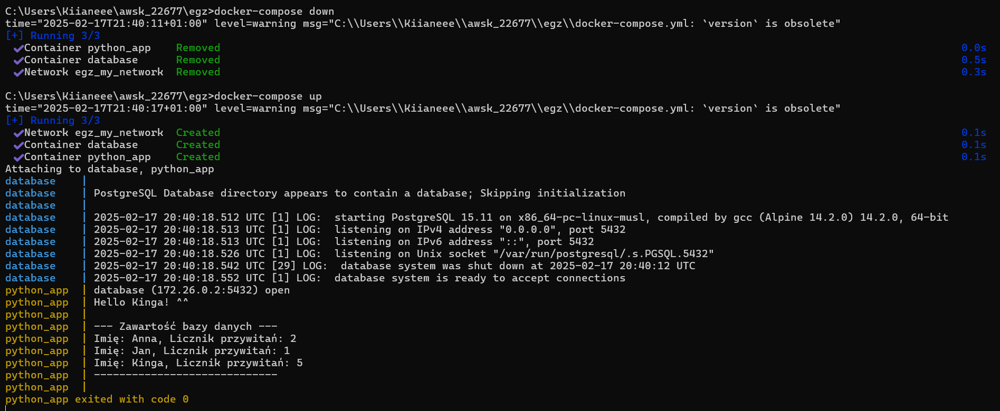
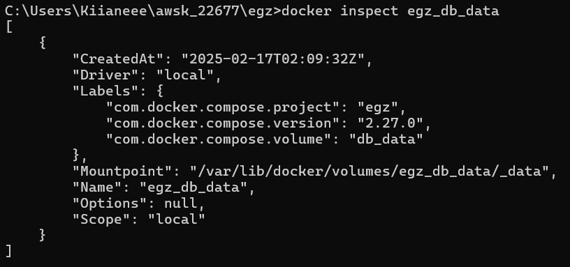
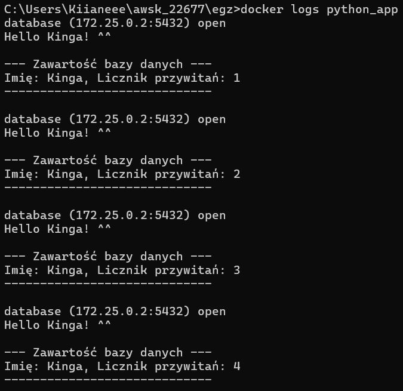
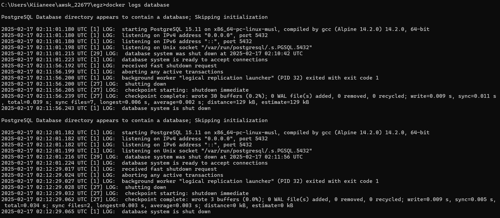
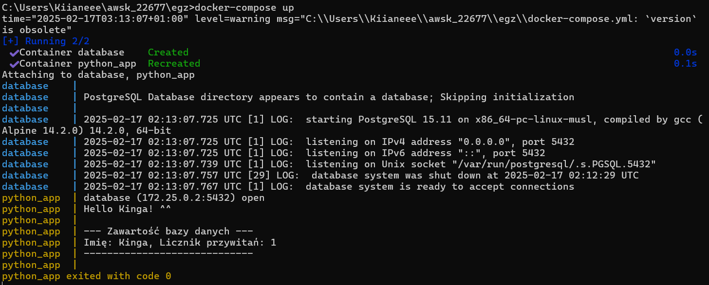
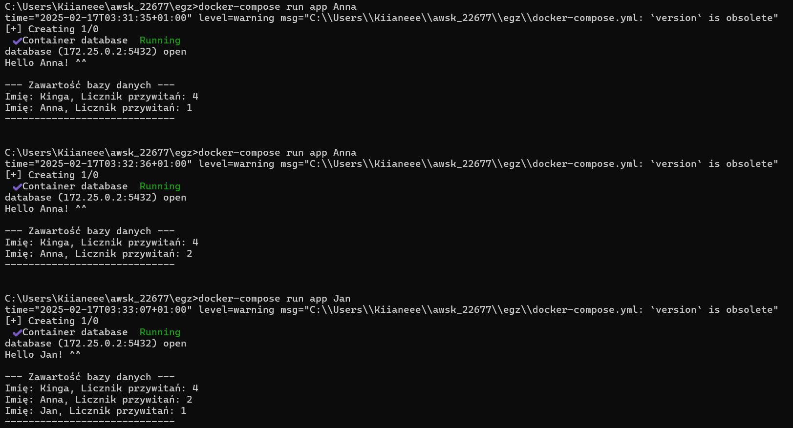

# Analiza projektu Docker'owego.
### Kinga Wierzbicka 215IC_B2 22677


## *Dockerfile* to plik konfiguracyjny zawierający instrukcje potrzebne do zbudowania obrazu Dockera. Obraz to szablon, na podstawie którego tworzy się kontenery.

### Dockerfile stosuje się do:
- Automatyzacji procesu budowy obrazów.
- Zapewnienia przenośności aplikacji - ten sam Dockerfile można uruchomić na różnych systemach.
- Zmniejszenia ryzyka błędów konfiguracji - wszystko jest opisane w jednym pliku.
- Możliwości wersjonowania dzięki czemu można kontrolować zmiany w środowisku aplikacji.

### Przykładowy stworzony Dockerfile do uruchomienia skryptu python (który wita użytkownika):

Dockerfile:

```
# Wybór bazowego obrazu
FROM python:3.9-alpine
# Ustawienie katalogu roboczego oraz przekopiowanie kodu do kontenera
WORKDIR /app
COPY code /app/
# Dodanie użytkownika oraz nadanie mu uprawnień (w celu zwiększenia bezpieczeństwa skrypt nie będzie uruchamiany z uprawnieniami root)
RUN adduser -D appuser && chown -R appuser /app
# Przełączenie się na użytkownika
USER appuser
# Ustawienie domyślnego procesu po starcie kontenera - skryptu pythona
ENTRYPOINT ["python", "/app/script.py"]
# Wykorzystanie CMD jako domyślnego parametru dla ENTRYPOINT
CMD ["Kinga"]
```

script.py:

```
import sys

name = sys.argv[1]

print(f"Hello {name}! ^^")
```

Dockerfile umożliwia utworzenie tylko jednego obrazu jednocześnie, do zbudowania projektu potrzeba więcej elementów więc posłużę się docker-compose.

## docker-compose to narzędzie do zarządzania wieloma kontenerami jednocześnie. Umożliwia definiowanie i uruchamianie aplikacji składających się z kilku usług za pomocą jednego pliku docker-compose.yml.

### docker-compose stosuje się dla:
- Łatwego zarządzania wieloma kontenerami np. aplikacja + baza danych.
- Definiowania zależności między usługami np. aplikacja uruchomi się dopiero, gdy baza danych będzie gotowa.
- Konfiguracji wolumenów i sieci w jednym miejscu.
- Automatycznego restartowania usług w przypadku awarii.

docker-compose.yml:

```
version: "3"

services:
  app:
    build: .
    container_name: python_app
    volumes:
      - ./data:/app/data
    environment:
      - LOG_LEVEL=debug
      - DB_HOST=db
      - DB_NAME=mydb
      - DB_USER=user
      - DB_PASS=password
    depends_on:
      - db
    networks:
      - my_network

  db:
    image: postgres:15-alpine
    container_name: database
    restart: always
    environment:
      POSTGRES_USER: user
      POSTGRES_PASSWORD: password
      POSTGRES_DB: mydb
    volumes:
      - db_data:/var/lib/postgresql/data
    networks:
      - my_network

networks:
  my_network:

volumes:
  db_data:
```

zaaktualizowany Dockerfile:

```
# Wybór bazowego obrazu
FROM python:3.9-alpine
# Ustawienie katalogu roboczego
WORKDIR /app
# Przekopiowanie kodu python, wymaganych zależności oraz skryptu wait-for do kontenera
COPY code /app/
COPY requirements.txt /app/requirements.txt
COPY wait-for.sh /app/wait-for.sh
# Dodanie użytkownika oraz nadanie mu uprawnień (w celu zwiększenia bezpieczeństwa skrypt nie będzie uruchamiany z uprawnieniami root) oraz zainstalowanie potrzebnych zależności (psycopg2 - biblioteka umożliwiająca w Pythonie nawiązywania sesji z bazą Postgresową)
RUN adduser -D appuser && chown -R appuser /app && pip install --no-cache-dir -r /app/requirements.txt && chmod +x /app/wait-for.sh
# Przełączenie się na użytkownika
USER appuser
# Ustawienie domyślnego procesu po starcie kontenera - skryptu pythona
ENTRYPOINT ["/app/wait-for.sh", "python", "/app/script.py"]
# Wykorzystanie CMD jako domyślnego parametru dla ENTRYPOINT
CMD ["Kinga"]
```

zaaktualizowany script.py z obsługą bazy danych - zapisywanie w bazie przywitanych imion oraz ich ilości

```
import sys
import psycopg2
import os

# Pobranie zmiennych środowiskowych do połączenia z bazą
DB_HOST = os.getenv("DB_HOST", "localhost")
DB_NAME = os.getenv("DB_NAME", "mydb")
DB_USER = os.getenv("DB_USER", "user")
DB_PASS = os.getenv("DB_PASS", "password")

def connect_db():
    # Nawiązanie połączenia z bazą danych
    return psycopg2.connect(
        host=DB_HOST,
        database=DB_NAME,
        user=DB_USER,
        password=DB_PASS
    )

def initialize_db():
    # Tworzenie tabeli imion jeśli nie istnieje
    conn = connect_db()
    cur = conn.cursor()
    cur.execute("""
        CREATE TABLE IF NOT EXISTS names (
            name TEXT PRIMARY KEY,
            count INTEGER DEFAULT 1
        )
    """)
    conn.commit()
    cur.close()
    conn.close()

def update_or_insert_name(name):
    # Dodanie imienia do bazy lub zwiększenie jego liczniku
    conn = connect_db()
    cur = conn.cursor()
    cur.execute("SELECT count FROM names WHERE name = %s", (name,))
    row = cur.fetchone()

    if row:
        new_count = row[0] + 1
        cur.execute("UPDATE names SET count = %s WHERE name = %s", (new_count, name))
    else:
        cur.execute("INSERT INTO names (name, count) VALUES (%s, 1)", (name,))

    conn.commit()
    cur.close()
    conn.close()

def show_database():
    # Wyświetla zawartość bazy danych
    conn = connect_db()
    cur = conn.cursor()
    cur.execute("SELECT * FROM names")
    rows = cur.fetchall()
    
    print("\n--- Zawartość bazy danych ---")
    for row in rows:
        print(f"Imię: {row[0]}, Licznik przywitań: {row[1]}")
    print("-----------------------------\n")

    cur.close()
    conn.close()

if __name__ == "__main__":
    name = sys.argv[1]
    print(f"Hello {name}! ^^")
    initialize_db()
    update_or_insert_name(name)
    show_database()
```

## Usługi (services) 
to procesy uruchomione w kontenerach. Każda usługa może działać jako niezależna jednostka, ale może też komunikować się z innymi.
- Pozwalają na rozdzielenie funkcjonalności (np. osobny kontener dla aplikacji i osobny dla bazy danych).
- Zapewniają skalowalność – możemy uruchomić wiele replik tej samej usługi.
- Ułatwiają zarządzanie zależnościami.

W prezentowanym projekcie są to: app (aplikacja Python w kontenerze) i db (baza PostgreSQL w osobnym kontenerze), które komunikują się po wewnętrznej sieci Dockera.

## Skrypt *wait-for* pozwala sprawdzić, czy usługa jest dostępna przed jej użyciem. Gdy aplikacja wymaga dostępu do innej usługi np. bazy danych, może się zdarzyć, że baza nie zdąży się uruchomić przed aplikacją. Dzięki niemu można zapobiec błędom połączenia gdy np. aplikacja nie próbuje łączyć się z bazą, która jeszcze się nie uruchomiła i zapewnić poprawną kolejność uruchamiania usług.

Zawartość użytego w projekcie skryptu wait-for.sh:

```
#!/bin/sh
until nc -z -v -w30 database 5432; do
  echo "Waiting for database connection..."
  sleep 5
done
exec "$@"
```

```nc -z -v -w30 database 5432``` - sprawdza, czy database nasłuchuje na porcie 5432
jeśli baza nie działa, skrypt czeka 5 sekund i próbuje ponownie - ```sleep 5```

## Wolumeny to trwałe miejsce na dane, które przechowuje informacje nawet po wyłączeniu kontenera.
- Umożliwiają przechowywanie danych poza kontenerem, dzięki temu nie tracimy danych po restarcie.
- Ułatwiają zarządzanie danymi np. współdzielenie między kontenerami.
- Oferują przenośność - ten sam wolumen można używać w różnych środowiskach.

W projekcie utworzyłam w docker-compose wolumen db_data:

```
volumes:
  db_data:
```

oraz podpiełam go do bazy danych:

```
db:
    volumes:
      - db_data:/var/lib/postgresql/data
```

Prezentacja działającego volumenu danych bazy:

```
docker-compose down
docker-compose up
```



Jak widać na screenie mimo usunięcia konteneru po `docker-compose down`, przy ponownym uruchomieniu bazy danych dane zostały zachowane.

## docker inspect
to dockerowe narzędzie diagnostyczne, służy do uzyskania szczegółowych informacji o kontenerze, obrazie, wolumenie lub sieci. 
Zwraca wynik w formacie JSON, który można analizować pod kątem różnych właściwości.

```docker inspect python_app``` pokazuje szczegółowe informacje o kontenerze do najważniejszych informacji jakie możemy o nim uzyskać można zaliczyć:
- Id - Unikalny identyfikator kontenera
- Name - Nazwa kontenera
- State - Status kontenera (Running, Exited, Paused)
- Image - Obraz, na którym bazuje kontener
- Mounts - Informacje o wolumenach i mapowaniach katalogów
- NetworkSettings - Adresy IP, sieci, porty
- Config - Zmiennie środowiskowe, komenda startowa, wejściowy katalog

```
C:\Users\Kiianeee\awsk_22677\egz>docker inspect python_app
[
    {
        "Id": "e04a7ac48e20c0736b10468a9cb6757433e541fe10bc18db1262caa7a1e6f3b2",
        "Created": "2025-02-17T02:13:07.174379107Z",
        "Path": "/app/wait-for.sh",
        "Args": [
            "python",
            "/app/script.py",
            "Kinga"
        ],
        "State": {
            "Status": "exited",
            "Running": false,
            "Paused": false,
            "Restarting": false,
            "OOMKilled": false,
            "Dead": false,
            "Pid": 0,
            "ExitCode": 0,
            "Error": "",
            "StartedAt": "2025-02-17T02:30:26.884735095Z",
            "FinishedAt": "2025-02-17T02:30:26.964407466Z"
        },
        "Image": "sha256:f2e0bf742e0f665aac332b7cb88318d8abbc55d1f8564f9e7664c2237c75d6c9",
        "ResolvConfPath": "/var/lib/docker/containers/e04a7ac48e20c0736b10468a9cb6757433e541fe10bc18db1262caa7a1e6f3b2/resolv.conf",
        "HostnamePath": "/var/lib/docker/containers/e04a7ac48e20c0736b10468a9cb6757433e541fe10bc18db1262caa7a1e6f3b2/hostname",
        "HostsPath": "/var/lib/docker/containers/e04a7ac48e20c0736b10468a9cb6757433e541fe10bc18db1262caa7a1e6f3b2/hosts",
        "LogPath": "/var/lib/docker/containers/e04a7ac48e20c0736b10468a9cb6757433e541fe10bc18db1262caa7a1e6f3b2/e04a7ac48e20c0736b10468a9cb6757433e541fe10bc18db1262caa7a1e6f3b2-json.log",
        "Name": "/python_app",
        "RestartCount": 0,
        "Driver": "overlay2",
        "Platform": "linux",
        "MountLabel": "",
        "ProcessLabel": "",
        "AppArmorProfile": "",
        "ExecIDs": null,
        "HostConfig": {
            "Binds": [
                "C:\\Users\\Kiianeee\\awsk_22677\\egz\\data:/app/data:rw"
            ],
            "ContainerIDFile": "",
            "LogConfig": {
                "Type": "json-file",
                "Config": {}
            },
            "NetworkMode": "egz_my_network",
            "PortBindings": {},
            "RestartPolicy": {
                "Name": "no",
                "MaximumRetryCount": 0
            },
            "AutoRemove": false,
            "VolumeDriver": "",
            "VolumesFrom": null,
            "ConsoleSize": [
                0,
                0
            ],
            "CapAdd": null,
            "CapDrop": null,
            "CgroupnsMode": "host",
            "Dns": null,
            "DnsOptions": null,
            "DnsSearch": null,
            "ExtraHosts": [],
            "GroupAdd": null,
            "IpcMode": "private",
            "Cgroup": "",
            "Links": null,
            "OomScoreAdj": 0,
            "PidMode": "",
            "Privileged": false,
            "PublishAllPorts": false,
            "ReadonlyRootfs": false,
            "SecurityOpt": null,
            "UTSMode": "",
            "UsernsMode": "",
            "ShmSize": 67108864,
            "Runtime": "runc",
            "Isolation": "",
            "CpuShares": 0,
            "Memory": 0,
            "NanoCpus": 0,
            "CgroupParent": "",
            "BlkioWeight": 0,
            "BlkioWeightDevice": null,
            "BlkioDeviceReadBps": null,
            "BlkioDeviceWriteBps": null,
            "BlkioDeviceReadIOps": null,
            "BlkioDeviceWriteIOps": null,
            "CpuPeriod": 0,
            "CpuQuota": 0,
            "CpuRealtimePeriod": 0,
            "CpuRealtimeRuntime": 0,
            "CpusetCpus": "",
            "CpusetMems": "",
            "Devices": null,
            "DeviceCgroupRules": null,
            "DeviceRequests": null,
            "MemoryReservation": 0,
            "MemorySwap": 0,
            "MemorySwappiness": null,
            "OomKillDisable": false,
            "PidsLimit": null,
            "Ulimits": null,
            "CpuCount": 0,
            "CpuPercent": 0,
            "IOMaximumIOps": 0,
            "IOMaximumBandwidth": 0,
            "MaskedPaths": [
                "/proc/asound",
                "/proc/acpi",
                "/proc/kcore",
                "/proc/keys",
                "/proc/latency_stats",
                "/proc/timer_list",
                "/proc/timer_stats",
                "/proc/sched_debug",
                "/proc/scsi",
                "/sys/firmware",
                "/sys/devices/virtual/powercap"
            ],
            "ReadonlyPaths": [
                "/proc/bus",
                "/proc/fs",
                "/proc/irq",
                "/proc/sys",
                "/proc/sysrq-trigger"
            ]
        },
        "GraphDriver": {
            "Data": {
                "LowerDir": "/var/lib/docker/overlay2/5310425d43ef4d87b11ca2e57b1f8553e46cfd4abd3ca3ba9e0defb002ca33b8-init/diff:/var/lib/docker/overlay2/k3ows88rjejqzq9g5bj07gug3/diff:/var/lib/docker/overlay2/wb88kqf33t18z2g18xwhjvwpg/diff:/var/lib/docker/overlay2/vahg1wtq9o6odr9kckgl36nid/diff:/var/lib/docker/overlay2/p7e0by7rcf9jzq90pa1s4y8q3/diff:/var/lib/docker/overlay2/wnox9of46disp9z1acps23jto/diff:/var/lib/docker/overlay2/70d9df7c700211efed6c65e57a86e0214b7805a8a3d897368954a9009b21f12d/diff:/var/lib/docker/overlay2/ced9a2cc1c35139a762ca3752dcb309d3da3476e93dfeadaed3511b7f05c642c/diff:/var/lib/docker/overlay2/688face5e63fb2eefaef7769bfba3c9d122bca787bdd9ae0fefa2b7a3655886b/diff:/var/lib/docker/overlay2/6ac5238ed548a257cce4820d0f512cd58c0b83c8bf5f4ce11cfde00ddb95010f/diff",
                "MergedDir": "/var/lib/docker/overlay2/5310425d43ef4d87b11ca2e57b1f8553e46cfd4abd3ca3ba9e0defb002ca33b8/merged",
                "UpperDir": "/var/lib/docker/overlay2/5310425d43ef4d87b11ca2e57b1f8553e46cfd4abd3ca3ba9e0defb002ca33b8/diff",
                "WorkDir": "/var/lib/docker/overlay2/5310425d43ef4d87b11ca2e57b1f8553e46cfd4abd3ca3ba9e0defb002ca33b8/work"
            },
            "Name": "overlay2"
        },
        "Mounts": [
            {
                "Type": "bind",
                "Source": "C:\\Users\\Kiianeee\\awsk_22677\\egz\\data",
                "Destination": "/app/data",
                "Mode": "rw",
                "RW": true,
                "Propagation": "rprivate"
            }
        ],
        "Config": {
            "Hostname": "e04a7ac48e20",
            "Domainname": "",
            "User": "appuser",
            "AttachStdin": false,
            "AttachStdout": true,
            "AttachStderr": true,
            "Tty": false,
            "OpenStdin": false,
            "StdinOnce": false,
            "Env": [
                "DB_PASS=password",
                "LOG_LEVEL=debug",
                "DB_HOST=db",
                "DB_NAME=mydb",
                "DB_USER=user",
                "PATH=/usr/local/bin:/usr/local/sbin:/usr/local/bin:/usr/sbin:/usr/bin:/sbin:/bin",
                "LANG=C.UTF-8",
                "GPG_KEY=E3FF2839C048B25C084DEBE9B26995E310250568",
                "PYTHON_VERSION=3.9.21",
                "PYTHON_SHA256=3126f59592c9b0d798584755f2bf7b081fa1ca35ce7a6fea980108d752a05bb1"
            ],
            "Cmd": [
                "Kinga"
            ],
            "Image": "egz-app",
            "Volumes": null,
            "WorkingDir": "/app",
            "Entrypoint": [
                "/app/wait-for.sh",
                "python",
                "/app/script.py"
            ],
            "OnBuild": null,
            "Labels": {
                "com.docker.compose.config-hash": "ffc979eac69495d4e96eb209629cdb48a0ca77f08579b94622de776e73101b83",
                "com.docker.compose.container-number": "1",
                "com.docker.compose.depends_on": "db:service_started:false",
                "com.docker.compose.image": "sha256:f2e0bf742e0f665aac332b7cb88318d8abbc55d1f8564f9e7664c2237c75d6c9",
                "com.docker.compose.oneoff": "False",
                "com.docker.compose.project": "egz",
                "com.docker.compose.project.config_files": "C:\\Users\\Kiianeee\\awsk_22677\\egz\\docker-compose.yml",
                "com.docker.compose.project.working_dir": "C:\\Users\\Kiianeee\\awsk_22677\\egz",
                "com.docker.compose.replace": "32cca604da9e4127d9988176d35a5a2fb1ea84796b9de37c28de1fec29987dbc",
                "com.docker.compose.service": "app",
                "com.docker.compose.version": "2.27.0"
            }
        },
        "NetworkSettings": {
            "Bridge": "",
            "SandboxID": "5b51ef7638221ab0a86949c7bd4ab87dc051e2ad629f9814cf7c84ea2d8e1e37",
            "SandboxKey": "/var/run/docker/netns/5b51ef763822",
            "Ports": {},
            "HairpinMode": false,
            "LinkLocalIPv6Address": "",
            "LinkLocalIPv6PrefixLen": 0,
            "SecondaryIPAddresses": null,
            "SecondaryIPv6Addresses": null,
            "EndpointID": "",
            "Gateway": "",
            "GlobalIPv6Address": "",
            "GlobalIPv6PrefixLen": 0,
            "IPAddress": "",
            "IPPrefixLen": 0,
            "IPv6Gateway": "",
            "MacAddress": "",
            "Networks": {
                "egz_my_network": {
                    "IPAMConfig": null,
                    "Links": null,
                    "Aliases": [
                        "python_app",
                        "app"
                    ],
                    "MacAddress": "",
                    "NetworkID": "471c2b180acec5867eb90d7999aec48c66a61bc0e55d08a94e322325a4b4d68d",
                    "EndpointID": "",
                    "Gateway": "",
                    "IPAddress": "",
                    "IPPrefixLen": 0,
                    "IPv6Gateway": "",
                    "GlobalIPv6Address": "",
                    "GlobalIPv6PrefixLen": 0,
                    "DriverOpts": null,
                    "DNSNames": [
                        "python_app",
                        "app",
                        "e04a7ac48e20"
                    ]
                }
            }
        }
    }
]
```
Najważniejsze informacje jakie możemy dowiedzieć się o utworzonej sieci to np:
- Name - Nazwa sieci
- Id - Unikalny identyfikator sieci
- Driver - Typ sieci (np. bridge, overlay, host)
- IPAM.Config - Konfiguracja IP (zakres adresów IP, maska podsieci)
- Containers - Lista kontenerów podłączonych do sieci
- Internal - Czy sieć jest widoczna poza Dockerem
- Options - Dodatkowe opcje sieci, np. com.docker.network.bridge.name (nazwa mostka w systemie)

Inspekcja sieci utworzonej w projekcie:

```
C:\Users\Kiianeee\awsk_22677\egz>docker inspect egz_my_network
[
    {
        "Name": "egz_my_network",
        "Id": "471c2b180acec5867eb90d7999aec48c66a61bc0e55d08a94e322325a4b4d68d",
        "Created": "2025-02-17T02:11:00.593184212Z",
        "Scope": "local",
        "Driver": "bridge",
        "EnableIPv6": false,
        "IPAM": {
            "Driver": "default",
            "Options": null,
            "Config": [
                {
                    "Subnet": "172.25.0.0/16",
                    "Gateway": "172.25.0.1"
                }
            ]
        },
        "Internal": false,
        "Attachable": false,
        "Ingress": false,
        "ConfigFrom": {
            "Network": ""
        },
        "ConfigOnly": false,
        "Containers": {
            "f7cff11cead3670f8c9f4c1c4a07683ae89724a1e0e5d0314a0c5b52f94cf033": {
                "Name": "database",
                "EndpointID": "0d0f989e35781c79435500edc8df5e03ea4eabc612f539037f86ca2159fb8d4f",
                "MacAddress": "02:42:ac:19:00:02",
                "IPv4Address": "172.25.0.2/16",
                "IPv6Address": ""
            }
        },
        "Options": {},
        "Labels": {
            "com.docker.compose.network": "my_network",
            "com.docker.compose.project": "egz",
            "com.docker.compose.version": "2.27.0"
        }
    }
]
```

Najważniejsze informacje jakie możemy dowiedzieć się o utworzonym wolumenie to np:
- Name - Nazwa wolumenu
- Driver - Typ sterownika wolumenu (local, nfs, cloudstor, itp.)
- Mountpoint - Ścieżka na hoście, gdzie przechowywane są dane
- CreatedAt - Data i czas utworzenia wolumenu
- Scope - Zakres (local – dostępny tylko na tym hoście, global – używany w klastrze)
- Options - Dodatkowe opcje (np. kompresja, uprawnienia)
- Labels - Etykiety przypisane do wolumenu

Inspekcja wolumenu uworzonego w projekcie dla bazy danych - ```docker inspect egz_db_data``` 



## Docker zapisuje logi dla każdego kontenera. Możemy je przeglądać, aby monitorować działanie aplikacji i debugować błędy.

```docker logs python_app```  wyświetla logi aplikacji.



Wsród logów widać nawiązywanie połączenia z bazą danych oraz wyświetlaną przez aplikację historię zawartości bazy

``` docker logs database``` wyświetla logi bazy danych



Wśród logów widać kiedy baza danych nasłuchiwała, została wyłączona, dane w bazie uległy zmianie

Przydatna może być również flaga `-f` która umożliwia śledzenie logów w czasie rzeczywistym

Prezentacja pierwszego uruchomienia skryptu:

```
docker-compose up
```



Następne uruchomienia kontenera ze skryptem python z zmienionym parametrem:

```
docker-compose run app Anna
docker-compose run app Anna
docker-compose run app Jan
```



