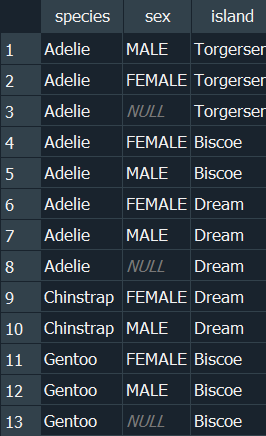
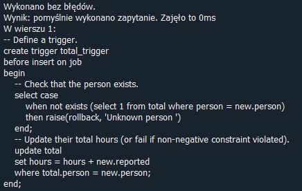
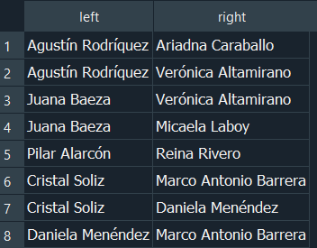

"# 215IC" 
#### 1. Selecting Constant
```bash 
select 1;
```


#### 2.Selecting All Values from Table
```bash 
select * from little_penguins;
```


#### 3. Specifying Columns
```bash 
select
    species,
    island,
    sex
from little_penguins;
```


#### 4. Sorting
```bash 
select
    species,
    sex,
    island
from little_penguins
order by island asc, sex desc;
```


#### Exercise 1
```bash 
SELECT sex, body_mass_g
FROM little_penguins
ORDER BY body_mass_g DESC;
```


#### 5. Limiting Output
```bash 
select
    species,
    sex,
    island
from penguins
order by species, sex, island
limit 10;
```


#### 6. Paging Output
```bash 
select
    species,
    sex,
    island
from penguins
order by species, sex, island
limit 10 offset 3;
```


#### 7. Removing Duplicates
```bash 
select distinct
    species,
    sex,
    island
from penguins;
```


#### Exercise 2
Write a SQL query to select the islands and species from rows 50 to 60 inclusive of the penguins table. Your result should have 11 rows.
```bash 
SELECT island, species
FROM little_penguins
LIMIT 10 OFFSET 49;
```
Modify your query to select distinct combinations of island and species from the same rows and compare the result to what you got in part 1.
```bash 
SELECT DISTINCT island, species
FROM little_penguins
LIMIT 10 OFFSET 49;
```
#### 8. Filtering Results
```bash 
select distinct
    species,
    sex,
    island
from penguins
where island = 'Biscoe';
```


#### Exercise 3

Write a query to select the body masses from penguins that are less than 3000.0 grams.
```bash 
SELECT body_mass_g
FROM penguins
WHERE body_mass_g < 3000.0;
```


Write another query to select the species and sex of penguins that weight less than 3000.0 grams. This shows that the columns displayed and those used in filtering are independent of each other.
```bash 
SELECT species, sex
FROM penguins
WHERE body_mass_g < 3000.0;
```


#### 9. Filtering with More Complex Conditions
```bash 
select distinct
    species,
    sex,
    island
from penguins
where island = 'Biscoe' and sex != 'MALE';
```


#### Exercise 4

Use the not operator to select penguins that are not Gentoos.
```bash 
SELECT 
    species,
    sex,
    island
FROM penguins
WHERE species != 'Gentoo';
```


SQL’s or is an inclusive or: it succeeds if either or both conditions are true. SQL does not provide a specific operator for exclusive or, which is true if either but not both conditions are true, but the same effect can be achieved using and, or, and not. Write a query to select penguins that are female or on Torgersen Island but not both.
```bash 
SELECT 
    species,
    sex,
    island
FROM penguins
WHERE (sex = 'female' OR island = 'Torgersen') AND NOT (sex = 'female' AND island = 'Torgersen');
```


#### 10. Doing Calculations
```bash 
select
    flipper_length_mm / 10.0,
    body_mass_g / 1000.0
from penguins
limit 3;
```


#### 11. Renaming Columns
```bash 
select
    flipper_length_mm / 10.0 as flipper_cm,
    body_mass_g / 1000.0 as weight_kg,
    island as where_found
from penguins
limit 3;
```


#### Exercise 5

Write a single query that calculates and returns:

A column called what_where that has the species and island of each penguin separated by a single space.
A column called bill_ratio that has the ratio of bill length to bill depth.
You can use the || operator to concatenate text to solve part 1, or look at the documentation for SQLite’s format() function.
```bash 
SELECT species || ' ' || island AS what_where,
       bill_length_mm / bill_depth_mm AS bill_ratio
FROM penguins;
```


#### 12. Calculating with Missing Values
```bash 
select
    flipper_length_mm / 10.0 as flipper_cm,
    body_mass_g / 1000.0 as weight_kg,
    island as where_found
from penguins
limit 5;
```


#### 13. Null Equality
Part1
```bash 
select distinct
    species,
    sex,
    island
from penguins
where island = 'Biscoe';
```


#### Part 2
```bash 
select distinct
    species,
    sex,
    island
from penguins
where island = 'Biscoe' and sex = 'FEMALE';
```


#### 14. Null Inequality
```bash 
select distinct
    species,
    sex,
    island
from penguins
where island = 'Biscoe' and sex != 'FEMALE';
```


#### 15. Ternary Logic
```bash 
select null = null;


```
#### 16. Handling Null Safely
```bash 
select
    species,
    sex,
    island
from penguins
where sex is null;
```


#### Exercise 6

Write a query to find penguins whose body mass is known but whose sex is not.
```bash 
SELECT *
FROM penguins
WHERE body_mass_g IS NOT NULL
  AND sex IS NULL;
```


Write another query to find penguins whose sex is known but whose body mass is not.
```bash 
SELECT *
FROM penguins
WHERE body_mass_g IS NULL
  AND sex IS NOT NULL;
```


 ####  17. Aggregating
```bash 
  select sum(body_mass_g) as total_mass
from penguins;
```


#### 18. Common Aggregation Functions
```bash 
select
    max(bill_length_mm) as longest_bill,
    min(flipper_length_mm) as shortest_flipper,
    avg(bill_length_mm) / avg(bill_depth_mm) as weird_ratio
from penguins;
```


#### Exercise 7

What is the average body mass of penguins that weight more than 3000.0 grams?
```bash 
SELECT AVG(body_mass_g) AS average_body_mass
FROM penguins
WHERE body_mass_g > 3000.0;
```


#### 19. Counting
```bash 
select
    count(*) as count_star,
    count(sex) as count_specific,
    count(distinct sex) as count_distinct
from penguins;
```


#### Exercise 8
How many different body masses are in the penguins dataset?
```bash 
SELECT COUNT(DISTINCT body_mass_g) AS distinct_body_masses
FROM penguins;
```


#### 20. Grouping
```bash 
select avg(body_mass_g) as average_mass_g
from penguins
group by sex;
```


#### 21. Behavior of Unaggregated Columns
```bash 
select
    sex,
    avg(body_mass_g) as average_mass_g
from penguins
group by sex;
```


#### 22. Arbitrary Choice in Aggregation
```bash 
select
    sex,
    body_mass_g
from penguins
group by sex;
```


#### Exercise 9

Explain why the output of the previous query has a blank line before the rows for female and male penguins.

Write a query that shows each distinct body mass in the penguin dataset and the number of penguins that weigh that much.
```bash 
SELECT body_mass_g, COUNT(*) AS num_penguins
FROM penguins
GROUP BY body_mass_g
ORDER BY body_mass_g;
```


#### 23. Filtering Aggregated Values
```bash 
select
    sex,
    avg(body_mass_g) as average_mass_g
from penguins
group by sex
having average_mass_g > 4000.0;
```


#### 24. Readable Output
```bash 
select
    sex,
    round(avg(body_mass_g), 1) as average_mass_g
from penguins
group by sex
having average_mass_g > 4000.0;
```


#### 25. Filtering Aggregate Inputs
```bash 
select
    sex,
    round(
        avg(body_mass_g) filter (where body_mass_g < 4000.0),
        1
    ) as average_mass_g
from penguins
group by sex;
```


#### Exercise 10

Write a query that uses filter to calculate the average body masses of heavy penguins (those over 4500 grams) and light penguins (those under 3500 grams) simultaneously. Is it possible to do this using where instead of filter?
```bash 
SELECT
    AVG(CASE WHEN body_mass_g > 4500 THEN body_mass_g END) AS average_body_mass_heavy,
    AVG(CASE WHEN body_mass_g < 3500 THEN body_mass_g END) AS average_body_mass_light
FROM penguins;


```
#### 26. Creating In-memory Database
```bash 
sqlite3 :memory:
```
#### 27. Creating Tables
```bash 
create table job (
    name text not null,
    billable real not null
);
create table work (
    person text not null,
    job text not null
);
```


#### 28. Inserting Data
```bash 
insert into job values
('calibrate', 1.5),
('clean', 0.5);
insert into work values
('mik', 'calibrate'),
('mik', 'clean'),
('mik', 'complain'),
('po', 'clean'),
('po', 'complain'),
('tay', 'complain');
```


#### Exercise 11

Using an in-memory database, define a table called notes with two text columns author and note and then add three or four rows. Use a query to check that the notes have been stored and that you can (for example) select by author name.

What happens if you try to insert too many or too few values into notes? What happens if you insert a number instead of a string into the note field?
```bash 
CREATE TABLE notes (
    author TEXT,
    note TEXT
);
```

```bash 
INSERT INTO notes (author, note) VALUES
    ('Alicja', 'first note'),
    ('Arek', 'second note'),
    ('Bartek', 'third note');
```

```bash 
INSERT INTO notes (author, note) VALUES
    ('Antek', '4th note', 'cos');
```

```bash 
INSERT INTO notes (author) VALUES
    ('Robert');
```

```bash 
SELECT * FROM notes;
```
#### 29. Updating Rows

```bash 
update work
set person = 'tae'
where person = 'tay';
```


#### 30. Deleting Rows
```bash 
delete from work
where person = 'tae';

select * from work;
```


#### Exercise 12

What happens if you try to delete rows that don’t exist (e.g., all entries in work that refer to juna)?

Query will execute correctly, even if nothing is delete.


#### 31. Backing Up
```bash 
create table backup (
    person text not null,
    job text not null
);

insert into backup
select
    person,
    job
from work
where person = 'tae';

delete from work
where person = 'tae';

select * from backup;
```


#### 32. Combining Information
```bash 
select *
from work cross join job;
```


#### 33. Inner Join
```bash 
select *
from work inner join job
    on work.job = job.name;
```


#### Exercise 13

Re-run the query shown above using where job = name instead of the full table.name notation. Is the shortened form easier or harder to read and more or less likely to cause errors?
```bash 
select *
from work inner join job
    on job = name;
```


34. Aggregating Joined Data
```bash 
select
    work.person,
    sum(job.billable) as pay
from work inner join job
    on work.job = job.name
group by work.person;
```


#### 35. Left Join
```bash 
select *
from work left join job
    on work.job = job.name;
```


#### 36. Aggregating Left Joins
```bash 
select
    work.person,
    sum(job.billable) as pay
from work left join job
    on work.job = job.name
group by work.person;
```


#### 37. Coalescing Values
```bash 
select
    work.person,
    coalesce(sum(job.billable), 0.0) as pay
from work left join job
    on work.job = job.name
group by work.person;
```


#### 38. Full Outer Join
```bash 
create table size (
    s text not null
);
insert into size values ('light'), ('heavy');

create table weight (
    w text not null
);

select * from size full outer join weight;

```
#### 39. Negating Incorrectly
```bash 
select distinct person
from work
where job != 'calibrate';
```


#### 40. Set Membership
```bash 
select *
from work
where person not in ('mik', 'tay');
```


#### 41. Subqueries
```bash 
select distinct person
from work
where person not in (
    select distinct person
    from work
    where job = 'calibrate'
);
```


#### 42. Defining a Primary Key
```bash 
create table lab_equipment (
    size real not null,
    color text not null,
    num integer not null,
    primary key (size, color)
);

insert into lab_equipment values
(1.5, 'blue', 2),
(1.5, 'green', 1),
(2.5, 'blue', 1);

select * from lab_equipment;
```

```bash 
insert into lab_equipment values
(1.5, 'green', 2);
```


#### Exercise
Does the penguins table have a primary key? If so, what is it? What about the work and job tables?

#### 43. Autoincrementing and Primary Keys
```bash 
create table person (
    ident integer primary key autoincrement,
    name text not null
);
```

```bash 
insert into person values
(null, 'mik'),
(null, 'po'),
(null, 'tay');
select * from person;
insert into person values (1, 'prevented');
```


#### 44. Internal Tables
```bash 
select * from sqlite_sequence;
```


#### Exercise
Are you able to modify the values stored in sqlite_sequence? In particular, are you able to reset the values so that the same sequence numbers are generated again?

We are not able to modify directly, we only can:
- Dropping and recreating the table with the AUTOINCREMENT column.
- Inserting data into the table again, starting the sequence numbers from 1.

#### 45. Altering Tables
```bash 
alter table job
add ident integer not null default -1;

update job
set ident = 1
where name = 'calibrate';

update job
set ident = 2
where name = 'clean';

select * from job;
```


### 46. Comparing Individual Values to Aggregates
```bash
select body_mass_g
from penguins
where
    body_mass_g > (
        select avg(body_mass_g)
        from penguins
    )
limit 5;
```


### Exercise 14 
Use a subquery to find the number of penguins that weigh the same as the lightest penguin.
```bash
SELECT COUNT(*) AS number_of_penguins
FROM penguins
WHERE body_mass_g = (SELECT MIN(body_mass_g) FROM penguins);
```


### 47. Comparing Individual Values to Aggregates Within Groups
```bash
select
    penguins.species,
    penguins.body_mass_g,
    round(averaged.avg_mass_g, 1) as avg_mass_g
from penguins inner join (
    select
        species,
        avg(body_mass_g) as avg_mass_g
    from penguins
    group by species
) as averaged
    on penguins.species = averaged.species
where penguins.body_mass_g > averaged.avg_mass_g
limit 5;
```


### Exercise 15
Use a subquery to find the number of penguins that weigh the same as the lightest penguin of the same sex and species.
```bash
SELECT COUNT(*) AS number_of_penguins
FROM penguins
WHERE body_mass_g = (SELECT MIN(body_mass_g) FROM penguins) AND species = (SELECT species FROM penguins WHERE body_mass_g = (SELECT MIN(body_mass_g) FROM penguins)) AND sex = (SELECT sex FROM penguins WHERE body_mass_g = (SELECT MIN(body_mass_g) FROM penguins));
```


### 48. Common Table Expressions
```bash
with grouped as (
    select
        species,
        avg(body_mass_g) as avg_mass_g
    from penguins
    group by species
)

select
    penguins.species,
    penguins.body_mass_g,
    round(grouped.avg_mass_g, 1) as avg_mass_g
from penguins inner join grouped
where penguins.body_mass_g > grouped.avg_mass_g
limit 5;
```


### 49. Explaining Query Plans
```bash
explain query plan
select
    species,
    avg(body_mass_g)
from penguins
group by species;
```


### Exercise 16
Use a CTE to find the number of penguins that weigh the same as the lightest penguin of the same sex and species.
```bash
WITH LightestPenguins AS (
    SELECT species, sex, MIN(body_mass_g) AS min_weight
    FROM penguins
    GROUP BY species, sex
)
SELECT p.species, p.sex, COUNT(*) AS number_of_penguins
FROM penguins p
JOIN LightestPenguins lp
ON p.species = lp.species AND p.sex = lp.sex AND p.body_mass_g = lp.min_weight
GROUP BY p.species, p.sex;
```


### 50. Enumerating Rows
```bash
select
    rowid,
    species,
    island
from penguins
limit 5;
```


### Exercise 17
```bash
CREATE TABLE test_table (
    value TEXT
);

INSERT INTO test_table (value) VALUES ('Row1');
INSERT INTO test_table (value) VALUES ('Row2');
INSERT INTO test_table (value) VALUES ('Row3');

SELECT rowid, value FROM test_table;
```

```bash
DELETE FROM test_table;

INSERT INTO test_table (value) VALUES ('Row1');
INSERT INTO test_table (value) VALUES ('Row2');
INSERT INTO test_table (value) VALUES ('Row3');

SELECT rowid, value FROM test_table;
```


### 51. Conditionals
```bash
with sized_penguins as (
    select
        species,
        iif(
            body_mass_g < 3500,
            'small',
            'large'
        ) as size
    from penguins
    where body_mass_g is not null
)

select
    species,
    size,
    count(*) as num
from sized_penguins
group by species, size
order by species, num;
```


### Exercise 18
How does the result of the previous query change if the check for null body mass is removed? Why is the result without that check misleading?

What does each of the expressions shown below produce? Which ones do you think actually attempt to divide by zero?
iif(0, 123, 1/0)
iif(1, 123, 1/0)
iif(0, 1/0, 123)
iif(1, 1/0, 123)
```bash
with sized_penguins as (
    select
        species,
        iif(
            body_mass_g < 3500,
            'small',
            'large'
        ) as size
    from penguins
    where body_mass_g 
)

select
    species,
    size,
    count(*) as num
from sized_penguins
group by species, size
order by species, num;
```

```bash

SELECT iif(0, 123, 1/0) AS result;

```

```bash
SELECT iif(1, 123, 1/0) AS result;
```


```bash
SELECT iif(0, 1/0, 123) AS result;
```

```bash

SELECT iif(1, 1/0, 123) AS result;

```


### 52.Selecting a Case
```bash
with sized_penguins as (
    select
        species,
        case
            when body_mass_g < 3500 then 'small'
            when body_mass_g < 5000 then 'medium'
            else 'large'
        end as size
    from penguins
    where body_mass_g is not null
)

select
    species,
    size,
    count(*) as num
from sized_penguins
group by species, size
order by species, num;
```


### Exercise 19
Modify the query above so that the outputs are "penguin is small" and "penguin is large" by concatenating the string "penguin is " to the entire case rather than to the individual when branches. (This exercise shows that case/when is an expression rather than a statement.)
```bash
with sized_penguins as (
    select
        species,
        'penguin is ' || case
            when body_mass_g < 3500 then 'small'
            when body_mass_g < 5000 then 'medium'
            else 'large'
        end as size
    from penguins
    where body_mass_g is not null
)

select
    species,
    size,
    count(*) as num
from sized_penguins
group by species, size
order by species, num;
```


### 53. Checking a Range
```bash
with sized_penguins as (
    select
        species,
        case
            when body_mass_g between 3500 and 5000 then 'normal'
            else 'abnormal'
        end as size
    from penguins
    where body_mass_g is not null
)

select
    species,
    size,
    count(*) as num
from sized_penguins
group by species, size
order by species, num;
```


### Exercise 20
The expression val between 'A' and 'Z' is true if val is 'M' (upper case) but false if val is 'm' (lower case). Rewrite the expression using SQLite's built-in scalar functions so that it is true in both cases.
```bash
SELECT UPPER(val) BETWEEN 'A' AND 'Z';
```


### 54. Yet Another Database
```bash
select * from staff;
```


### 55. Pattern Matching
```bash
select
    personal,
    family
from staff
where personal like '%ya%';
```


### Exercise 21
Rewrite the pattern-matching query shown above using glob.
```bash
select
    personal,
    family
from staff
where personal glob '*ya*';
```


### 56. Selecting First and Last Rows
```bash
select * from (
    select * from (select * from experiment order by started asc limit 5)
    union all
    select * from (select * from experiment order by started desc limit 5)
)
order by started asc;
```


### Exercise 22
```bash
SELECT *
FROM penguins
WHERE species = 'Adelie'
UNION ALL
SELECT *
FROM penguins
WHERE species = 'Adelie' ORDER BY bill_depth_mm;
```

```bash
SELECT *
FROM penguins
WHERE species = 'Adelie' ORDER BY bill_depth_mm;
```


### 57. Intersection
```bash
select
    personal,
    family,
    dept,
    age
from staff
where dept = 'mb'
intersect
select
    personal,
    family,
    dept,
    age from staff
where age < 50;
```


### Exercise 23
```bash
SELECT *
FROM penguins
WHERE species = 'Adelie'
INTERSECT
SELECT *
FROM penguins
WHERE body_mass_g > 4000;
```

```bash
SELECT *
FROM penguins
WHERE species = 'Adelie' AND body_mass_g > 4000;
```

```bash
EXPLAIN QUERY PLAN
SELECT *
FROM penguins
WHERE species = 'Adelie'
INTERSECT
SELECT *
FROM penguins
WHERE body_mass_g > 4000;
```

```bash
EXPLAIN QUERY PLAN
SELECT *
FROM penguins
WHERE species = 'Adelie' AND body_mass_g > 4000;
```


Using 'WHERE' seems more efficient because it is faster and less complicated.

### 58. Exclusion
```bash
select
    personal,
    family,
    dept,
    age
from staff
where dept = 'mb'
except
    select
        personal,
        family,
        dept,
        age from staff
    where age < 50;
```


### Exercise 24
Use exclude to find all Gentoo penguins that aren’t male. How can you check that your query is working correctly?
```bash
SELECT *
FROM penguins
WHERE species = 'Gentoo'
EXCEPT
SELECT *
FROM penguins
WHERE species = 'Gentoo' AND sex = 'Male';
```

Check:
```bash

```


### 59. Random Numbers and Why Not
```bash
with decorated as (
    select random() as rand,
    personal || ' ' || family as name
    from staff
)

select
    rand,
    abs(rand) % 10 as selector,
    name
from decorated
where selector < 5;
```


### Exercise 25
Write a query that:

uses a CTE to create 1000 random numbers between 0 and 10 inclusive;

uses a second CTE to calculate their mean;
```bash
WITH RECURSIVE random_numbers AS (
    SELECT RANDOM() % 11 AS value
    UNION ALL
    SELECT RANDOM() % 11
    FROM random_numbers
    LIMIT 1000
),
mean_value AS (
    SELECT AVG(value) AS mean
    FROM random_numbers
),
variance AS (
    SELECT AVG((value - mean_value.mean) * (value - mean_value.mean)) AS var
    FROM random_numbers, mean_value
)
SELECT mean_value.mean
FROM mean_value;

```


### 60. Creating an Index
```bash
explain query plan
select filename
from plate
where filename like '%07%';
```


### 61.Self Join
```bash
with person as (
    select
        ident,
        personal || ' ' || family as name
    from staff
)

select
    left_person.name,
    right_person.name
from person as left_person inner join person as right_person
limit 10;
```


### 62. Generating Unique Pairs
```bash
with person as (
    select
        ident,
        personal || ' ' || family as name
    from staff
)

select
    left_person.name,
    right_person.name
from person as left_person inner join person as right_person
on left_person.ident < right_person.ident
where left_person.ident <= 4 and right_person.ident <= 4;
```


### 63. Filtering Pairs
```bash
with
person as (
    select
        ident,
        personal || ' ' || family as name
    from staff
),

together as (
    select
        left_perf.staff as left_staff,
        right_perf.staff as right_staff
    from performed as left_perf inner join performed as right_perf
        on left_perf.experiment = right_perf.experiment
    where left_staff < right_staff
)

select
    left_person.name as person_1,
    right_person.name as person_2
from person as left_person inner join person as right_person join together
    on left_person.ident = left_staff and right_person.ident = right_staff;
```


### 64. Existence and Correlated Subqueries
```bash
select
    name,
    building
from department
where
    exists (
        select 1
        from staff
        where dept = department.ident
    )
order by name;
```


### 65. Nonexistence
```bash
select
    name,
    building
from department
where
    not exists (
        select 1
        from staff
        where dept = department.ident
    )
order by name;
```


### Exercise 26
Can you rewrite the previous query using exclude? If so, is your new query easier to understand? If the query cannot be rewritten, why not?
```bash
SELECT
    department.name,
    department.building
FROM department
LEFT JOIN staff ON department.ident = staff.dept
WHERE staff.dept IS NULL
ORDER BY department.name;
```
In my opinion, this query is easier to understand for less advanced users.


### 66. Avoiding Correlated Subqueries
```bash
select distinct
    department.name as name,
    department.building as building
from department inner join staff
    on department.ident = staff.dept
order by name;
```


### 67. Lead and Lag
```bash
with ym_num as (
    select
        strftime('%Y-%m', started) as ym,
        count(*) as num
    from experiment
    group by ym
)

select
    ym,
    lag(num) over (order by ym) as prev_num,
    num,
    lead(num) over (order by ym) as next_num
from ym_num
order by ym;
```


### 68. Windowing Functions
```bash
with ym_num as (
    select
        strftime('%Y-%m', started) as ym,
        count(*) as num
    from experiment
    group by ym
)

select
    ym,
    num,
    sum(num) over (order by ym) as num_done,
    (sum(num) over (order by ym) * 1.00) / (select sum(num) from ym_num) as completed_progress,
    cume_dist() over (order by ym) as linear_progress
from ym_num
order by ym;
```


### 69. Explaining Another Query Plan
```bash
explain query plan
with ym_num as (
    select
        strftime('%Y-%m', started) as ym,
        count(*) as num
    from experiment
    group by ym
)
select
    ym,
    num,
    sum(num) over (order by ym) as num_done,
    cume_dist() over (order by ym) as progress
from ym_num
order by ym;
```


### 70. Partitioned Windows
```bash
with y_m_num as (
    select
        strftime('%Y', started) as year,
        strftime('%m', started) as month,
        count(*) as num
    from experiment
    group by year, month
)

select
    year,
    month,
    num,
    sum(num) over (partition by year order by month) as num_done
from y_m_num
order by year, month;
```


### Exercise 27
Create a query that:

finds the unique weights of the penguins in the penguins database;

sorts them;

finds the difference between each successive distinct weight; and

counts how many times each unique difference appears.
```bash
WITH sorted_weights AS (
    SELECT DISTINCT body_mass_g
    FROM penguins
    WHERE body_mass_g IS NOT NULL
    ORDER BY body_mass_g
),
differences AS (
    SELECT 
        body_mass_g,
        LAG(body_mass_g) OVER (ORDER BY body_mass_g) AS prev_weight
    FROM sorted_weights
),
calculated_diffs AS (
    SELECT 
        body_mass_g - prev_weight AS diff
    FROM differences
    WHERE prev_weight IS NOT NULL
)
SELECT 
    diff,
    COUNT(*) AS count
FROM calculated_diffs
GROUP BY diff
ORDER BY count DESC;
```


### 71. Storing JSON
```bash
select * from machine;
```


### 72. Unpacking JSON Arrays
```bash
select
    ident,
    json_each.key as key,
    json_each.value as value
from usage, json_each(usage.log)
limit 10;
```


### 73. Modifying JSON
```bash
select
    ident,
    name,
    json_set(details, '$.sold', json_quote('2024-01-25')) as updated
from machine;
```


### 74. Refreshing the Penguins Database
```bash
select
    species,
    count(*) as num
from penguins
group by species;
```


### 75. Tombstones
```bash
alter table penguins
add active integer not null default 1;

update penguins
set active = iif(species = 'Adelie', 0, 1);
select
    species,
    count(*) as num
from penguins
where active
group by species;
```


### 76. Hours Reminder
```bash
create table job (
    name text not null,
    billable real not null
);
insert into job values
('calibrate', 1.5),
('clean', 0.5);
select * from job;
```


### 77. Adding Checks
```bash
create table job (
    name text not null,
    billable real not null,
    check (billable > 0.0)
);
insert into job values ('calibrate', 1.5);
insert into job values ('reset', -0.5);
```

```bash
select * from job;
```


### Exercise 28
Rewrite the definition of the penguins table to add the following constraints:

body_mass_g must be null or non-negative.

island must be one of "Biscoe", "Dream", or "Torgersen". (Hint: the in operator will be useful here.)
```bash
CREATE TABLE penguins (
    species TEXT,
    island TEXT CHECK (island IN ('Biscoe', 'Dream', 'Torgersen')),
    bill_length_mm REAL,
    bill_depth_mm REAL,
    flipper_length_mm REAL,
    body_mass_g REAL CHECK (body_mass_g IS NULL OR body_mass_g >= 0),
    sex TEXT
);

INSERT INTO penguins VALUES('Adelie','Dreayy',39.60000000000000142,18.10000000000000143,186.0,4450.0,'MALE');
```


### 78. Transactions
```bash
create table job (
    name text not null,
    billable real not null,
    check (billable > 0.0)
);

insert into job values ('calibrate', 1.5);

begin transaction;
insert into job values ('clean', 0.5);
rollback;

select * from job;
```


### 79. Rollback in Constraints
```bash
create table job (
    name text not null,
    billable real not null,
    check (billable > 0.0) on conflict rollback
);

insert into job values
    ('calibrate', 1.5);
insert into job values
    ('clean', 0.5),
    ('reset', -0.5);
```

```bash
select * from job;
```


### 80. Rollback in Statements
```bash
create table job (
    name text not null,
    billable real not null,
    check (billable > 0.0)
);

insert or rollback into job values
('calibrate', 1.5);
insert or rollback into job values
('clean', 0.5),
('reset', -0.5);
```

```bash
select * from job;
```


### 81. Upsert
```bash
create table jobs_done (
    person text unique,
    num integer default 0
);

insert into jobs_done values
('zia', 1);
.print 'after first'
select * from jobs_done;
.print


insert into jobs_done values
('zia', 1);
.print 'after failed'
```

```bash
select * from jobs_done;
```

```bash
insert into jobs_done values
('zia', 1)
on conflict(person) do update set num = num + 1;
.print '\nafter upsert'
select * from jobs_done;
```


### 82. Creating Triggers
```bash
-- Track hours of lab work.
create table job (
    person text not null,
    reported real not null check (reported >= 0.0)
);

-- Explicitly store per-person total rather than using sum().
create table total (
    person text unique not null,
    hours real
);

-- Initialize totals.
insert into total values
('gene', 0.0),
('august', 0.0);

-- Define a trigger.
create trigger total_trigger
before insert on job
begin
    -- Check that the person exists.
    select case
        when not exists (select 1 from total where person = new.person)
        then raise(rollback, 'Unknown person ')
    end;
    -- Update their total hours (or fail if non-negative constraint violated).
    update total
    set hours = hours + new.reported
    where total.person = new.person;
end;
```


### 83. Trigger Not Firing
```bash
insert into job values
('gene', 1.5),
('august', 0.5),
('gene', 1.0);

SELECT * FROM job;
```


### 84. Trigger Firing
```bash
insert into job values
('gene', 1.0),
('august', -1.0);
```


### Exercise 30
Using the penguins database:

create a table called species with columns name and count; and

define a trigger that increments the count associated with each species each time a new penguin is added to the penguins table.

Does your solution behave correctly when several penguins are added by a single insert statement?
```bash
CREATE TABLE species (
    name TEXT PRIMARY KEY,
    count INTEGER DEFAULT 0
);

CREATE TRIGGER increment_species_count
AFTER INSERT ON penguins
FOR EACH ROW
BEGIN
    INSERT INTO species (name, count)
    VALUES (NEW.species, 1)
    ON CONFLICT(name) DO UPDATE SET count = count + 1;
END;

INSERT INTO penguins (species, island, bill_length_mm, bill_depth_mm, flipper_length_mm, body_mass_g, sex)
VALUES 
    ('Adelie', 'Biscoe', 39.1, 18.7, 181, 3750, 'male'),
    ('Chinstrap', 'Dream', 50.5, 19.3, 194, 4200, 'female'),
    ('Adelie', 'Biscoe', 40.3, 20.1, 190, 3800, 'female');

SELECT * FROM species;

```


### 85. Representing Graphs
```bash
create table lineage (
    parent text not null,
    child text not null
);
insert into lineage values
('Arturo', 'Clemente'),
('Darío', 'Clemente'),
('Clemente', 'Homero'),
('Clemente', 'Ivonne'),
('Ivonne', 'Lourdes'),
('Soledad', 'Lourdes'),
('Lourdes', 'Santiago');
select * from lineage;
```


### exercise 31
Write a query that uses a self join to find every person's grandchildren.
```bash
SELECT DISTINCT
    grandparent.parent AS grandparent,
    grandchild.child AS grandchild
FROM
    lineage AS parent
JOIN
    lineage AS grandparent ON parent.parent = grandparent.child
JOIN
    lineage AS grandchild ON parent.child = grandchild.parent;
```


### 86. Recursive Queries
```bash
with recursive descendent as (
    select
        'Clemente' as person,
        0 as generations
    union all
    select
        lineage.child as person,
        descendent.generations + 1 as generations
    from descendent inner join lineage
        on descendent.person = lineage.parent
)

select
    person,
    generations
from descendent;
```


### Exercise 32
```bash
with recursive descendent as (
    select
        'Clemente' as person,
        0 as generations
    union
    select
        lineage.child as person,
        descendent.generations + 1 as generations
    from descendent inner join lineage
        on descendent.person = lineage.parent
)

select
    person,
    generations
from descendent;
```

The result from union is the same because there are no duplicates in the table

### 87. Contact Tracing Database
```bash
select * from person;
```

```bash
select * from contact;
```


### 88. Bidirectional Contacts
```bash
create temporary table bi_contact (
    left text,
    right text
);

insert into bi_contact
select
    left, right from contact
    union all
    select right, left from contact
;

SELECT*FROM bi_contact;
```


### 89. Updating Group Identifiers
```bash
select
    left.name as left_name,
    left.ident as left_ident,
    right.name as right_name,
    right.ident as right_ident,
    min(left.ident, right.ident) as new_ident
from
    (person as left join bi_contact on left.name = bi_contact.left)
    join person as right on bi_contact.right = right.name;
```


### 90. Recursive Labeling
```bash
with recursive labeled as (
    select
        person.name as name,
        person.ident as label
    from
        person
    union -- not 'union all'
    select
        person.name as name,
        labeled.label as label
    from
        (person join bi_contact on person.name = bi_contact.left)
        join labeled on bi_contact.right = labeled.name
    where labeled.label < person.ident
)
select name, min(label) as group_id
from labeled
group by name
order by label, name;
```


### Exercise 33
Modify the query above to use union all instead of union to trigger infinite recursion. How can you modify the query so that it stops at a certain depth so that you can trace its output?
```bash
with recursive labeled as (
    select
        person.name as name,
        person.ident as label
    from
        person
    union ALL
    select
        person.name as name,
        labeled.label as label
    from
        (person join bi_contact on person.name = bi_contact.left)
        join labeled on bi_contact.right = labeled.name
    where labeled.label < person.ident
	AND labeled.depth < 5  
)
select name, min(label) as group_id
from labeled
group by name
order by label, name;
```


I added a stopping condition at depth level 5

