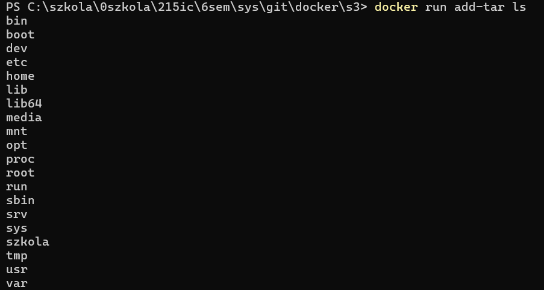
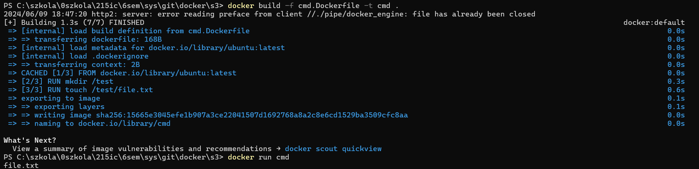
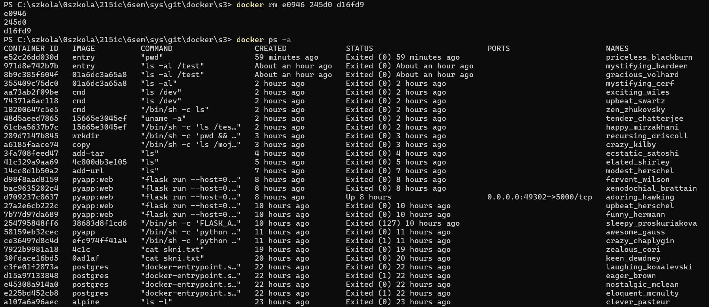
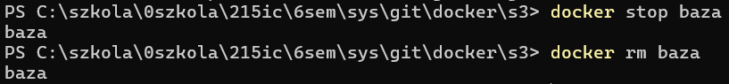

"# 215IC" 

### Kurs Dockera
Przeprowadzony z kusu na YouTube:
https://www.youtube.com/playlist?list=PLkcy-k498-V5AmftzfqinpMF2LFqSHK5n

### 1. Czym jest Docker? Dlaczego jest niezbędny?

Docker, czy też konteneryzacja ogólnie, składa się zawsze z platformy uruchomieniowej. Jest to taki system, który pozwala nam uruchamiać te nasze paczki z oprogramowaniem.

Porównanie warstw kontenerów i maszyn wirtualnych:


Docker jest to zautomatyzowany sposób budowania obrazów. Jest to też standard, czy też standardowy format, tych obrazów. Jest też właśnie samo narzędzie do budowania obrazów zarówno automatyczne jak i ręczne. Jest to też środowisko uruchomieniowe, czyli to, w jaki sposób możemy później te obrazy uruchamiać.

### 2. Uruchom swój pierwszy kontener!

Kontener:
- Instancja
- To co jest uruchomione
- Proces

Obraz:
- Szablon
- Struktura plików + metadane
- Program

Uruchomienie polecenia ls -l (wylistowanie zawartości katalogu) w kontenerze stworzonym
na podstawie obrazu o nazwie ubuntu 
```bash
docker run ubuntu ls -l
```

Sprawdzenie wersji jądra systemu operacyjnego
```bash
docker run ubuntu uname -a
```

```bash
docker run debian uname -a
```

Wiersz poleceń w kontenerze:
```bash
docker run --interactive --tty ubuntu bash
docker run -it ubuntu bash
ls -l
exit
```

Zapisanie tekstu do pliku i odczytanie zawartości tego pliku
```bash
echo "skni" > skni.txt
cat skni.txt
```

Wyświetlanie stworzonych kontenerów:
```bash
docker container ls -a
docker ps -a
```

```bash
docker start awesome_meitner
```

```bash
docker exec 4c4d cat skni.txt
```


### 3. Jak działają obrazy Dockerowe?
Obrazy Dockerowe składają się z warstw. Warstwy są niezmienne. Pojedyncza warstwa składa się z odniesienia
do poprzedniej warstwy i zmian w systemie plików w stosunku do niej.
Obrazy mogą współdzielić te same warstwy. Przechowujemy tylko jedną kopię warstwy, niezależnie od
tego ile obrazów wykorzystuje tę warstwę. Tym samym oszczędzamy miejsce na dysku i użycie sieci, bo nie
musimy przesyłać warstw, które mamy już zapisane na dysku.


Tworzenie obrazu:
```bash
docker commit 4c4d skni_img
```

Lista obrazów:
```bash
docker image ls
```

Podejrzenie warstw obrazu:
```bash
docker history skni_img
```

```bash
docker history ubuntu
```

```bash
docker run -it skni_img bash
cat skni.txt
```

Aktualizuja listy pakietów i instalacja Vim.
```bash
apt update && apt install vim
```

Uruchomienie Vim (zaawansowanego edytora tekstu)
```bash
vim
```

```bash
docker ps -a
docker commit ab06 vim_img 
```

```bash
docker image ls
docker history vim_img
```


### 4. Docker Hub
Docker Hub - centralne repozytorium obrazów dockerowych.
```bash
docker run alpine ls -l
```

Ściąganie obrazu z Docker Hub:
```bash
docker pull postgres
```

```bash
docker run postgres
```

```bash
docker login
docker push skni_img
```

Wgrywając na Docker Hub, musimy nazwać obraz w formacie <nazwa_uzytkownika>/<nazwa_obrazu>
```bash
docker tag skni_img kiianeee/obraz
docker push kiianeee/obraz
```

Obraz na moim profilu https://hub.docker.com/u/kiianeee:


### 5. Kopiowanie plików - Polecenie docker cp
Polecenie docker cp służy do kopiowania plików lub katalogów pomiędzy systemem hosta a kontenerem Docker. 
```bash
docker cp confident_lalande:/skni.txt .
```

```bash
dir
```

Edytowanie skni.txt, przekopiowanie go do kontenera i wyświetlenie:
```bash
notepad skni.txt
docker cp skni.txt confident_lalande:/
docker start confident_lalande
docker ps
docker exec confident_lalande cat skni.txt
```

### 6. Dockerfile, czyli automatyczne budowanie obrazów
Dockerfile umożliwia automatyzację budowania obrazów.
Dla każdego polecenie w Dockerfile, docker tworzy nowy tymczasowy kontener, wykonuje w nim polecenie i
zapisuje obraz tego kontenera jako nową warstwę obrazu. Następne polecenie
• FROM <obraz bazowy> (np. FROM ubuntu) - zaczynamy budowanie naszego obrazu na bazie tego
obrazu
• COPY <sciezka zrodlowa> <sciezka docelowa> - przekopiuj plik z build contextu do obrazu
• ADD <sciezka zrodlowa> <sciezka docelowa> - to samo co COPY, a dodatkowo pobieranie
plików przez URL i rozpakowywanie archiwów tar (zob. Polecenie ADD)
• WORKDIR <katalog> - katalog, w którym będą wykonywane wszystkie następne polecenia; polecenie
utworzy katalog jeżeli nie istniał
• RUN <polecenie> - wykonaj polecenie w trakcie budowania obrazu
• CMD <polecenie> - ustaw domyślne polecenie uruchomienia kontenera (polecenie nie będzie wykonane w trakcie budowania obrazu)
• ENTRYPOINT <polecenie> - ustaw domyślne polecenie uruchomienia kontenera (zob. Polecenia
CMD i ENTRYPOINT)

```bash
notepad Dockerfile

FROM ubuntu

COPY skni.txt .

RUN apt-get update
RUN apt-get install --yes vim

docker build .
```

```bash
docker images
```

```bash
docker run 0ad1af cat skni.txt
```


### 7. Nazwij obraz! | Tagowanie
```bash
docker build --tag mojvim .
```

```bash
docker images
```

```bash
docker tag mojvim:latest mojvim:2.0
docker images
```

```bash
docker build --tag mojvim:ubuntu19 .
docker images
```


### 8. Build Context 

```bash
cd ctx
echo "asd" > skni.txt
docker build -f ../Dockerfile .
```

```bash
docker run 4c1c cat skni.txt
```

```bash
ls
rm skni.txt
ls
ls ..
```

```bash
docker build .
```

```bash
cd ..
docker build -f Dockerfile ctx
```


### 9. Konteneryzacja aplikacji konsolowej i webowej 
app.py:
```bash
from flask import Flask

app = Flask(__name__)

@app.route('/')
def hello_world():
    return "Hello, Internet"

if __name__ == '__main__':
    print('Hello, Console')
    i = 10
    while i>0:
        print(f'Times {i}')
        i -= 1
```
requirements.txt:
```bash
flask
```
Dockerfile:
```bash
FROM python:3.8

COPY requirements.txt .
RUN pip install -r requirements.txt

COPY app.py .

CMD python app.py
```

```bash
docker build --tag pyapp .
```

```bash
docker run pyapp
```

Dockerfile:
```bash
FROM python:3.8

COPY requirements.txt .
RUN pip install -r requirements.txt

COPY app.py .

CMD FLASK_APP = app python -m flask run --host=0.0.0.0
# lub

ENV FLASK_APP=app
CMD ["flask", "run", "--host=0.0.0.0"]
```
```bash
docker build -t pyapp:web .
docker run pyapp:web
```

```bash
docker run --publish 5000 pyapp:web
```

```bash
docker ps
```


http://localhost:49302/:

```bash
docker run --publish 5123:5000 pyapp:web
```
http://localhost:5123/:

### 10. Polecenia ADD, COPY i WORKDIR
ADD: Kopiuje pliki i katalogi, może rozpakowywać archiwa i pobierać pliki z URL.
COPY: Kopiuje pliki i katalogi z lokalnego kontekstu build do systemu plików w kontenerze, bez dodatkowych funkcji ADD.
WORKDIR: Ustawia katalog roboczy dla kolejnych instrukcji w Dockerfile. Jeśli katalog nie istnieje, zostanie utworzony.
addurl.Dockerfile:
```bash
FROM ubuntu

ADD http://ftp.pl.debian.org/debian/pool/main/n/nano/nano_3.2-3amd64.deb .
RUN ls
```
```bash
docker build -f addurl.Dockerfile -t add-url .
```

```bash
docker run add-url ls
```

addurl.Dockerfile:
```bash
FROM ubuntu

ADD test.tar.gz .
RUN ls
```
```bash
docker build -f addurl.Dockerfile -t add-tar .
```

```bash
docker run add-tar ls
```

ADD .tar automatycznie rozpakowywuje archiwum
addurl.Dockerfile:
```bash
FROM ubuntu

COPY test.txt /moj_katalog/
COPY katalog/ /moj_katalog/
COPY test1.txt test2.txt /moj_katalog/
CMD ls /moj_katalog
```
```bash
docker build -f addurl.Dockerfile -t copy .
docker run copy
```

addurl.Dockerfile:
```bash
FROM ubuntu
WORKDIR /app
COPY test.txt .
CMD pwd && ls
```
```bash
docker build -f addurl.Dockerfile -t wrkdir .
docker run wrkdir
```


### 11. Czym różni się ENTRYPOINT od CMD
Formy argumentu: shell i exec Oba polecenia przyjmują argumenty w dwóch formach nazwanych: shell i
exec.

Forma shell to zwykła komenda powłoki linuxowej . Żeby z niej skorzystać w kontenerze musimy mieć
zainstalowaną powłokę (np. sh albo bash) - domyślnie dostępne w większości obrazów.
Przykład: CMD ls -al /app/stuff | grep test.txt

Forma exec ma postać tablicy argumentów (w formacie JSON, parametry w cudzysłowach, rozdzielane
przecinkiem). Możemy jej używać zawsze, nawet gdy w kontenerze nie mamy żadnego shella. Nie możemy w
niej korzystać z funkcji powłoki, takich jak przekierowanie strumieni (cat > test.txt) albo pipe (cat |
grep). Przykład: CMD ["ls", "-a", "-l", "/app/stuff"]

Polecenie CMD Definiuje domyślne polecenie wykonane w kontenerze.
Nadpisywane poleceniem podanym przy uruchamianiu kontenera (docker run ubuntu <polecenie>
).
Polecenie ENTRYPOINT Definiuje program uruchomiony w kontenerze.
Nie jest nadpisywane przez polecenie podane przy uruchamianiu kontenera, ale można je nadpisać podając
flagę --entrypoint (np. docker run --entrypoint=bash ubuntu).

Jeżeli podamy w Dockerfile oba polecenia z argumentem w formie exec, to polecenie CMD będzie ustawiało
domyślne argumenty programu podanego w ENTRYPOINT.

cmd.Dockerfile:
```bash
FROM ubuntu

RUN mkdir /test
RUN touch /test/file.txt
CMD ls /test 
```
```bash
docker build -f cmd.Dockerfile -t cmd .
docker run cmd
```

Zmiana w Dockerfile z CMD ls /test  na CMD ls
```bash
docker run cmd uname -a
docker build -f cmd.Dockerfile -t cmd .
docker run cmd
```

```bash
docker run cmd ls /dev
```

entrypoint.Dockerfile:
```bash
FROM ubuntu

RUN mkdir /test
RUN touch /test/file.txt
ENTRYPOINT ["ls", "-al"]
```
```bash
docker build -f entrypoint.Dockerfile -t entry .
docker run entry
```

```bash
docker run entry /test
```

W Dockerfile przed ENTRYPOINT dodana linia - CMD ["/test"]
```bash
docker build -f entrypoint.Dockerfile -t entry .
docker run entry
```

Uruchomienie z "pwd" jako punktem wejścia, zamiast domyślnego polecenia zdefiniowanego w obrazie. 
```bash
docker run --entrypoint pwd entry
```


### 12. Dane w kontenerze: VOLUMES
Wolumeny
• Zarządzane przez dockera
• Tworzenie: docker volume create <nazwa>
• Wylistowanie: docker volume ls
• Usunięcie docker volume rm <wolumen>
• Podpięcie do kontenera: docker run --volume <wolumen>:<katalog_kontenera> <obraz>
• Podpięcie do kontenera tylko do odczytu: docker run --volume <wolumen>:<katalog_kontenera>:ro <obraz>
```bash
docker volume create moj-volume
docker volume ls
docker volume rm moj-volume
docker volume ls
```

vol.Dockerfile:
```bash
FROM ubuntu

WORKDIR /katalog
CMD ls -al && echo "test" > file.txt && ls -al
```
```bash
docker build -f vol.Dockerfile -t vol_test .
docker run vol_test
```

```bash
docker run --volume moj-volume:/katalog vol_test
docker run --volume moj-volume:/katalog vol_test
```

```bash
docker volume ls
docker ps
docker ps -a
```

```bash
docker rm e0946 245d0 d16fd9
docker ps -a
```

Anonimowe wolumeny:
```bash
docker volume ls
docker run --volume moj-volume:/katalog vol_test
docker run --volume /katalog vol_test
docker volume ls
```

Bind mount:
Połączenie katalogów lub plików z hosta do kontenera. Ścieżka do katalogu na hoście musi być ścieżką
absolutną (typu: /home/user/foo/bar/; na Windowsie: //c/Users/user/foo/bar)
```bash
ls
ls katalog
docker run --volume //c/szkola/0szkola/215ic/6sem/sys/git/docker/s3/katalog:/katalog vol_test
```

```bash
ls katalog
docker run --volume //c/szkola/0szkola/215ic/6sem/sys/git/docker/s3/katalog:/katalog vol_test watch ls /katalog
docker run -it --volume //c/szkola/0szkola/215ic/6sem/sys/git/docker/s3/katalog:/katalog vol_test watch ls /katalog
```

Narzędzie watch cyklicznie (domyślnie co 2 sekundy) wykonuje polecenie ls /katalog, co pozwala na bieżąco obserwować zawartość montowanego katalogu.

### 13. Baza danych w kontenerze
Dodanie nowej zmiennej środowiskowej:
```bash
docker run ubuntu env
docker run -e MOJA_ZMIENNA=true ubuntu env
```

Postgres w kontenerze:
```bash
docker run --name baza --detach postgres
docker ps
docker ps -a
```

```bash
docker logs baza
docker rm baza
docker run --name baza --detach -e POSTGRES_PASSWORD=haslo postgres
```

```bash
docker ps
docker exec -it baza psql --username postgres

create table tabela();
select * from tabela;
\q
```

```bash
docker stop baza
docker rm baza
```

```bash
docker run --name baza --detach -e POSTGRES_PASSWORD=haslo --volume dane_bazy:/var/lib/postresql/data postgres
docker exec -it baza psql --username postgres
```

```bash
docker logs baza
```


```bash
docker exec -it baza psql --username postgres

\dt
create table tabela();
\q

docker stop baza
docker rm baza
docker volume ls
```

```bash
docker run --name baza --detach -e POSTGRES_PASSWORD=haslo --volume dane_bazy:/var/lib/postresql/data postgres
docker exec -it baza psql --username postgres

\dt
select*from tabela;
```

```bash
docker stop baza
docker rm baza
docker run --name baza --detach -e POSTGRES_PASSWORD=haslo -e POSTGRES_USER=ja --volume dane_bazy:/var/lib/postresql/data -p 5432:5432 postgres
docker logs baza
```

```bash
docker ps
```


### 14. Polecenie Docker Inspect
Poleceniem docker inspect <kontener> możemy wyświetlić wszystko co Docker wie o danym kontenerze w formacie JSON, wyświetla m.in. stan kontenera, lokalizację plików, sieci.
```bash
docker run ubuntu echo Hello
docker ps -a
```

```bash
docker inspect 0e5e1
```
Wynik polecenia:
```bash
[
    {
        "Id": "0e5e123742a82552fa9ab39b34b330b280cd34c0c64b7355ad90925aca5cd936",
        "Created": "2024-06-10T18:10:58.457375992Z",
        "Path": "echo",
        "Args": [
            "Hello"
        ],
        "State": {
            "Status": "exited",
            "Running": false,
            "Paused": false,
            "Restarting": false,
            "OOMKilled": false,
            "Dead": false,
            "Pid": 0,
            "ExitCode": 0,
            "Error": "",
            "StartedAt": "2024-06-10T18:10:58.896458407Z",
            "FinishedAt": "2024-06-10T18:10:58.905075773Z"
        },
        "Image": "sha256:17c0145030df106e60e5d99149d69810db23b869ff0d3c9d236279a5a7bbb6b3",
        "ResolvConfPath": "/var/lib/docker/containers/0e5e123742a82552fa9ab39b34b330b280cd34c0c64b7355ad90925aca5cd936/resolv.conf",
        "HostnamePath": "/var/lib/docker/containers/0e5e123742a82552fa9ab39b34b330b280cd34c0c64b7355ad90925aca5cd936/hostname",
        "HostsPath": "/var/lib/docker/containers/0e5e123742a82552fa9ab39b34b330b280cd34c0c64b7355ad90925aca5cd936/hosts",
        "LogPath": "/var/lib/docker/containers/0e5e123742a82552fa9ab39b34b330b280cd34c0c64b7355ad90925aca5cd936/0e5e123742a82552fa9ab39b34b330b280cd34c0c64b7355ad90925aca5cd936-json.log",
        "Name": "/interesting_hertz",
        "RestartCount": 0,
        "Driver": "overlay2",
        "Platform": "linux",
        "MountLabel": "",
        "ProcessLabel": "",
        "AppArmorProfile": "",
        "ExecIDs": null,
        "HostConfig": {
            "Binds": null,
            "ContainerIDFile": "",
            "LogConfig": {
                "Type": "json-file",
                "Config": {}
            },
            "NetworkMode": "bridge",
            "PortBindings": {},
            "RestartPolicy": {
                "Name": "no",
                "MaximumRetryCount": 0
            },
            "AutoRemove": false,
            "VolumeDriver": "",
            "VolumesFrom": null,
            "ConsoleSize": [
                41,
                156
            ],
            "CapAdd": null,
            "CapDrop": null,
            "CgroupnsMode": "host",
            "Dns": [],
            "DnsOptions": [],
            "DnsSearch": [],
            "ExtraHosts": null,
            "GroupAdd": null,
            "IpcMode": "private",
            "Cgroup": "",
            "Links": null,
            "OomScoreAdj": 0,
            "PidMode": "",
            "Privileged": false,
            "PublishAllPorts": false,
            "ReadonlyRootfs": false,
            "SecurityOpt": null,
            "UTSMode": "",
            "UsernsMode": "",
            "ShmSize": 67108864,
            "Runtime": "runc",
            "Isolation": "",
            "CpuShares": 0,
            "Memory": 0,
            "NanoCpus": 0,
            "CgroupParent": "",
            "BlkioWeight": 0,
            "BlkioWeightDevice": [],
            "BlkioDeviceReadBps": [],
            "BlkioDeviceWriteBps": [],
            "BlkioDeviceReadIOps": [],
            "BlkioDeviceWriteIOps": [],
            "CpuPeriod": 0,
            "CpuQuota": 0,
            "CpuRealtimePeriod": 0,
            "CpuRealtimeRuntime": 0,
            "CpusetCpus": "",
            "CpusetMems": "",
            "Devices": [],
            "DeviceCgroupRules": null,
            "DeviceRequests": null,
            "MemoryReservation": 0,
            "MemorySwap": 0,
            "MemorySwappiness": null,
            "OomKillDisable": false,
            "PidsLimit": null,
            "Ulimits": [],
            "CpuCount": 0,
            "CpuPercent": 0,
            "IOMaximumIOps": 0,
            "IOMaximumBandwidth": 0,
            "MaskedPaths": [
                "/proc/asound",
                "/proc/acpi",
                "/proc/kcore",
                "/proc/keys",
                "/proc/latency_stats",
                "/proc/timer_list",
                "/proc/timer_stats",
                "/proc/sched_debug",
                "/proc/scsi",
                "/sys/firmware",
                "/sys/devices/virtual/powercap"
            ],
            "ReadonlyPaths": [
                "/proc/bus",
                "/proc/fs",
                "/proc/irq",
                "/proc/sys",
                "/proc/sysrq-trigger"
            ]
        },
        "GraphDriver": {
            "Data": {
                "LowerDir": "/var/lib/docker/overlay2/2e7d8b93c2d797278c8a7920aad9d4100da50fd92a930088aa57e35d530f8760-init/diff:/var/lib/docker/overlay2/491c7e818fb7d653a69e38c29cffc26608fe1d6b0b85db0d2d99041c4eca1fcc/diff",
                "MergedDir": "/var/lib/docker/overlay2/2e7d8b93c2d797278c8a7920aad9d4100da50fd92a930088aa57e35d530f8760/merged",
                "UpperDir": "/var/lib/docker/overlay2/2e7d8b93c2d797278c8a7920aad9d4100da50fd92a930088aa57e35d530f8760/diff",
                "WorkDir": "/var/lib/docker/overlay2/2e7d8b93c2d797278c8a7920aad9d4100da50fd92a930088aa57e35d530f8760/work"
            },
            "Name": "overlay2"
        },
        "Mounts": [],
        "Config": {
            "Hostname": "0e5e123742a8",
            "Domainname": "",
            "User": "",
            "AttachStdin": false,
            "AttachStdout": true,
            "AttachStderr": true,
            "Tty": false,
            "OpenStdin": false,
            "StdinOnce": false,
            "Env": [
                "PATH=/usr/local/sbin:/usr/local/bin:/usr/sbin:/usr/bin:/sbin:/bin"
            ],
            "Cmd": [
                "echo",
                "Hello"
            ],
            "Image": "ubuntu",
            "Volumes": null,
            "WorkingDir": "",
            "Entrypoint": null,
            "OnBuild": null,
            "Labels": {
                "org.opencontainers.image.ref.name": "ubuntu",
                "org.opencontainers.image.version": "24.04"
            }
        },
        "NetworkSettings": {
            "Bridge": "",
            "SandboxID": "b864f2f65ac492c08b876c26b2b87f8c92772f621db7ab91d71eb059bd6a71cf",
            "SandboxKey": "/var/run/docker/netns/b864f2f65ac4",
            "Ports": {},
            "HairpinMode": false,
            "LinkLocalIPv6Address": "",
            "LinkLocalIPv6PrefixLen": 0,
            "SecondaryIPAddresses": null,
            "SecondaryIPv6Addresses": null,
            "EndpointID": "",
            "Gateway": "",
            "GlobalIPv6Address": "",
            "GlobalIPv6PrefixLen": 0,
            "IPAddress": "",
            "IPPrefixLen": 0,
            "IPv6Gateway": "",
            "MacAddress": "",
            "Networks": {
                "bridge": {
                    "IPAMConfig": null,
                    "Links": null,
                    "Aliases": null,
                    "MacAddress": "",
                    "NetworkID": "39bf3684f9fa0cf709632fbfedd2a5cc1ee101b525aad740357bcc8e7445262e",
                    "EndpointID": "",
                    "Gateway": "",
                    "IPAddress": "",
                    "IPPrefixLen": 0,
                    "IPv6Gateway": "",
                    "GlobalIPv6Address": "",
                    "GlobalIPv6PrefixLen": 0,
                    "DriverOpts": null,
                    "DNSNames": null
                }
            }
        }
    }
]
```
### 15. Docker Networks: wirtualne sieci w kontenerach
The Host Driver

-Jest to sieć publiczna.
-Kontener będzie używać adresu IP i portu hosta do uruchamiania usług wewnątrz kontenera.
-Usuwa izolację sieciową pomiędzy kontenerem a maszyną hosta, na której działa Docker
-Na przykład, jeśli uruchomisz kontener powiązany z portem 80 i korzystasz z sieci hosta, aplikacja kontenera będzie dostępna na porcie 80 adresu IP hosta.
-Jedynym ograniczeniem sterownika hosta jest to, że działa on na hostach z systemem Linux, ale nie na systemach Windows i Mac.
-Nie wymaga translacji adresów sieciowych (NAT).

Docker automatycznie tworzy taką sieć, która jest przypisana do każdego kontenera:

Uruchamienie dwów kontenerów Docker z obrazem busybox w trybie odłączonym, interaktywnym i z przypisanym terminalem:
```bash
docker network ls
docker run -dit --name contA busybox
docker run -dit --name contB busybox
```

```bash
docker network inspect bridge
```
Wynik:
```bash
[
    {
        "Name": "bridge",
        "Id": "39bf3684f9fa0cf709632fbfedd2a5cc1ee101b525aad740357bcc8e7445262e",
        "Created": "2024-06-08T16:29:00.81640646Z",
        "Scope": "local",
        "Driver": "bridge",
        "EnableIPv6": false,
        "IPAM": {
            "Driver": "default",
            "Options": null,
            "Config": [
                {
                    "Subnet": "172.17.0.0/16",
                    "Gateway": "172.17.0.1"
                }
            ]
        },
        "Internal": false,
        "Attachable": false,
        "Ingress": false,
        "ConfigFrom": {
            "Network": ""
        },
        "ConfigOnly": false,
        "Containers": {
            "4b66a14214dbc47446f992be6fccd3592b54737a0b0bfc13fe5da4e95e864444": {
                "Name": "baza",
                "EndpointID": "2b49774f1756e815deef7f987a919f58123fa22afdfe32461656a7a00c560f1a",
                "MacAddress": "02:42:ac:11:00:05",
                "IPv4Address": "172.17.0.5/16",
                "IPv6Address": ""
            },
            "4c4d17b4a46f0e13089a930d7ec4275602108a8ebc97961ece4a597d0a32050b": {
                "Name": "awesome_meitner",
                "EndpointID": "85bd4325a4bc02a242bd68464e0d4f6d9b30ca34087abae3813a483d937f1cc8",
                "MacAddress": "02:42:ac:11:00:02",
                "IPv4Address": "172.17.0.2/16",
                "IPv6Address": ""
            },
            "5970e743ae278582db5c0bd2a26b52d947eb5f8267670751528b816e84cf98cd": {
                "Name": "confident_lalande",
                "EndpointID": "c81277c5ca4ab16a0e931afec6b991667abf0d807ec30968ac80c54f5b44e053",
                "MacAddress": "02:42:ac:11:00:03",
                "IPv4Address": "172.17.0.3/16",
                "IPv6Address": ""
            },
            "5b6c2e86faee259470ee60e20562988543a1afd1b1024f0af97765e7718564af": {
                "Name": "contA",
                "EndpointID": "bb9b774a8e512cba9a6bb57837bfb4ab75f45d3d2bef166e7875dbd3cdfa7af1",
                "MacAddress": "02:42:ac:11:00:06",
                "IPv4Address": "172.17.0.6/16",
                "IPv6Address": ""
            },
            "7814eb1a864ff2379f5e425386d4cdf2c66dfd300ad9375c557971d3e8be0c27": {
                "Name": "contB",
                "EndpointID": "9f471105b1eead80216dabbf8e1bbc6d4ba6bc5800ffcc4d2dbe52d2379f1679",
                "MacAddress": "02:42:ac:11:00:07",
                "IPv4Address": "172.17.0.7/16",
                "IPv6Address": ""
            },
            "d709237c8637b9a7b83dd5bcbdada028d1e27c35a975db33bfd6bb7e58428b42": {
                "Name": "adoring_hawking",
                "EndpointID": "6f0a86c0cb818b2990e197dbf84dada0c12f56ae74c10301a351833ad0c08430",
                "MacAddress": "02:42:ac:11:00:04",
                "IPv4Address": "172.17.0.4/16",
                "IPv6Address": ""
            }
        },
        "Options": {
            "com.docker.network.bridge.default_bridge": "true",
            "com.docker.network.bridge.enable_icc": "true",
            "com.docker.network.bridge.enable_ip_masquerade": "true",
            "com.docker.network.bridge.host_binding_ipv4": "0.0.0.0",
            "com.docker.network.bridge.name": "docker0",
            "com.docker.network.driver.mtu": "1500"
        },
        "Labels": {}
    }
]
```
Sprawdzenie interfejsu sieciowego, ping na Google oraz kontener B w terminalu kontenera A:
```bash
docker attach contA

ip addr
ping google.com
ping 172.17.0.7
```


```bash
docker stop contA cont B
docker rm contA cont B
docker network create --driver bridge moja-siec
docker network ls
docker run -dit --name contA busybox
docker run -dit --name contB busybox
docker run -dit --name contC --network moja-siec busybox
```

```bash
docker network inspect moja-sieci
```

```bash
docker network inspect bridge
```
Wynik:
```bash
[
    {
        "Name": "bridge",
        "Id": "39bf3684f9fa0cf709632fbfedd2a5cc1ee101b525aad740357bcc8e7445262e",
        "Created": "2024-06-08T16:29:00.81640646Z",
        "Scope": "local",
        "Driver": "bridge",
        "EnableIPv6": false,
        "IPAM": {
            "Driver": "default",
            "Options": null,
            "Config": [
                {
                    "Subnet": "172.17.0.0/16",
                    "Gateway": "172.17.0.1"
                }
            ]
        },
        "Internal": false,
        "Attachable": false,
        "Ingress": false,
        "ConfigFrom": {
            "Network": ""
        },
        "ConfigOnly": false,
        "Containers": {
            "4b66a14214dbc47446f992be6fccd3592b54737a0b0bfc13fe5da4e95e864444": {
                "Name": "baza",
                "EndpointID": "2b49774f1756e815deef7f987a919f58123fa22afdfe32461656a7a00c560f1a",
                "MacAddress": "02:42:ac:11:00:05",
                "IPv4Address": "172.17.0.5/16",
                "IPv6Address": ""
            },
            "4c4d17b4a46f0e13089a930d7ec4275602108a8ebc97961ece4a597d0a32050b": {
                "Name": "awesome_meitner",
                "EndpointID": "85bd4325a4bc02a242bd68464e0d4f6d9b30ca34087abae3813a483d937f1cc8",
                "MacAddress": "02:42:ac:11:00:02",
                "IPv4Address": "172.17.0.2/16",
                "IPv6Address": ""
            },
            "5970e743ae278582db5c0bd2a26b52d947eb5f8267670751528b816e84cf98cd": {
                "Name": "confident_lalande",
                "EndpointID": "c81277c5ca4ab16a0e931afec6b991667abf0d807ec30968ac80c54f5b44e053",
                "MacAddress": "02:42:ac:11:00:03",
                "IPv4Address": "172.17.0.3/16",
                "IPv6Address": ""
            },
            "aba29e5f41eac615e2c338c4f8d35e23c23bb78495b24ad8ec054e3261a5b25f": {
                "Name": "contA",
                "EndpointID": "e6052e3616dca4ca8d9bc219989d21b4d688c80770d27f67214da2f8a0cd8f4e",
                "MacAddress": "02:42:ac:11:00:06",
                "IPv4Address": "172.17.0.6/16",
                "IPv6Address": ""
            },
            "b8c089a53e4742a46554821bb17038dfdf6bbbfd7d7a5d16ba8114b8e73e4be8": {
                "Name": "contB",
                "EndpointID": "8198936346b7e1dfc12dd1bbe8f41a33a8dab2ccdd6a2442a3e8b203c2dbc8b1",
                "MacAddress": "02:42:ac:11:00:07",
                "IPv4Address": "172.17.0.7/16",
                "IPv6Address": ""
            },
            "d709237c8637b9a7b83dd5bcbdada028d1e27c35a975db33bfd6bb7e58428b42": {
                "Name": "adoring_hawking",
                "EndpointID": "6f0a86c0cb818b2990e197dbf84dada0c12f56ae74c10301a351833ad0c08430",
                "MacAddress": "02:42:ac:11:00:04",
                "IPv4Address": "172.17.0.4/16",
                "IPv6Address": ""
            }
        },
        "Options": {
            "com.docker.network.bridge.default_bridge": "true",
            "com.docker.network.bridge.enable_icc": "true",
            "com.docker.network.bridge.enable_ip_masquerade": "true",
            "com.docker.network.bridge.host_binding_ipv4": "0.0.0.0",
            "com.docker.network.bridge.name": "docker0",
            "com.docker.network.driver.mtu": "1500"
        },
        "Labels": {}
    }
]
```
```bash
docker network connect moja-siec contB
docker network inspect moja-siec
```

```bash
docker attach contC

ip addr
ping google.com
ping contB
ping contA
ping 172.17.0.6
```

ping contB nie działało w poprzednim przykładzie, można było ping tylko po ip
Tutaj nie można ping contA, ponieważ nie został dodany do sieci.
```bash
docker attach contB

ip addr
ping google.com
ping contC
ping contA
ping 172.17.0.6
```

### 16. Sieci w praktyce | Łączymy kontenery!
```bash
docker network create baza-net
```

```bash
docker run --name baza -v dane_bazy:/var/lib/postgresql/data -e POSTGRES_DB=mojabaza -e POSTGRES_USER=ja -e POSTGRES_PASSWORD=mojehaslo --network baza-net --detach postgres
docker ps
docker run -p 8080:8080 --network baza-net adminer
```

Na localhost:8080 :

Widok po zalogowaniu:


### 17. Do czego służy Docker Compose?
Docker Compose to narzędzie służące do definiowania i uruchamiania wielokontenerowych aplikacji Docker. Pozwala na zarządzanie kilkoma kontenerami jako jedną całością, co ułatwia konfigurację, uruchamianie i skalowanie aplikacji składających się z wielu serwisów.
Umożliwia definiowanie wszystkich usług (kontenerów), z których składa się aplikacja, w jednym pliku konfiguracyjnym docker-compose.yml.
Uruchomienie serwisów:
```bash
docker-compose up
```
Zatrzymanie wszystkich usług:
```bash
docker-compose down
```
Możemy podejrzeć efekty działania docker-compose up poleceniami:
```bash
docker ps
docker network ls
docker volume ls
```

Plik docker-compose.yml:
```bash
version: "3"
services:
    baza:
        image: postgres
        volumes: 
            - dane_bazy:/var/lib/postgresql/data
        environment:
            POSTGRES_USER: ja
            POSTGRES_DB: mojabaza
            POSTGRES_PASSWORD: mojehaslo
        networks:
            - baza-net

    panel:
        image: adminer
        networks:
            - baza-net
        ports:
            - 8080:8080
networks:
    baza-net:
volumes:
    dane_bazy:
```
Uruchomienie serwisów:
```bash
docker-compose up
```


Po zalogowaniu na localhost:8080:

### 18. Jak uruchomić aplikację w Django używając Docker Compose?
Opcja -d w poleceniu docker-compose up -d oznacza "detach" i sprawia, że Docker Compose uruchamia wszystkie zdefiniowane w pliku docker-compose.yml usługi w tle (trybie odłączonym). Dzięki temu terminal jest od razu dostępny do dalszej pracy, a kontenery działają w tle.
```bash
docker-compose up -d
docker ps
```

```bash
docker network ls
docker volume ls
```

Wyłączenie:
- docker-compose stop: Zatrzymuje kontenery, ale nie usuwa ich. Sieci i wolumeny pozostają nienaruszone. Kontenery mogą być ponownie uruchomione za pomocą docker-compose start.
- docker-compose down: Zatrzymuje i usuwa kontenery, sieci i wszystkie pliki konfiguracyjne utworzone przez Docker Compose, ale pozostawia wolumeny danych.
- docker-compose down -v: Zatrzymuje i usuwa kontenery, sieci, pliki konfiguracyjne oraz wolumeny danych. Wolumeny danych są trwale usunięte, co oznacza utratę danych przechowywanych w tych wolumenach.
```bash
docker-compose down
```

Dockerfile:
```bash
FROM python:3.8
WORKDIR app
RUN pip install Django gunicorn psycopg2
COPY mysite .
CMD gunicorn --bind=0.0.0.0:8080 mysite.wsgi
```
```bash
docker build -t django_app .
docker run -p 8082:8080 django_app
```

Na http://localhost:8082/:

docker-compose.yml:
```bash
version: "3"
services:
    baza:
        image: postgres
        volumes: 
            - dane_bazy:/var/lib/postgresql/data
        environment:
            POSTGRES_USER: ja
            POSTGRES_DB: mojabaza
            POSTGRES_PASSWORD: mojehaslo
        networks:
            - baza-net

    moj_projekt:
        build: ./django_app
        image: django_img
        networks:
            - baza-net
        ports:
            - 8080:8080
        depends_on:
            - baza
networks:
    baza-net:
volumes:
    dane_bazy:
```
Uruchomienie docker-compose.yml z wymuszeniem ponownego budowania obrazów
```bash
docker-compose up --build
```

W ..\s4\django_app\moj_projekt\moj_projekt\settings.py w sekcji Database:
```bash
DATABASES = {
    'default': {
        'ENGINE': 'django.db.backends.postgresql',
        'NAME': 'mojabaza',
        'USER': 'ja',
        'PASSWORD': 'mojehaslo',
        'HOST': 'baza',
        'PORT': '5432'
    }
}
```
```bash
docker-compose up --build -d
```

```bash
docker ps
docker-compose ps
```

Migracja bazy danych oraz stworzenie superuser
```bash
docker-compose exec moj_projekt python manage.py migrate
docker-compose exec moj_projekt python manage.py createsuperuser
```

Na http://localhost:8080/admin/login/:

Po zalogowaniu:

### 19. NGINX jako reverse proxy aplikacji w Django i Docker Compose


NGINX jako reverse proxy dla aplikacji Django działa jako pośrednik, który przyjmuje żądania HTTP od klientów i przekazuje je do aplikacji Django działającej na serwerze. Po otrzymaniu odpowiedzi od aplikacji, NGINX odsyła je z powrotem do klienta.

Główne korzyści z użycia NGINX jako reverse proxy:
- NGINX działa jako warstwa ochronna, ukrywając wewnętrzne szczegóły serwera aplikacji przed użytkownikami zewnętrznymi i oferując dodatkowe mechanizmy ochrony, takie jak ograniczenie liczby połączeń.
- NGINX może obsługiwać certyfikaty SSL, odciążając aplikację od zarządzania szyfrowaniem/dekrypcją ruchu HTTPS.
- NGINX może efektywnie serwować statyczne pliki (CSS, JS, obrazy), co zmniejsza obciążenie serwera aplikacji.
- NGINX może rozdzielać ruch na kilka serwerów aplikacji, co zwiększa skalowalność i wydajność aplikacji.

Zmodyfikowany docker-compose.yml w sekcji moj_projekt oraz dodana sekcja gateway:
```bash
version: "3"
services:
    baza:
        image: postgres
        volumes: 
            - dane_bazy:/var/lib/postgresql/data
        environment:
            POSTGRES_USER: ja
            POSTGRES_DB: mojabaza
            POSTGRES_PASSWORD: mojehaslo
        networks:
            - baza-net

    moj_projekt:
        build: ./django_app
        image: django_img
        networks:
            - baza-net
            - app-net
        depends_on:
            - baza
    gateway:
        image: nginx
        volumes:
            - ./nginx.conf:/etc/nginx/nginx.conf:ro
        depends_on:
            - moj_projekt
        networks:
            - app-net
        ports:
            - 8080:8080
networks:
    baza-net:
    app-net:
volumes:
    dane_bazy:
```
nginx.conf:
```bash
events {}

http {
	server {
		listen 8080;
		
		location / {
			proxy_pass http://moj_projekt:8080;
			proxy_set_header Host $host;
		}
	}
}
```
```bash
docker-compose up
```


Na localhost:8080:


### 20. Jak wykorzystać Multi-Stage build w Twoim obrazie?

Multi-Stage build w Dockerfile umożliwia tworzenie lekkich i efektywnych obrazów, dzieląc proces budowania na wiele etapów. Każdy etap może bazować na innym obrazie bazowym i wykonywać różne operacje, a końcowy obraz może zawierać tylko to, co jest niezbędne do uruchomienia aplikacji, eliminując zbędne zależności i pliki używane w poprzednich etapach budowania.

package.json:
```bash
{
	"name": "spa_app",
	"version": "0.1.0",
	"private": true,
	"dependencies": {
		"@testing-library/jest-dom": "^4.2.4",
		"@testing-library/react": "^9.5.0",
		"@testing-library/user-event": "^7.2.1",
		"react": "^16.13.1",
		"react-dom": "^16.13.1",
		"react-scripts": "3.4.1"
	},
	"scripts": {
		"start": "react-scripts start",
		"build": "react-scripts build",
		"test": "react-scripts test",
		"eject": "react-scripts eject"
	},
	"eslintConfig": {
		"extends": "react-app"
	},
	"browserslist": {
		"production": [
			">0.2%",
			"not dead",
			"not op_mini all"
		],
		"development": [
		"last 1 chrome version",
		"last 1 firefox version",
		"last 1 safari version"
		]
	}
}
```
Dockerfile:
```bash
FROM node:14.2 AS builder
WORKDIR /app
COPY ./package.json ./package-lock.json /app/
RUN npm install

COPY ./public/ /app/public/
COPY ./src/ /app/src/
RUN npm run build

FROM nginx
COPY nginx.conf /etc/nginx/nginx.conf

COPY --from=builder /app/build/ /var/www/
```
nginx.conf:
```bash
events {}

http {
	server {
		listen 8080;
		
		root /var/www;
		
		location / {}
	}
}
```
```bash
docker build -t frontend .
docker run -p 8080:8080 frontend
docker images
```

### 21. Zmniejsz obraz używając FROM scratch!

Użycie FROM scratch w Dockerfile pozwala na stworzenie najmniejszego możliwego obrazu, ponieważ scratch to pusty obraz bazowy. Jest to użyteczne szczególnie dla aplikacji napisanych w językach skompilowanych, takich jak Go lub C, które nie mają wielu zależności runtime.

### 22. 5 sposobów optymalizacji obrazów Dockerowych (+ bonus) 